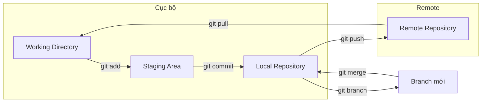

# 8.1 Máy quay thời gian và mạng an toàn của bạn——Quy trình Git cơ bản

Git là máy quay thời gian của code——cho phép bạn quay về quá khứ bất cứ lúc nào, cũng là mạng an toàn——để bạn thử nghiệm táo bạo mà không sợ thất bại.

## Giá trị cốt lõi

Git không giải quyết vấn đề "làm thế nào để viết code", mà là "làm thế nào để quản lý thay đổi code một cách an toàn":

- **Truy vết phiên bản**: Mỗi commit là một snapshot, có thể rollback bất cứ lúc nào
- **Phát triển song song**: Thông qua branch, nhiều người có thể phát triển các tính năng khác nhau đồng thời
- **Đánh giá thay đổi**: Thông qua PR, code phải được review trước khi lên production
- **Giải quyết xung đột**: Khi nhiều người chỉnh sửa cùng một file, cung cấp cơ chế merge

## Toàn cảnh quy trình Git

## Bảng tra cứu nhanh lệnh cốt lõi

| Tình huống | Lệnh | Giải thích |
|------|------|------|
| Lưu thay đổi | `git add .` | Thêm tất cả thay đổi vào staging area |
| Tạo snapshot | `git commit -m "msg"` | Tạo một version snapshot |
| Đẩy lên remote | `git push` | Đẩy commit cục bộ lên remote |
| Kéo cập nhật | `git pull` | Lấy code mới nhất từ remote |
| Tạo branch | `git checkout -b feat/xx` | Tạo và chuyển sang branch mới |
| Merge branch | `git merge feat/xx` | Merge branch chỉ định vào branch hiện tại |
| Rollback phiên bản | `git reset --hard HEAD~1` | Rollback về phiên bản trước |

## Cấu trúc của mục này

Mục này sẽ xuất phát từ thao tác thực tế, giúp bạn nắm vững kỹ năng cốt lõi của Git:

1. **Lệnh cơ bản**: Sử dụng add/commit/push/pull hàng ngày
2. **Thao tác branch**: Tạo, chuyển, merge, xóa branch
3. **Giải quyết xung đột**: Cách xử lý khi code "đánh nhau"
4. **Rollback phiên bản**: Sự khác biệt và cách sử dụng reset và revert
5. **gitignore**: File nào không nên được quản lý phiên bản

## Checklist nghiệm thu

- [ ] Có thể hoàn thành độc lập quy trình clone → sửa → commit → push
- [ ] Có thể tạo branch, chuyển branch, merge branch
- [ ] Có thể xử lý xung đột merge đơn giản
- [ ] Hiểu sự khác biệt giữa reset và revert
- [ ] Có thể cấu hình đúng file .gitignore
