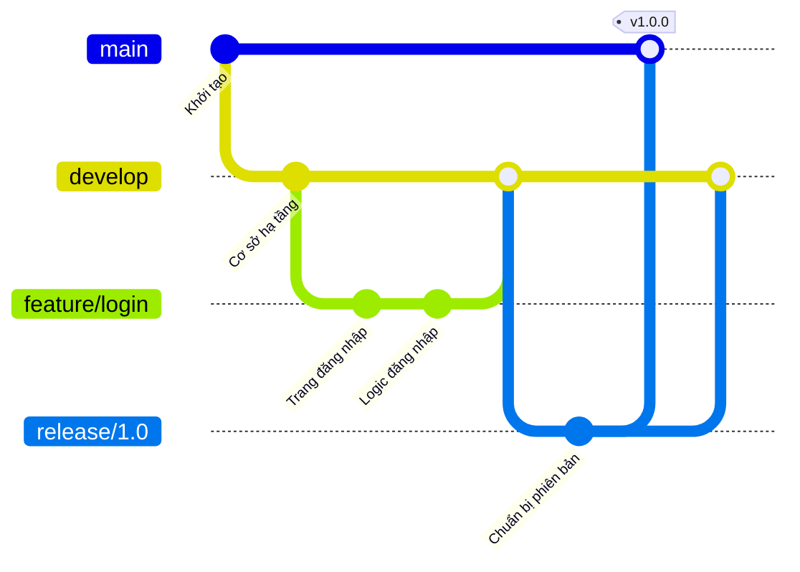
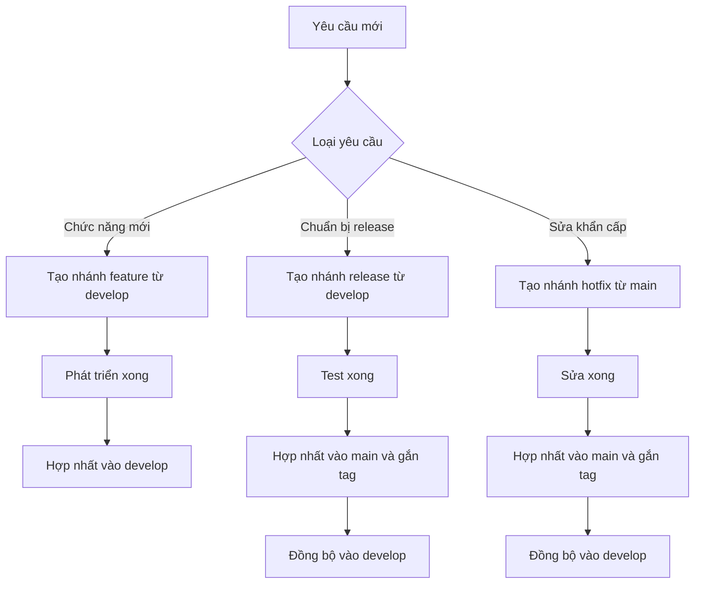

# 8.2.1 Quy trình làm việc của team chuyên nghiệp——Git Flow

Git Flow là một bộ quy tắc quản lý nhánh trưởng thành, phù hợp với các dự án có chu kỳ release phiên bản rõ ràng.

## Cấu trúc nhánh Git Flow



## Năm loại nhánh

| Loại nhánh | Quy tắc đặt tên | Vòng đời | Nguồn | Mục tiêu hợp nhất |
|----------|----------|----------|------|----------|
| main | `main` | Vĩnh viễn | - | - |
| develop | `develop` | Vĩnh viễn | main | release |
| feature | `feature/*` | Tạm thời | develop | develop |
| release | `release/*` | Tạm thời | develop | main + develop |
| hotfix | `hotfix/*` | Tạm thời | main | main + develop |

### 1. Nhánh main

- **Tác dụng**：Code production, luôn ở trạng thái có thể deploy
- **Quy tắc**：Chỉ chấp nhận hợp nhất từ release và hotfix, cấm commit trực tiếp
- **Tags**：Sau mỗi lần hợp nhất, cần gắn tag phiên bản (ví dụ: `v1.0.0`)

### 2. Nhánh develop

- **Tác dụng**：Dòng chính phát triển, chứa tiến độ phát triển mới nhất
- **Quy tắc**：Chỉ chấp nhận hợp nhất từ feature, release, hotfix
- **Trạng thái**：Có thể chứa chức năng chưa hoàn thành, không đảm bảo có thể deploy

### 3. Nhánh feature

```bash
# Tạo nhánh chức năng
git checkout develop
git checkout -b feature/user-profile

# Sau khi phát triển xong, hợp nhất về develop
git checkout develop
git merge --no-ff feature/user-profile
git branch -d feature/user-profile
```

- **Tác dụng**：Phát triển tính năng mới
- **Đặt tên**：`feature/tên-chức-năng` (ví dụ: `feature/user-login`)
- **Vòng đời**：Trong quá trình phát triển chức năng

### 4. Nhánh release

```bash
# Chuẩn bị release
git checkout develop
git checkout -b release/1.0.0

# Sửa các lỗi được phát hiện, cập nhật số phiên bản...

# Release lên main
git checkout main
git merge --no-ff release/1.0.0
git tag -a v1.0.0 -m "Release 1.0.0"

# Đồng bộ về develop
git checkout develop
git merge --no-ff release/1.0.0
git branch -d release/1.0.0
```

- **Tác dụng**：Chuẩn bị release phiên bản, chỉ sửa bug và cập nhật số phiên bản
- **Đặt tên**：`release/số-phiên-bản` (ví dụ: `release/1.0.0`)
- **Quy tắc**：Không cho phép thêm tính năng mới

### 5. Nhánh hotfix

```bash
# Sửa khẩn cấp
git checkout main
git checkout -b hotfix/security-fix

# Sửa vấn đề...

# Hợp nhất vào main
git checkout main
git merge --no-ff hotfix/security-fix
git tag -a v1.0.1 -m "Hotfix: security issue"

# Đồng bộ vào develop
git checkout develop
git merge --no-ff hotfix/security-fix
git branch -d hotfix/security-fix
```

- **Tác dụng**：Sửa bug khẩn cấp trong production
- **Đặt tên**：`hotfix/mô-tả-vấn-đề` (ví dụ: `hotfix/login-crash`)
- **Quy tắc**：Sau khi sửa, phải hợp nhất vào cả main và develop

## Quy trình làm việc Git Flow



## Công cụ Git Flow

Có thể dùng extension `git-flow` để đơn giản hóa các thao tác:

```bash
# Cài đặt (macOS)
brew install git-flow

# Khởi tạo
git flow init

# Bắt đầu phát triển chức năng
git flow feature start user-login

# Hoàn thành phát triển chức năng
git flow feature finish user-login

# Bắt đầu release
git flow release start 1.0.0

# Hoàn thành release
git flow release finish 1.0.0
```

## Trường hợp áp dụng và hạn chế

**Phù hợp**：
- Các sản phẩm có chu kỳ release phiên bản rõ ràng
- Cần duy trì đồng thời nhiều phiên bản
- Team lớn, cần quy trình nghiêm ngặt

**Không phù hợp**：
- Ứng dụng web triển khai liên tục
- Project small team phát triển nhanh chóng
- Chỉ duy trì một phiên bản duy nhất

## Hướng dẫn hợp tác với AI

**Ví dụ Prompt**：
> "Dự án chúng tôi dùng Git Flow, hiện cần sửa khẩn cấp một lỗ hổng bảo mật trong production, vui lòng liệt kê các bước thao tác hoàn chỉnh."

## Danh sách kiểm tra

- [ ] Hiểu tác dụng của năm loại nhánh
- [ ] Có thể thực hiện chính xác việc tạo và hợp nhất nhánh feature
- [ ] Hiểu sự khác biệt giữa release và hotfix
- [ ] Biết trường hợp áp dụng của Git Flow
