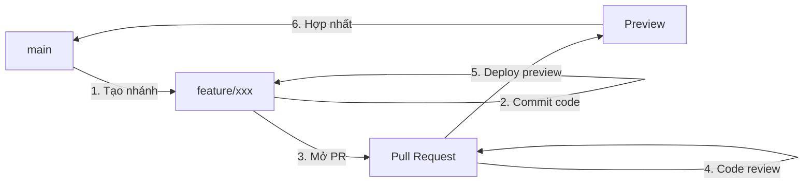
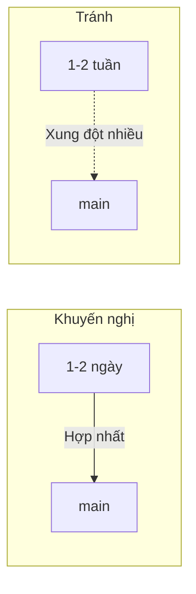

# 8.2.2 Quy trình agile cho team nhỏ——GitHub Flow

GitHub Flow chỉ có một nguyên tắc cốt lõi：nhánh main luôn có thể deploy. Phần còn lại thì đơn giản hóa.

## Quy trình cốt lõi GitHub Flow



## Sáu bước quy trình làm việc

### Bước 1：Tạo nhánh từ main

```bash
git checkout main
git pull origin main
git checkout -b feat/user-dashboard
```

**Quy tắc đặt tên**：
- `feat/xxx` - Chức năng mới
- `fix/xxx` - Sửa bug
- `docs/xxx` - Cập nhật tài liệu
- `refactor/xxx` - Refactor code

### Bước 2：Commit code

```bash
# Commit thường xuyên, mỗi commit là một đơn vị logic
git add .
git commit -m "feat: thêm layout bảng điều khiển người dùng"
git commit -m "feat: hoàn thành logic lấy dữ liệu"
git commit -m "style: điều chỉnh kiểu bảng điều khiển"
```

### Bước 3：Push và tạo Pull Request

```bash
git push -u origin feat/user-dashboard
```

Sau đó tạo PR trên GitHub, điền:
- **Tiêu đề**：Mô tả tóm tắt những thay đổi
- **Mô tả**：Giải thích chi tiết những gì đã thay đổi, tại sao thay đổi
- **Liên kết Issue**：Nếu có

### Bước 4：Code review

Các thành viên team review code：
- Chất lượng code
- Tính đúng đắn của logic kinh doanh
- Độ phủ test
- Tiềm ẩn bảo mật

### Bước 5：Deploy preview

Công cụ CI/CD hiện đại (như Vercel) sẽ tự động tạo môi trường preview cho mỗi PR：

```
Preview: https://project-feat-user-dashboard.vercel.app
```

Chỉ có thể hợp nhất sau khi test xong trong môi trường preview.

### Bước 6：Hợp nhất vào main

Sau khi review xong, hợp nhất PR qua GitHub UI：
- **Merge commit**：Giữ lại toàn bộ lịch sử
- **Squash and merge**：Nén thành một commit duy nhất (khuyến nghị)
- **Rebase and merge**：Hợp nhất qua rebase, giữ lịch sử tuyến tính

Sau khi hợp nhất, main sẽ tự động trigger deployment lên production.

## GitHub Flow vs Git Flow

| Đặc điểm | GitHub Flow | Git Flow |
|------|-------------|----------|
| Số loại nhánh | 2 loại (main + feature) | 5 loại |
| Độ phức tạp | Đơn giản | Phức tạp |
| Tốc độ release | Triển khai liên tục | Release định kỳ |
| Quản lý phiên bản | Không cần | Cần thiết |
| Team phù hợp | Team nhỏ | Team lớn |
| Trường hợp tốt nhất | Ứng dụng web | Phần mềm truyền thống |

## Quy trình sửa khẩn cấp

Trong GitHub Flow, sửa khẩn cấp cũng sử dụng quy trình phát triển chức năng thông thường：

```bash
# 1. Tạo nhánh sửa từ main
git checkout main && git pull
git checkout -b fix/critical-bug

# 2. Sửa vấn đề
git add . && git commit -m "fix: sửa lỗi đăng nhập không thành công"

# 3. Push và tạo PR
git push -u origin fix/critical-bug

# 4. Review nhanh rồi hợp nhất
# 5. Main tự động deploy
```

## Các thực tiễn tốt nhất

### 1. Giữ nhánh sống ngắn



### 2. Commit từng bước

```bash
# Cách tốt：mỗi commit tập trung vào một việc
git commit -m "feat: thêm component avatar người dùng"
git commit -m "feat: tích hợp avatar vào user card"
git commit -m "test: thêm test cho component avatar"

# Tránh：một commit khổng lồ
git commit -m "feat: thêm hệ thống người dùng"  # chứa 50 file thay đổi
```

### 3. Đồng bộ main kịp thời

```bash
# Định kỳ đồng bộ trong quá trình phát triển
git fetch origin main
git rebase origin/main
```

### 4. Sử dụng mẫu PR

Tạo `.github/PULL_REQUEST_TEMPLATE.md` trong thư mục gốc repo：

```markdown
## Loại thay đổi
- [ ] Chức năng mới
- [ ] Sửa bug
- [ ] Refactor
- [ ] Tài liệu

## Mô tả thay đổi
<!-- Mô tả những gì bạn thay đổi -->

## Test
- [ ] Đã thêm/cập nhật test
- [ ] Test cục bộ đã thông qua

## Ảnh chụp (nếu áp dụng)
```

## Hướng dẫn hợp tác với AI

**Ví dụ Prompt**：
> "Tôi đang phát triển một chức năng mới, đã commit code vài lần trên nhánh feat/user-profile. Hiện phát hiện nhánh main có cập nhật mới, tôi muốn đồng bộ những cập nhật này vào nhánh của mình, đồng thời giữ lịch sử commit gọn gàng, nên làm sao?"

## Danh sách kiểm tra

- [ ] Hiểu sáu bước quy trình của GitHub Flow
- [ ] Có thể hoàn thành độc lập toàn bộ quy trình từ tạo nhánh đến hợp nhất
- [ ] Hiểu sự khác biệt giữa GitHub Flow và Git Flow
- [ ] Nắm vững các thực tiễn tốt nhất về đồng bộ nhánh và PR
