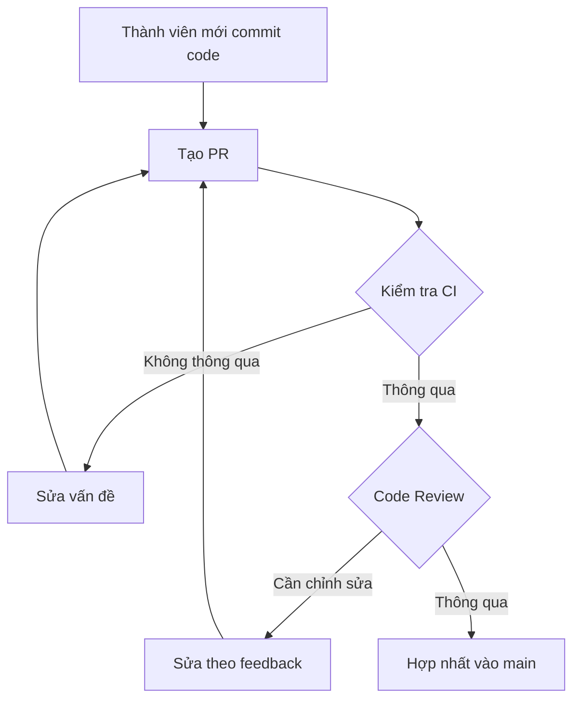

# 8.2.3 Nhánh chính không phải ai cũng có thể sửa——Bảo vệ nhánh

Quy tắc bảo vệ nhánh giống như "đèn giao thông" trong hợp tác team——không có quy tắc, quy trình tốt nhất cũng dễ bị phá vỡ.

## Tại sao cần bảo vệ nhánh

Khi không có bảo vệ nhánh, có thể xảy ra：

- Có người push trực tiếp vào main, bỏ qua code review
- Code chưa test xong được hợp nhất
- Người dùng push force overwrite code của người khác
- Nhánh main rơi vào trạng thái không thể deploy

**Mục tiêu cốt lõi của bảo vệ nhánh**：Đảm bảo code trên nhánh main luôn ở trạng thái có thể deploy.

## Cấu hình bảo vệ nhánh GitHub

### Vào settings

```
Repository → Settings → Branches → Add branch protection rule
```

### Quy tắc bảo vệ cốt lõi

| Quy tắc | Tác dụng | Khuyến nghị |
|------|------|------|
| Require a pull request | Cấm push trực tiếp, phải qua PR | Bắt buộc |
| Require approvals | Cần số lượng phê duyệt nhất định | Tối thiểu 1 người |
| Require status checks | Kiểm tra CI phải thông qua | Bắt buộc |
| Require branches to be up to date | PR phải đồng bộ với nhánh đích | Khuyến nghị |
| Require signed commits | Yêu cầu ký GPG | Tùy chọn |
| Include administrators | Admin cũng phải tuân theo quy tắc | Khuyến nghị |

### Ví dụ cấu hình

```yaml
# Ví dụ cấu hình quy tắc bảo vệ nhánh
Branch name pattern: main

Protection rules:
  - Require a pull request before merging: ✅
    - Required approving reviews: 1
    - Dismiss stale reviews: ✅
    - Require review from code owners: ✅

  - Require status checks to pass: ✅
    - Required checks:
      - build
      - test
      - lint
    - Require branches to be up to date: ✅

  - Do not allow bypassing: ✅
```

## Tích hợp kiểm tra trạng thái

Bảo vệ nhánh có thể tích hợp với CI/CD để đảm bảo chất lượng code：

```yaml
# .github/workflows/ci.yml
name: CI

on:
  pull_request:
    branches: [main]

jobs:
  build:
    runs-on: ubuntu-latest
    steps:
      - uses: actions/checkout@v4
      - uses: actions/setup-node@v4
        with:
          node-version: '20'
      - run: pnpm install
      - run: pnpm build

  test:
    runs-on: ubuntu-latest
    steps:
      - uses: actions/checkout@v4
      - uses: actions/setup-node@v4
      - run: pnpm install
      - run: pnpm test

  lint:
    runs-on: ubuntu-latest
    steps:
      - uses: actions/checkout@v4
      - uses: actions/setup-node@v4
      - run: pnpm install
      - run: pnpm lint
```

Sau khi cấu hình, trang PR sẽ hiển thị trạng thái kiểm tra：

```
┌─────────────────────────────────────────┐
│ ✅ build — All checks have passed       │
│ ✅ test — All checks have passed        │
│ ✅ lint — All checks have passed        │
├─────────────────────────────────────────┤
│ ✅ Ready to merge                       │
└─────────────────────────────────────────┘
```

## Cấu hình Code Owners

Chỉ định người phụ trách code thông qua file `CODEOWNERS`：

```bash
# .github/CODEOWNERS

# Người review mặc định
* @team-lead

# Code frontend
/src/components/ @frontend-team
/src/app/ @frontend-team

# Code backend
/src/api/ @backend-team
/prisma/ @backend-team

# Cơ sở hạ tầng
/.github/ @devops-team
/docker/ @devops-team

# Tài liệu
/docs/ @docs-team
```

Sau khi cấu hình, khi sửa code ở các thư mục này sẽ tự động yêu cầu người phụ trách review.

## Các tình huống thực tiễn áp dụng quy tắc bảo vệ

### Tình huống 1：Thành viên mới tham gia team



### Tình huống 2：Sửa khẩn cấp

Ngay cả trong trường hợp khẩn cấp, cũng nên tuân theo quy trình：

1. Tạo nhánh hotfix
2. Sửa nhanh và commit
3. Tạo PR, đánh dấu `urgent`
4. Yêu cầu review nhanh (có thể @reviewer trong nhóm)
5. Hợp nhất sau khi review xong

**Không khuyến nghị**：Tạm thời vô hiệu hóa bảo vệ nhánh (sẽ để lại rủi ro bảo mật)

## Các câu hỏi thường gặp

### Q: Admin có thể bỏ qua bảo vệ không?

Nếu bật "Include administrators", thì admin cũng phải tuân theo quy tắc.

### Q: Khi kiểm tra CI thỉnh thoảng không thành công, làm sao?

1. Đảm bảo cấu hình CI ổn định, đáng tin cậy
2. Sử dụng cơ chế retry
3. Nếu cần thiết, có thể "Re-run" các kiểm tra không thành công

### Q: Trường hợp khẩn cấp không ai review được thì sao?

1. Thiết lập nhiều người có thể approve
2. Thiết lập cơ chế liên hệ khẩn cấp
3. Cân nhắc sử dụng auto-merge (không khuyến nghị cho main)

## Hướng dẫn hợp tác với AI

**Ví dụ Prompt**：
> "Vui lòng giúp tôi cấu hình một GitHub Actions workflow, chạy build, test và type-check cho dự án Next.js khi có PR, và đặt những công việc này làm kiểm tra bắt buộc cho bảo vệ nhánh."

## Danh sách kiểm tra

- [ ] Hiểu tầm quan trọng của bảo vệ nhánh
- [ ] Có thể cấu hình các quy tắc bảo vệ nhánh cơ bản trên GitHub
- [ ] Hiểu cách tích hợp kiểm tra trạng thái CI
- [ ] Biết cách cấu hình CODEOWNERS
