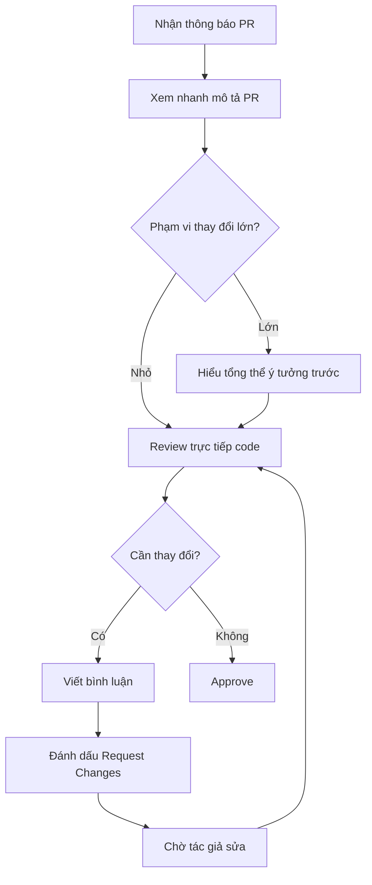

# 8.2.4 Đồng nghiệp xem code cho bạn——Code review

Code review không phải là cuộc họp chỉ trích, mà là khâu cốt lõi chia sẻ kiến thức và đảm bảo chất lượng team.

## Giá trị của code review

| Giá trị | Giải thích |
|------|------|
| Phát hiện Bug | Hai mắt tìm thấy vấn đề dễ hơn một mắt |
| Truyền kiến thức | Người review học cách làm của tác giả, ngược lại cũng vậy |
| Chất lượng code | Duy trì phong cách code và kiến trúc nhất quán trong team |
| Giảm rủi ro | Giảm lỗi độc lập, nhiều người hiểu code |

## Cấu hình mẫu PR

Tạo `.github/PULL_REQUEST_TEMPLATE.md` trong repo：

```markdown
## Loại thay đổi

- [ ] Chức năng mới (feat)
- [ ] Sửa bug (fix)
- [ ] Refactor code (refactor)
- [ ] Điều chỉnh kiểu (style)
- [ ] Cập nhật tài liệu (docs)
- [ ] Liên quan test (test)
- [ ] Cấu hình build (build)

## Mô tả thay đổi

<!-- Mô tả tóm tắt những gì bạn thay đổi, tại sao cần thay đổi -->

## Liên kết Issue

<!-- Nếu có, điền số Issue liên quan -->
Closes #

## Danh sách tự kiểm tra

- [ ] Code tuân theo quy tắc dự án
- [ ] Đã thêm/cập nhật test cần thiết
- [ ] Test cục bộ đã thông qua
- [ ] Đã cập nhật tài liệu liên quan

## Ảnh chụp/Video (nếu áp dụng)

<!-- Nếu thay đổi UI, vui lòng đính kèm ảnh hoặc video -->
```

## Danh sách kiểm tra cho người review

### Tính đúng đắn chức năng

- [ ] Logic code có thực hiện đúng yêu cầu không
- [ ] Các trường hợp biên được xử lý đúng không
- [ ] Xử lý lỗi có hoàn chỉnh không
- [ ] Có xem xét vấn đề đồng thời/race condition không

### Chất lượng code

- [ ] Code có rõ ràng, dễ đọc không
- [ ] Đặt tên có mô tả đúng ý định không
- [ ] Hàm/component có tuân theo single responsibility không
- [ ] Có code lặp lại có thể rút trích không

### Bảo mật

- [ ] Có rủi ro SQL injection không
- [ ] Input người dùng có được xác thực không
- [ ] Dữ liệu nhạy cảm có được xử lý đúng không
- [ ] Có key hard-coded không

### Hiệu năng

- [ ] Có vấn đề hiệu năng rõ ràng không
- [ ] Query database có hiệu quả không
- [ ] Có vấn đề N+1 query không
- [ ] Frontend có tránh render không cần thiết không

### Test

- [ ] Có độ phủ test đủ không
- [ ] Test case có bao gồm các trường hợp biên không
- [ ] Test có dễ bảo trì không

## Quy tắc bình luận review

### Nhãn loại bình luận

```markdown
[Bắt buộc] Có rò rỉ bộ nhớ ở đây, cần hủy đăng ký trong hàm cleanup của useEffect

[Đề xuất] Có thể xem xét dùng useMemo để tối ưu phép tính này

[Câu hỏi] Tại sao chọn xử lý ở đây thay vì ở service layer?

[Tốt] Cách đóng gói này rất thanh lịch!

[Ghi chú] FYI: Phiên bản mới của library này có breaking change
```

### Thực tiễn tốt nhất khi bình luận

**Nên làm**：
- Giải thích nguyên nhân vấn đề, không chỉ chỉ ra vấn đề
- Đưa ra gợi ý cải thiện cụ thể
- Ghi nhận những điều làm tốt trong code
- Phân biệt giữa thay đổi bắt buộc và đề xuất tùy chọn

**Tránh**：
- Dùng ngôn ngữ xem thường
- Chỉ nói "sai" mà không giải thích lý do
- Đòi hỏi hoàn hảo khiến không thể merge
- Bình luận về vấn đề không liên quan đến code

## Quy trình review hiệu quả



## Quản lý thời gian review

| Nguyên tắc | Giải thích |
|------|------|
| Phản hồi kịp thời | Hoàn thành review lần đầu trong 24 giờ |
| Review theo đợt | Định thời gian cố định xử lý PR, tránh bị gián đoạn thường xuyên |
| Ưu tiên | Sửa khẩn cấp > Chặn người khác > Chức năng thường |
| Giao tiếp | PR lớn cần thảo luận trước, tránh chỉnh sửa qua lại |

## Thực tiễn tốt nhất cho tác giả

### Trước khi tạo PR

- Tự review một lần code của mình
- Đảm bảo kiểm tra CI đã thông qua
- Viết mô tả PR rõ ràng
- Kiểm soát kích thước PR (khuyến nghị < 400 dòng thay đổi)

### Phản ứng với bình luận

```markdown
# Đồng ý và đã sửa
Đã sửa, áp dụng phương án useMemo mà bạn đề xuất

# Giải thích lý do
Giữ phương án cũ, vì phép tính ở đây có độ phức tạp thấp, dùng useMemo còn tăng overhead bộ nhớ

# Cần thảo luận thêm
Vấn đề này khá phức tạp, có thể thảo luận offline được không?
```

## Hỗ trợ AI cho code review

Có thể để AI hỗ trợ review ban đầu：

**Ví dụ Prompt**：
> "Vui lòng review thay đổi code dưới đây, chú ý các điểm：
> 1. Có bug rõ ràng hoặc lỗi logic không
> 2. Có tiềm ẩn bảo mật không
> 3. Có vấn đề hiệu năng không
> 4. Code style có tuân theo best practice của React/TypeScript không
>
> ```tsx
> // Code của bạn...
> ```"

## Danh sách kiểm tra

- [ ] Hiểu giá trị của code review
- [ ] Có thể cấu hình mẫu PR
- [ ] Nắm vững quy tắc bình luận review
- [ ] Hiểu trách nhiệm của tác giả và người review
