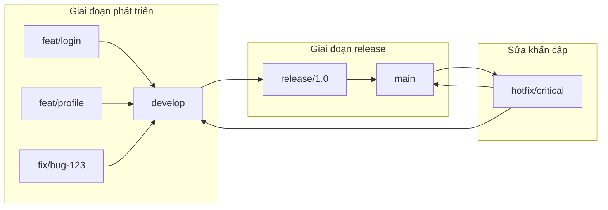

# 8.2 Tại sao không thể commit code tùy tiện——Chiến lược nhánh

Commit code trực tiếp vào nhánh main giống như thay đổi làn trên đường cao tốc—dường như tiện lợi nhưng lại rất nguy hiểm.

## Tại sao cần chiến lược nhánh

Các team không có chiến lược nhánh thường gặp những vấn đề này:

- Code chưa test xong được deploy trực tiếp lên production, gây sự cố
- Nhiều người phát triển cùng lúc, code xung đột thường xuyên
- Khi có lỗi, không biết commit nào gây ra
- Sửa bug khẩn cấp bị chặn bởi code chức năng chưa hoàn thành

**Bản chất của chiến lược nhánh là cô lập rủi ro**——cho phép code ở các giai đoạn khác nhau chạy trên các "làn" khác nhau.

## Tổng quan chiến lược nhánh

## Hai mô hình nhánh chính

| Mô hình | Trường hợp áp dụng | Độ phức tạp | Số lượng nhánh |
|------|----------|--------|----------|
| Git Flow | Phần mềm truyền thống, release định kỳ | Cao | Nhiều |
| GitHub Flow | Triển khai liên tục, ứng dụng web | Thấp | Ít |

**Khuyến nghị**：Với dự án fullstack Next.js, **GitHub Flow** thích hợp hơn——đơn giản, nhanh chóng, phù hợp với triển khai liên tục.

## Cấu trúc phần này

1. **Git Flow**：Quy trình làm việc hoàn chỉnh với các nhánh feature/release/hotfix
2. **GitHub Flow**：Mô hình nhánh đơn giản cho team nhỏ
3. **Bảo vệ nhánh**：Cách buộc phải dùng PR và kiểm tra trạng thái
4. **Đánh giá code**：Mẫu PR và các thực tiễn tốt nhất của Code Review

## Nguyên tắc cốt lõi

Dù chọn mô hình nào, cũng nên tuân theo các nguyên tắc sau:

1. **Nhánh main luôn có thể deploy**：Code trên main có thể lên production bất kỳ lúc nào
2. **Phát triển chức năng trên nhánh riêng lẻ**：Một chức năng một nhánh, không can thiệp lẫn nhau
3. **Hợp nhất code qua PR**：Tất cả code phải qua review mới được vào nhánh chính
4. **Bước nhỏ, nhanh chóng**：Vòng đời nhánh càng ngắn càng tốt, tránh hợp nhất quy mô lớn

## Danh sách kiểm tra

- [ ] Hiểu tầm quan trọng của chiến lược nhánh
- [ ] Có thể chọn mô hình nhánh phù hợp dựa trên đặc điểm dự án
- [ ] Biết cách cấu hình quy tắc bảo vệ nhánh
- [ ] Nắm vững quy trình PR và code review cơ bản
