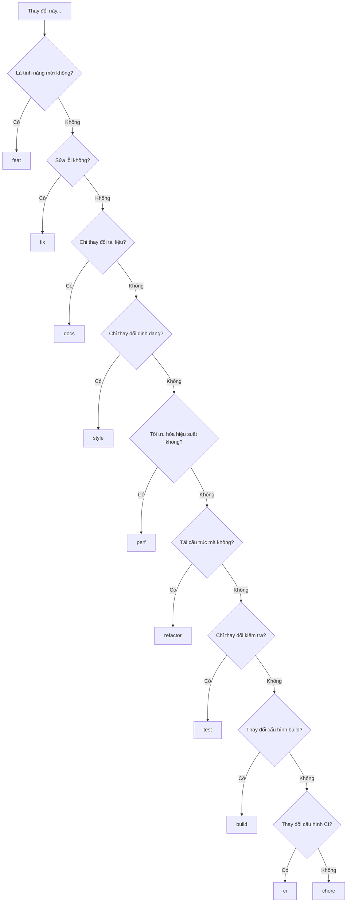

# 8.3.2 feat và fix là gì——Phân loại loại

Các loại thay đổi khác nhau sử dụng các tiền tố type khác nhau——đây là lõi của Conventional Commits.

## Bảng tra cứu nhanh loại

| Type | Mô tả | Kích hoạt thay đổi phiên bản | Ví dụ |
|------|------|--------------|------|
| feat | Tính năng mới | minor (1.x.0) | 添加用户登录 |
| fix | Sửa lỗi | patch (1.0.x) | 修复登录失败 |
| docs | Cập nhật tài liệu | Không | 更新 README |
| style | Định dạng mã | Không | 调整缩进 |
| refactor | Tái cấu trúc | Không | 优化代码结构 |
| perf | Tối ưu hóa hiệu suất | patch | 优化查询速度 |
| test | Liên quan đến kiểm tra | Không | 添加单元测试 |
| build | Liên quan đến build | Không | 升级依赖版本 |
| ci | Cấu hình CI | Không | 修改 workflow |
| chore | Công việc khác | Không | 更新 .gitignore |
| revert | Hoàn tác | Phụ thuộc vào commit gốc | 撤销某次提交 |

## Mô tả chi tiết

### feat - Tính năng mới

Được sử dụng để thêm tính năng hoặc đặc tính mới, ảnh hưởng đến trải nghiệm người dùng hoặc API:

```bash
feat: 添加用户注册功能
feat(auth): 支持 GitHub 第三方登录
feat(api): 新增获取用户列表接口
```

**Tiêu chí phán đoán**: Người dùng/người gọi có thể cảm nhận được khả năng mới.

### fix - Sửa lỗi

Sửa lỗi hoặc vấn đề trong mã:

```bash
fix: 修复首页白屏问题
fix(auth): 修复 token 过期后无法刷新的问题
fix(ui): 修复移动端按钮点击区域过小
```

**Tiêu chí phán đoán**: Sửa một vấn đề hiện có.

### docs - Tài liệu

Các thay đổi chỉ liên quan đến tài liệu:

```bash
docs: 更新安装说明
docs(api): 添加接口使用示例
docs(readme): 补充项目架构说明
```

**Tiêu chí phán đoán**: Chỉ thay đổi tập tin .md hoặc bình luận mã.

### style - Định dạng mã

Điều chỉnh định dạng không ảnh hưởng đến logic mã:

```bash
style: 统一使用单引号
style: 调整代码缩进为 2 空格
style: 移除多余的空行
```

**Tiêu chí phán đoán**: Điều chỉnh định dạng thuần, kết quả chạy hoàn toàn không thay đổi.

### refactor - Tái cấu trúc

Không phải tính năng mới cũng không phải sửa lỗi trong việc tái cấu trúc mã:

```bash
refactor: 提取公共验证逻辑
refactor(auth): 使用策略模式重构登录流程
refactor: 将类组件改为函数组件
```

**Tiêu chí phán đoán**: Tối ưu hóa cấu trúc mã, nhưng hành vi chức năng không thay đổi.

### perf - Tối ưu hóa hiệu suất

Thay đổi mã cải thiện hiệu suất:

```bash
perf: 使用虚拟列表优化长列表渲染
perf(api): 添加数据库查询缓存
perf: 图片懒加载优化首屏速度
```

**Tiêu chí phán đoán**: Thay đổi đặc biệt để cải thiện hiệu suất.

### test - Kiểm tra

Thêm hoặc sửa đổi mã kiểm tra:

```bash
test: 添加用户服务单元测试
test(e2e): 补充登录流程端到端测试
test: 修复测试用例中的 mock 数据
```

**Tiêu chí phán đoán**: Chỉ liên quan đến mã kiểm tra.

### build - Build

Thay đổi ảnh hưởng đến hệ thống build hoặc phụ thuộc bên ngoài:

```bash
build: 升级 Next.js 到 14.0
build: 添加 webpack 别名配置
build(deps): 更新 prisma 到最新版本
```

**Tiêu chí phán đoán**: Thay đổi phụ thuộc package.json hoặc sửa đổi cấu hình build.

### ci - Tích hợp liên tục

Thay đổi tập tin cấu hình CI và script:

```bash
ci: 添加 GitHub Actions 部署流程
ci: 配置自动化测试 workflow
ci: 添加代码覆盖率检查
```

**Tiêu chí phán đoán**: Chỉ liên quan đến cấu hình CI/CD.

### chore - Công việc khác

Các thay đổi khác không ảnh hưởng đến mã nguồn hoặc kiểm tra:

```bash
chore: 更新 .gitignore
chore: 添加 EditorConfig 配置
chore: 清理无用的注释代码
```

**Tiêu chí phán đoán**: Không thuộc loại nào ở trên.

### revert - Hoàn tác

Hủy bỏ commit trước đó:

```bash
revert: revert "feat(auth): 添加 Google 登录"

This reverts commit abc1234.
```

## Cây quyết định chọn loại



## Những hiểu lầm phổ biến

| Hiểu lầm | Cách làm đúng |
|------|----------|
| Sử dụng fix để biểu thị "sửa đổi" | fix chỉ dùng để sửa lỗi |
| Sử dụng feat để biểu thị "hoàn thành tính năng" | feat chỉ dùng để thêm tính năng mới |
| Sử dụng refactor để biểu thị "sửa đổi mã" | refactor chỉ dùng để tái cấu trúc không thay đổi hành vi |
| Sử dụng chore làm loại vạn năng | Ưu tiên sử dụng các loại cụ thể hơn |

## Danh sách kiểm tra

- [ ] Có thể phân biệt chính xác feat và fix
- [ ] Hiểu sự khác biệt giữa refactor và fix
- [ ] Biết ranh giới giữa style và refactor
- [ ] Có thể chọn loại đúng dựa trên nội dung thay đổi
