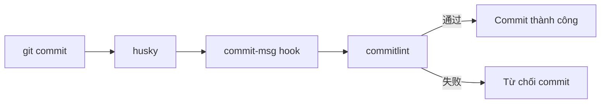

# 8.3.3 Robot giúp kiểm tra định dạng——Kiểm tra tự động

Dựa vào con người để ghi nhớ quy chuẩn là không đáng tin cậy——sử dụng các công cụ để tự động kiểm tra, chặn các commit message không chuẩn trước khi submit.

## Tổng quan bộ công cụ



| Công cụ | Chức năng |
|------|------|
| husky | Công cụ quản lý Git hooks |
| commitlint | Kiểm tra xem commit message có tuân theo quy chuẩn không |
| lint-staged | Chỉ chạy linter trên tập tin được stage |

## Cấu hình cài đặt

### 1. Cài đặt phụ thuộc

```bash
# Cài đặt husky và commitlint
pnpm add -D husky @commitlint/cli @commitlint/config-conventional

# Khởi tạo husky
pnpm exec husky init
```

### 2. Cấu hình commitlint

Tạo `commitlint.config.js`:

```javascript
module.exports = {
  extends: ['@commitlint/config-conventional'],
  rules: {
    // type phải là một trong những loại sau
    'type-enum': [
      2,
      'always',
      [
        'feat',     // Tính năng mới
        'fix',      // Sửa lỗi
        'docs',     // Tài liệu
        'style',    // Định dạng
        'refactor', // Tái cấu trúc
        'perf',     // Hiệu suất
        'test',     // Kiểm tra
        'build',    // Build
        'ci',       // CI
        'chore',    // Công việc khác
        'revert',   // Hoàn tác
      ],
    ],
    // type không thể trống
    'type-empty': [2, 'never'],
    // subject không thể trống
    'subject-empty': [2, 'never'],
    // subject tối đa 100 ký tự
    'subject-max-length': [2, 'always', 100],
  },
};
```

### 3. Cấu hình husky hook

```bash
# Tạo commit-msg hook
echo "pnpm exec commitlint --edit \$1" > .husky/commit-msg
```

Hoặc sửa `.husky/commit-msg` thủ công:

```bash
#!/usr/bin/env sh
. "$(dirname -- "$0")/_/husky.sh"

pnpm exec commitlint --edit $1
```

## Xác minh cấu hình

```bash
# Kiểm tra: commit không chuẩn sẽ bị từ chối
git commit -m "update code"
# ⧗   input: update code
# ✖   subject may not be empty [subject-empty]
# ✖   type may not be empty [type-empty]

# Kiểm tra: commit chuẩn sẽ thành công
git commit -m "feat: 添加用户登录"
# ✔ Commit successful!
```

## Cấu hình nâng cao

### Tùy chỉnh scope

```javascript
// commitlint.config.js
module.exports = {
  extends: ['@commitlint/config-conventional'],
  rules: {
    'scope-enum': [
      2,
      'always',
      [
        'auth',      // Module xác thực
        'user',      // Module người dùng
        'api',       // API liên quan
        'ui',        // Thành phần UI
        'database',  // Cơ sở dữ liệu
        'config',    // Cấu hình
      ],
    ],
  },
};
```

### Hỗ trợ tiếng Trung

Cấu hình mặc định hỗ trợ subject tiếng Trung, không cần cấu hình thêm:

```bash
git commit -m "feat(auth): 添加用户登录功能"  # ✅ Thành công
```

### Tích hợp lint-staged

Kiểm tra chất lượng mã cùng lúc trước khi commit:

```bash
pnpm add -D lint-staged
```

Cấu hình trong `package.json`:

```json
{
  "lint-staged": {
    "*.{ts,tsx}": [
      "eslint --fix",
      "prettier --write"
    ],
    "*.{json,md}": [
      "prettier --write"
    ]
  }
}
```

Cấu hình pre-commit hook:

```bash
echo "pnpm exec lint-staged" > .husky/pre-commit
```

## Ví dụ cấu hình đầy đủ

### package.json

```json
{
  "scripts": {
    "prepare": "husky"
  },
  "devDependencies": {
    "@commitlint/cli": "^18.0.0",
    "@commitlint/config-conventional": "^18.0.0",
    "husky": "^9.0.0",
    "lint-staged": "^15.0.0"
  },
  "lint-staged": {
    "*.{ts,tsx}": ["eslint --fix", "prettier --write"]
  }
}
```

### Cấu trúc thư mục

```
project/
├── .husky/
│   ├── _/
│   ├── commit-msg      # commitlint kiểm tra
│   └── pre-commit      # lint-staged kiểm tra
├── commitlint.config.js
└── package.json
```

## Câu hỏi thường gặp

### Q: hook không thực thi?

```bash
# Đảm bảo husky đã được khởi tạo
pnpm exec husky init

# Kiểm tra quyền tập tin hook
chmod +x .husky/commit-msg
```

### Q: Làm cách nào để bỏ qua kiểm tra?

```bash
# Có thể bỏ qua trong trường hợp khẩn cấp (không khuyến khích)
git commit -m "feat: xxx" --no-verify
```

### Q: Làm cách nào kiểm tra trong CI?

```yaml
# .github/workflows/ci.yml
- name: Validate commits
  run: |
    pnpm exec commitlint --from ${{ github.event.pull_request.base.sha }} --to ${{ github.event.pull_request.head.sha }}
```

## Hướng dẫn cộng tác với AI

**Ví dụ Prompt**:
> "Vui lòng giúp tôi cấu hình commitlint, yêu cầu:
> 1. Sử dụng quy chuẩn Conventional Commits
> 2. Giới hạn scope cho auth, user, api, ui
> 3. Độ dài tối đa của subject là 80 ký tự"

## Danh sách kiểm tra

- [ ] Cài đặt thành công husky và commitlint
- [ ] Cấu hình hook commit-msg
- [ ] Commit không chuẩn sẽ bị từ chối
- [ ] Tùy chọn: Cấu hình lint-staged
