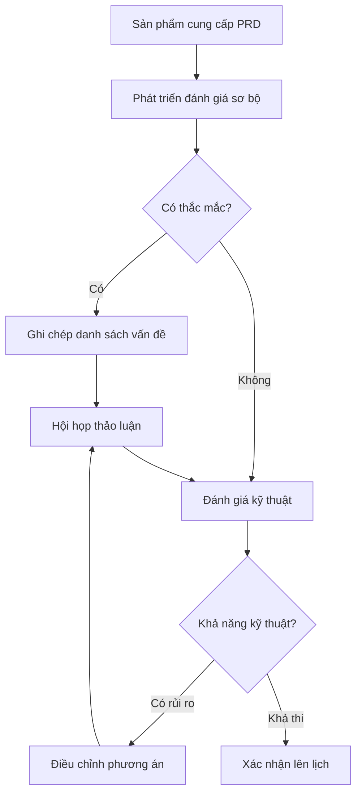

# 8.5.1 Xác nhận trước khi làm——Căn chỉnh yêu cầu

Sai hướng, code viết đẹp cũng lãng phí——căn chỉnh yêu cầu là bước đầu tiên của phát triển.

## Mục tiêu căn chỉnh yêu cầu

| Mục tiêu | Giải thích |
|------|------|
| Hiểu nhất quán | Sản phẩm, phát triển, kiểm thử hiểu yêu cầu nhất quán |
| Ranh giới rõ ràng | Rõ ràng những gì cần làm, những gì không làm |
| Xác nhận nghiệm thu | Tiêu chí hoàn thành có định nghĩa rõ ràng |
| Nhận dạng rủi ro | Phát hiện sớm khó khăn kỹ thuật và phụ thuộc |

## Các yếu tố chính của PRD

Một PRD (Product Requirement Document) tốt nên chứa:

### 1. Nền tảng và mục tiêu

```markdown
## Nền tảng
Người dùng phản hồi quy trình đăng nhập quá phức tạp, tỷ lệ mất người dùng cao.

## Mục tiêu
Đơn giản hóa quy trình đăng nhập, nâng cao tỷ lệ chuyển đổi đăng nhập 10%.

## Chỉ số thành công
- Thời gian hoàn thành đăng nhập giảm từ 30 giây xuống 15 giây
- Tỷ lệ thoát trang đăng nhập giảm 20%
```

### 2. Câu chuyện người dùng

```markdown
## Câu chuyện người dùng

Như là【Người dùng mới】
Tôi muốn【Đăng nhập nhanh qua mã xác thực điện thoại】
Để【Truy cập dịch vụ mà không cần nhớ mật khẩu】

Tiêu chí xác nhận：
- Nhận mã xác thực trong 5 giây sau khi nhập số điện thoại
- Mã xác thực có hiệu lực trong 5 phút
- Sau khi sai 3 lần cần chờ 1 phút
```

### 3. Danh sách chức năng

| Chức năng | Ưu tiên | Trạng thái |
|------|--------|------|
| Đăng nhập bằng mã xác thực điện thoại | P0 | Chờ phát triển |
| Lưu trạng thái đăng nhập | P0 | Chờ phát triển |
| Đăng nhập bên thứ ba (WeChat) | P1 | Chờ lên lịch |
| Đăng nhập bằng email | P2 | Tạm dừng |

### 4. Mô hình/Tương tác

- Liên kết mô hình trang
- Giải thích tương tác
- Xử lý trạng thái đặc biệt

## Quy trình đánh giá yêu cầu



## Danh sách kiểm tra đánh giá

### Từ góc độ sản phẩm

- [ ] Nền tảng yêu cầu và mục tiêu có rõ ràng không?
- [ ] Tình huống người dùng có đầy đủ không?
- [ ] Ưu tiên có hợp lý không?
- [ ] Có bỏ sót các trường hợp ranh giới không?

### Từ góc độ phát triển

- [ ] Có khả năng kỹ thuật không?
- [ ] Có phụ thuộc bên ngoài không?
- [ ] Ước tính khối lượng công việc có hợp lý không?
- [ ] Có ảnh hưởng đến chức năng hiện có không?

### Từ góc độ kiểm thử

- [ ] Tiêu chí xác nhận có rõ ràng không?
- [ ] Các trường hợp kiểm thử có đủ phủ sóng không?
- [ ] Yêu cầu hiệu suất có rõ ràng không?

## Ghi chép yêu cầu phiên bản đơn giản

Đối với dự án cá nhân hoặc đội nhỏ, có thể dùng Feature List đơn giản:

```markdown
# Feature: Tối ưu hóa đăng nhập người dùng

## Những gì cần làm
- [ ] Đăng nhập bằng mã xác thực điện thoại
- [ ] Giữ trạng thái đăng nhập trong 7 ngày
- [ ] Thông báo lỗi khi đăng nhập thất bại

## Những gì không làm
- Đăng nhập bên thứ ba (kỳ sau)
- Khôi phục mật khẩu (quy trình hiện có)

## Tiêu chí xác nhận
- Mã xác thực gửi trong 5 giây
- Sau khi đăng nhập chuyển hướng đến trang chủ
- Thông báo lỗi rõ ràng có thể hiểu được

## Ghi chú kỹ thuật
- Dùng dịch vụ SMS của Aliyun
- Dùng JWT để thực hiện trạng thái đăng nhập
- Cần backend API phối hợp
```

## Phân tích yêu cầu hỗ trợ AI

**Ví dụ Prompt**：
> "Tôi muốn làm chức năng đăng nhập người dùng, hỗ trợ hai cách: mã xác thực điện thoại và mật khẩu. Hãy giúp tôi:
> 1. Liệt kê các trường hợp ranh giới cần xem xét
> 2. Chia thành các tác vụ phát triển cụ thể
> 3. Ước tính thời gian phát triển cho từng tác vụ"

## Các câu hỏi thường gặp

### Q: Phải làm gì khi yêu cầu thay đổi?

1. Đánh giá ảnh hưởng của thay đổi
2. Ghi chú lý do thay đổi
3. Điều chỉnh lên lịch và tài nguyên
4. Đồng bộ với tất cả các bên liên quan

### Q: Phải làm gì khi yêu cầu không rõ ràng?

1. Liệt kê tất cả các điểm thắc mắc
2. Tổ chức cuộc họp hoặc tài liệu xác nhận
3. Cập nhật PRD sau khi xác nhận rõ
4. Nếu vẫn không rõ, hãy làm phần chắc chắn trước

## Danh sách nghiệm thu

- [ ] Hiểu những yếu tố chính của PRD
- [ ] Có khả năng viết Feature List phiên bản đơn giản
- [ ] Biết các điểm kiểm tra của đánh giá yêu cầu
- [ ] Hiểu cách xử lý thay đổi yêu cầu
