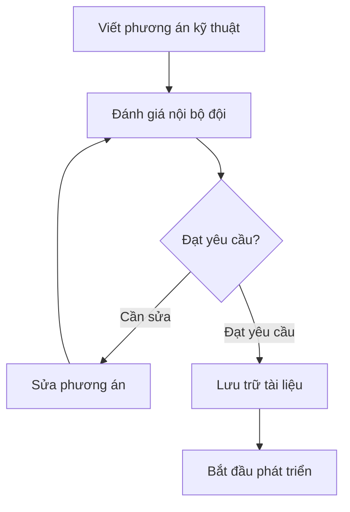

# 8.5.2 Phương án kỹ thuật có đáng tin không——Đánh giá kỹ thuật

Code viết nửa chừng phát hiện phương án không thể tiếp tục, đó là lãng phí thời gian nhất——đánh giá kỹ thuật giúp bạn tránh được tình huống này sớm.

## Mục tiêu đánh giá kỹ thuật

| Mục tiêu | Giải thích |
|------|------|
| Phương án khả thi | Đảm bảo phương án kỹ thuật có thể triển khai |
| Nhận dạng rủi ro | Phát hiện sớm các vấn đề tiềm tàng |
| Chia sẻ kiến thức | Các thành viên đội hiểu thiết kế hệ thống |
| Tối ưu phương án | Lắng nghe ý kiến để cải thiện thiết kế |

## Tình huống nào cần đánh giá kỹ thuật

| Tình huống | Cần đánh giá | Ví dụ |
|------|----------|------|
| Hệ thống mới | Có | Thiết kế kiến trúc dự án mới |
| Tái cấu trúc lớn | Có | Di chuyển cơ sở dữ liệu, nâng cấp framework |
| Chức năng phức tạp | Có | Hệ thống thanh toán, hệ thống quyền hạn |
| Chức năng đơn giản | Không | Thêm nút, sửa văn bản |
| Tối ưu hiệu suất | Tùy trường hợp | Thay đổi kiến trúc cần có |

## Mẫu tài liệu phương án kỹ thuật

### ADR (Architecture Decision Record)

```markdown
# ADR-001: Lựa chọn phương án xác thực người dùng

## Trạng thái
Đã chấp nhận

## Nền tảng
Cần thực hiện chức năng xác thực người dùng, hỗ trợ đăng nhập từ nhiều thiết bị, làm mới token, v.v.

## Quyết định
Sử dụng phương án JWT + Refresh Token, kết hợp với NextAuth.js để thực hiện.

## So sánh phương án

| Phương án | Ưu điểm | Nhược điểm |
|------|------|------|
| Session | Đơn giản, có thể vô hiệu hóa bất kỳ lúc nào | Cần lưu trữ phía server, khả năng mở rộng yếu |
| JWT | Không có trạng thái, khả năng mở rộng tốt | Rủi ro token bị rò rỉ, không thể vô hiệu hóa chủ động |
| JWT + Refresh | Cân bằng bảo mật và trải nghiệm | Độ phức tạp thực hiện cao hơn |

## Phương án thực hiện

### 1. Thiết kế Token
- Access Token: Thời gian hiệu lực 15 phút
- Refresh Token: Thời gian hiệu lực 7 ngày, lưu trữ trong HttpOnly Cookie

### 2. Cơ chế làm mới
- Frontend chặn response 401
- Tự động dùng Refresh Token để lấy Access Token mới
- Nếu Refresh Token hết hạn thì chuyển hướng đến trang đăng nhập

### 3. Biện pháp bảo mật
- Access Token lưu trữ trong bộ nhớ
- Refresh Token dùng HttpOnly Cookie
- Hỗ trợ đăng xuất đơn lẻ (danh sách đen Redis)

## Hệ quả
- Cần giới thiệu Redis để lưu trữ danh sách đen Token
- Frontend cần thực hiện logic làm mới Token
- Dự kiến chu kỳ phát triển 3 ngày
```

### Tài liệu thiết kế kỹ thuật (phiên bản ngắn)

```markdown
# Thiết kế kỹ thuật: Hệ thống thông báo tin nhắn

## 1. Tổng quan yêu cầu
Thực hiện thông báo tin nhắn nội bộ, hỗ trợ thông báo hệ thống và tin nhắn người dùng.

## 2. Thiết kế kiến trúc

```
┌──────────┐     ┌──────────┐     ┌──────────┐
│ Producer │ --> │  Queue   │ --> │ Consumer │
│  (API)   │     │  (Redis) │     │ (Worker) │
└──────────┘     └──────────┘     └──────────┘
                                       │
                                       ▼
                               ┌──────────────┐
                               │   Database   │
                               └──────────────┘
```

## 3. Mô hình dữ liệu

```prisma
model Notification {
  id        String   @id @default(cuid())
  userId    String
  type      String   // system, mention, reply
  content   Json
  read      Boolean  @default(false)
  createdAt DateTime @default(now())
}
```

## 4. Thiết kế API

- GET /api/notifications - Lấy danh sách thông báo
- PATCH /api/notifications/:id/read - Đánh dấu đã đọc
- DELETE /api/notifications/:id - Xóa thông báo

## 5. Rủi ro và biện pháp khắc phục

| Rủi ro | Biện pháp khắc phục |
|------|------|
| Lượng tin nhắn lớn gây vấn đề hiệu suất | Phân trang + tối ưu chỉ mục |
| Mất tin nhắn | Redis lưu trữ bền vững + cơ chế thử lại |
| Ghi đồng thời | Giảm tải hàng đợi tin nhắn |

## 6. Lên lịch
- Chức năng cơ bản: 2 ngày
- Hàng đợi tin nhắn: 1 ngày
- Kiểm thử và lên sóng: 1 ngày
```

## Quy trình đánh giá kỹ thuật



## Danh sách kiểm tra đánh giá

### Khả thi

- [ ] Phương án kỹ thuật có đầy đủ không?
- [ ] Có rủi ro kỹ thuật không?
- [ ] Các dịch vụ phụ thuộc có sẵn không?
- [ ] Có phương án đơn giản hơn không?

### Hiệu suất

- [ ] Dự kiến QPS là bao nhiêu?
- [ ] Khi lượng dữ liệu tăng có thể hỗ trợ không?
- [ ] Có tiềm ẩn nút thắt hiệu suất không?

### Bảo mật

- [ ] Dữ liệu nhạy cảm lưu trữ như thế nào?
- [ ] Giao diện có cần xác thực không?
- [ ] Có rủi ro tiêm nhiễm không?

### Dễ bảo trì

- [ ] Phương án có dễ hiểu không?
- [ ] Mở rộng sau này có tiện không?
- [ ] Có thiết kế quá mức không?

## Đánh giá kỹ thuật hỗ trợ AI

**Ví dụ Prompt**：
> "Tôi thiết kế một phương án hàng đợi tin nhắn, dùng cấu trúc List của Redis để thực hiện. Hãy giúp tôi đánh giá:
> 1. Những rủi ro kỹ thuật tiềm ẩn
> 2. Nút thắt hiệu suất nằm ở đâu
> 3. Có phương án thay thế tốt hơn không"

## Danh sách nghiệm thu

- [ ] Có khả năng viết tài liệu phương án kỹ thuật cơ bản
- [ ] Hiểu cấu trúc và mục đích của ADR
- [ ] Biết các điểm kiểm tra chính của đánh giá kỹ thuật
- [ ] Có khả năng nhận dạng rủi ro tiềm ẩn trong phương án
