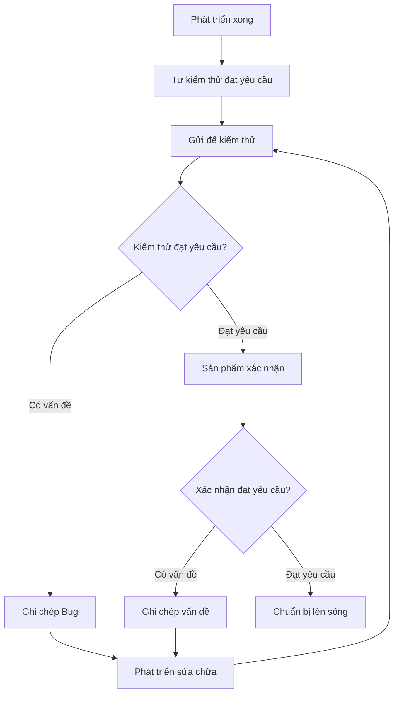

# 8.5.3 Làm xong rồi coi như xong chưa——Tiêu chí nghiệm thu

"Làm xong rồi" không bằng "làm tốt rồi"——tiêu chí nghiệm thu rõ ràng giúp cả hai bên có chung hiểu biết.

## Tác dụng của tiêu chí nghiệm thu

| Vấn đề | Hậu quả | Giải pháp |
|------|------|----------|
| Tiêu chí mơ hồ | Làm xong không biết coi như xong hay chưa | Định lượng tiêu chí nghiệm thu |
| Ranh giới không rõ | Chỉnh sửa lặp lại nhiều lần | Rõ ràng điều kiện ranh giới |
| Chất lượng không nhất quán | Mỗi lần giao hàng chất lượng dao động | Chuẩn hóa tiêu chuẩn chất lượng |

## Phân loại tiêu chí nghiệm thu

### 1. Nghiệm thu chức năng

**Vấn đề cốt lõi**：Chức năng có được thực hiện đúng theo yêu cầu không?

```markdown
## Tiêu chí nghiệm thu chức năng đăng nhập

### Quy trình bình thường
- [ ] Nhập đúng số điện thoại + mã xác thực, đăng nhập thành công
- [ ] Sau khi đăng nhập chuyển hướng chính xác đến trang chủ
- [ ] Trạng thái đăng nhập được giữ lại trong 7 ngày

### Quy trình ngoại lệ
- [ ] Định dạng số điện thoại không đúng, hiển thị "Số điện thoại không đúng định dạng"
- [ ] Mã xác thực không đúng, hiển thị "Mã xác thực không đúng"
- [ ] Sai liên tục 3 lần, khoá trong 1 phút
- [ ] Mã xác thực hết hạn, hiển thị "Mã xác thực đã hết hạn"

### Điều kiện ranh giới
- [ ] Số điện thoại trống, nút gửi bị vô hiệu hóa
- [ ] Mã xác thực không phải 6 chữ số, nút gửi bị vô hiệu hóa
- [ ] Mạng yếu có trạng thái loading
```

### 2. Nghiệm thu hiệu suất

**Vấn đề cốt lõi**：Hệ thống có đủ nhanh, đủ ổn định không?

| Chỉ số | Tiêu chuẩn | Giải thích |
|------|------|------|
| Tải trang | < 3 giây | Thời gian tải hoàn toàn trang đầu tiên |
| Phản hồi API | < 500ms | Thời gian phản hồi tại mức độ 95 phần trăm |
| Khả năng đồng thời | > 100 QPS | Kết quả kiểm tra áp lực của một thực thể duy nhất |
| Tỷ lệ lỗi | < 0,1% | Giám sát môi trường sản xuất |

### 3. Nghiệm thu tương thích

```markdown
## Tương thích trình duyệt

### Phải hỗ trợ
- [ ] Chrome hai phiên bản mới nhất
- [ ] Safari hai phiên bản mới nhất
- [ ] Firefox phiên bản mới nhất

### Di động
- [ ] iOS Safari 15+
- [ ] Android Chrome phiên bản mới nhất

### Có thể giảm chất lượng
- [ ] IE (không hỗ trợ, hiển thị gợi ý nâng cấp)
```

### 4. Nghiệm thu bảo mật

```markdown
## Danh sách kiểm tra bảo mật

### Xác thực và phân quyền
- [ ] Không thể truy cập trang được bảo vệ nếu chưa đăng nhập
- [ ] Không thể truy cập dữ liệu của người dùng khác
- [ ] Xử lý chính xác sau khi token hết hạn

### Xác thực đầu vào
- [ ] Bảo vệ chống tấn công XSS
- [ ] Bảo vệ chống tiêm SQL
- [ ] Bảo vệ chống CSRF

### Dữ liệu nhạy cảm
- [ ] Mật khẩu không được lưu trữ dưới dạng văn bản thô
- [ ] Thông tin nhạy cảm không được ghi lại trong nhật ký
- [ ] Truyền HTTPS
```

## Quy trình nghiệm thu



## Kiểm thử tự động như nghiệm thu

Sử dụng kiểm thử tự động thay thế một phần nghiệm thu thủ công:

### Kiểm thử đơn vị

```typescript
describe('Kiểm tra xác thực biểu mẫu đăng nhập', () => {
  it('Hiển thị lỗi khi định dạng số điện thoại không đúng', () => {
    render(<LoginForm />);
    fireEvent.change(screen.getByPlaceholderText('Số điện thoại'), {
      target: { value: '123' }
    });
    expect(screen.getByText('Số điện thoại không đúng định dạng')).toBeInTheDocument();
  });

  it('Vô hiệu hóa nút gửi khi độ dài mã xác thực không đủ', () => {
    render(<LoginForm />);
    fireEvent.change(screen.getByPlaceholderText('Mã xác thực'), {
      target: { value: '12' }
    });
    expect(screen.getByRole('button', { name: 'Đăng nhập' })).toBeDisabled();
  });
});
```

### Kiểm thử từ đầu đến cuối (E2E)

```typescript
// Kiểm thử Playwright
test('Quy trình đăng nhập người dùng', async ({ page }) => {
  await page.goto('/login');

  await page.fill('[name="phone"]', '13800138000');
  await page.click('button:has-text("Lấy mã xác thực")');

  // Chờ gửi mã xác thực
  await expect(page.locator('text=Lấy lại sau 60 giây')).toBeVisible();

  await page.fill('[name="code"]', '123456');
  await page.click('button:has-text("Đăng nhập")');

  // Xác minh chuyển hướng đến trang chủ
  await expect(page).toHaveURL('/');
});
```

## Mẫu tài liệu nghiệm thu

```markdown
# Báo cáo nghiệm thu chức năng

## Thông tin cơ bản
- Tên chức năng: Tối ưu hóa đăng nhập người dùng
- Nhân viên phát triển: Nguyễn Văn A
- Nhân viên kiểm thử: Trần Thị B
- Ngày nghiệm thu: 2024-01-15

## Nghiệm thu chức năng

| Mục nghiệm thu | Kết quả | Ghi chú |
|--------|------|------|
| Đăng nhập bằng mã xác thực điện thoại | ✅ Đạt yêu cầu | - |
| Thông báo lỗi | ✅ Đạt yêu cầu | - |
| Giữ lại trạng thái đăng nhập | ✅ Đạt yêu cầu | - |
| Cơ chế khoá | ⚠️ Có vấn đề | Hiển thị thời gian đếm ngược không chính xác |

## Nghiệm thu hiệu suất

| Chỉ số | Yêu cầu | Thực tế | Kết quả |
|------|------|------|------|
| Tải trang | < 3 giây | 2,1 giây | ✅ Đạt yêu cầu |
| Phản hồi giao diện | < 500ms | 180ms | ✅ Đạt yêu cầu |

## Vấn đề chờ xử lý
1. [ ] Hiển thị thời gian đếm ngược khoá không chính xác

## Kết luận nghiệm thu
- [x] Chức năng cơ bản hoàn thành, còn vấn đề nhỏ cần sửa
- [ ] Có thể lên sóng (chờ sửa xong vấn đề)
```

## Nghiệm thu hỗ trợ AI

**Ví dụ Prompt**：
> "Tôi thực hiện chức năng đăng nhập người dùng, hỗ trợ đăng nhập bằng mã xác thực điện thoại. Hãy giúp tôi tạo:
> 1. Danh sách kiểm tra trường hợp kiểm thử chức năng
> 2. Các điểm kiểm tra điều kiện ranh giới
> 3. Mục kiểm tra bảo mật"

## Danh sách nghiệm thu

- [ ] Có khả năng viết tiêu chí nghiệm thu rõ ràng
- [ ] Hiểu sự khác biệt giữa nghiệm thu chức năng, hiệu suất, bảo mật
- [ ] Có khả năng dùng kiểm thử tự động thay thế một phần nghiệm thu
- [ ] Biết cách ghi chép kết quả nghiệm thu
