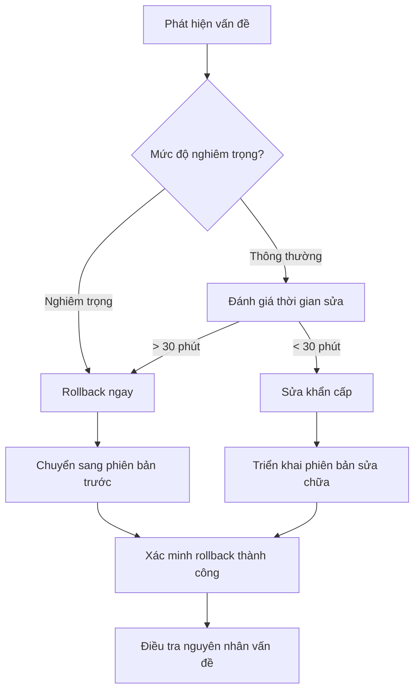

# 8.5.4 Quy trình tiêu chuẩn lên sóng——Quy trình triển khai

Lên sóng không phải điểm kết mà là điểm bắt đầu——quy trình triển khai chuẩn mực giúp bạn lên sóng an tâm, khi có vấn đề có thể rollback nhanh.

## Nguyên tắc cốt lõi triển khai

| Nguyên tắc | Giải thích | Thực hành |
|------|------|------|
| Có thể tái tạo | Mỗi lần triển khai kết quả nhất quán | Dùng Docker |
| Có thể rollback | Có vấn đề có thể phục hồi nhanh | Lưu giữ phiên bản cũ |
| Có thể quan sát | Biết trạng thái chạy của hệ thống | Nhật ký + Giám sát |
| Tự động hóa | Giảm thao tác thủ công | CI/CD |

## So sánh cách thức triển khai

| Cách thức | Ưu điểm | Nhược điểm | Trường hợp phù hợp |
|------|------|------|----------|
| Vercel | Không cấu hình, tự động CI | Tính năng bị giới hạn, giá cả | Frontend/API nhẹ |
| Docker | Môi trường nhất quán, có thể di chuyển | Cần máy chủ | Dịch vụ backend |
| 1Panel | Giao diện trực quan, dễ quản lý | Chi phí học tập | Dự án tự lưu trữ |
| K8s | Tính khả dụng cao, tự động mở rộng | Độ phức tạp cao | Triển khai quy mô lớn |

## Triển khai Next.js trên 1Panel

### 1. Chuẩn bị Dockerfile

```dockerfile
# Dockerfile
FROM node:20-alpine AS base

# Cài đặt phụ thuộc
FROM base AS deps
WORKDIR /app
COPY package.json pnpm-lock.yaml ./
RUN corepack enable pnpm && pnpm install --frozen-lockfile

# Xây dựng
FROM base AS builder
WORKDIR /app
COPY --from=deps /app/node_modules ./node_modules
COPY . .
RUN corepack enable pnpm && pnpm build

# Hình ảnh sản xuất
FROM base AS runner
WORKDIR /app
ENV NODE_ENV=production

RUN addgroup --system --gid 1001 nodejs
RUN adduser --system --uid 1001 nextjs

COPY --from=builder /app/public ./public
COPY --from=builder --chown=nextjs:nodejs /app/.next/standalone ./
COPY --from=builder --chown=nextjs:nodejs /app/.next/static ./.next/static

USER nextjs
EXPOSE 3000
ENV PORT=3000
ENV HOSTNAME="0.0.0.0"

CMD ["node", "server.js"]
```

### 2. Cấu hình next.config.js

```javascript
/** @type {import('next').NextConfig} */
const nextConfig = {
  output: 'standalone',
};

module.exports = nextConfig;
```

### 3. Tạo ứng dụng trên 1Panel

1. Vào 1Panel → Cửa hàng ứng dụng → Tạo ứng dụng tùy chỉnh
2. Điền thông tin ứng dụng
3. Tải Dockerfile hoặc cấu hình kho lưu trữ Git
4. Cấu hình biến môi trường
5. Khởi động ứng dụng

### 4. Cấu hình proxy ngược

Cấu hình Nginx trong 1Panel:

```nginx
server {
    listen 80;
    server_name your-domain.com;

    location / {
        proxy_pass http://localhost:3000;
        proxy_http_version 1.1;
        proxy_set_header Upgrade $http_upgrade;
        proxy_set_header Connection 'upgrade';
        proxy_set_header Host $host;
        proxy_cache_bypass $http_upgrade;
    }
}
```

## Triển khai tự động GitHub Actions

```yaml
# .github/workflows/deploy.yml
name: Deploy

on:
  push:
    branches: [main]

jobs:
  deploy:
    runs-on: ubuntu-latest
    steps:
      - uses: actions/checkout@v4

      - name: Build Docker image
        run: docker build -t myapp:latest .

      - name: Push to Registry
        run: |
          echo "${{ secrets.DOCKER_PASSWORD }}" | docker login -u "${{ secrets.DOCKER_USERNAME }}" --password-stdin
          docker tag myapp:latest ${{ secrets.DOCKER_REGISTRY }}/myapp:latest
          docker push ${{ secrets.DOCKER_REGISTRY }}/myapp:latest

      - name: Deploy to Server
        uses: appleboy/ssh-action@v1.0.0
        with:
          host: ${{ secrets.SERVER_HOST }}
          username: ${{ secrets.SERVER_USER }}
          key: ${{ secrets.SSH_PRIVATE_KEY }}
          script: |
            docker pull ${{ secrets.DOCKER_REGISTRY }}/myapp:latest
            docker stop myapp || true
            docker rm myapp || true
            docker run -d --name myapp -p 3000:3000 \
              --env-file /root/.env.production \
              ${{ secrets.DOCKER_REGISTRY }}/myapp:latest
```

## Danh sách kiểm tra triển khai

### Trước triển khai

- [ ] Code đã hợp nhất vào nhánh main
- [ ] Tất cả kiểm thử đã thành công
- [ ] Cấu hình biến môi trường chính xác
- [ ] Di chuyển cơ sở dữ liệu sẵn sàng
- [ ] Thông báo cho những người liên quan

### Trong quá trình triển khai

- [ ] Giám sát tiến độ triển khai
- [ ] Kiểm tra đầu ra nhật ký
- [ ] Xác minh dịch vụ khởi động

### Sau triển khai

- [ ] Truy cập các trang chính để xác minh
- [ ] Kiểm tra chỉ số giám sát
- [ ] Xác nhận nhật ký bình thường
- [ ] Giữ khả năng rollback

## Chiến lược rollback



### Docker rollback

```bash
# Xem lịch sử phiên bản
docker images myapp

# Rollback sang phiên bản chỉ định
docker stop myapp
docker rm myapp
docker run -d --name myapp -p 3000:3000 myapp:previous-tag
```

## Giám sát và cảnh báo

### Giám sát cơ bản

```yaml
# docker-compose.yml thêm kiểm tra sức khỏe
services:
  app:
    image: myapp:latest
    healthcheck:
      test: ["CMD", "curl", "-f", "http://localhost:3000/api/health"]
      interval: 30s
      timeout: 10s
      retries: 3
```

### API kiểm tra sức khỏe

```typescript
// app/api/health/route.ts
export async function GET() {
  try {
    // Kiểm tra kết nối cơ sở dữ liệu
    await prisma.$queryRaw`SELECT 1`;

    return Response.json({
      status: 'healthy',
      timestamp: new Date().toISOString(),
    });
  } catch (error) {
    return Response.json(
      { status: 'unhealthy', error: error.message },
      { status: 503 }
    );
  }
}
```

## Hướng dẫn cộng tác AI

**Ví dụ Prompt**：
> "Tôi muốn triển khai dự án Next.js lên máy chủ của mình (Ubuntu 22.04), dùng Docker. Hãy giúp tôi:
> 1. Viết Dockerfile xây dựng nhiều giai đoạn
> 2. Cấu hình GitHub Actions triển khai tự động
> 3. Thiết lập proxy ngược Nginx và HTTPS"

## Danh sách nghiệm thu

- [ ] Có khả năng viết Dockerfile cho Next.js
- [ ] Hiểu quy trình triển khai tự động CI/CD
- [ ] Biết các điểm kiểm tra trước và sau triển khai
- [ ] Nắm vững chiến lược rollback và cơ bản giám sát
