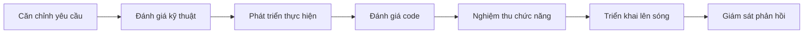

# 8.5 Đã căn chỉnh trước khi bắt đầu không——Quy trình làm việc

Dù code viết tốt đến mấy cũng cứu không nổi "sai hướng"——căn chỉnh, đánh giá, nghiệm thu là quy trình chủ chốt để đảm bảo giá trị đầu ra.

## Tại sao cần có quy trình

| Vấn đề | Hậu quả | Giải pháp |
|------|------|----------|
| Lệch hiểu yêu cầu | Làm xong phát hiện không phải cái cần | Căn chỉnh yêu cầu |
| Phương án kỹ thuật có rủi ro | Phát triển nửa chừng phát hiện không thể tiếp tục | Đánh giá kỹ thuật |
| Tiêu chí hoàn thành mơ hồ | Làm xong không biết coi như xong hay chưa | Tiêu chí nghiệm thu |
| Lên sóng không chuẩn | Lên sóng xong phát hiện lỗi không biết rollback | Quy trình triển khai |

## Quy trình phát triển toàn vẹn

## Cấu trúc của phần này

1. **Căn chỉnh yêu cầu**：Đánh giá PRD và xác nhận, đảm bảo làm đúng việc
2. **Đánh giá kỹ thuật**：Thiết kế phương án và đánh giá rủi ro, đảm bảo khả năng kỹ thuật
3. **Tiêu chí nghiệm thu**：Kiểm thử chức năng và chỉ số hiệu suất, đảm bảo chất lượng đạt chuẩn
4. **Quy trình triển khai**：Triển khai 1Panel và quy chuẩn lên sóng

## Nguyên tắc đơn giản hóa quy trình

Với đội nhỏ hoặc dự án cá nhân, có thể đơn giản hóa quy trình:

| Quy trình đầy đủ | Phiên bản đơn giản |
|----------|----------|
| Tài liệu PRD | Danh sách Feature đơn giản |
| Hội họp đánh giá kỹ thuật | Tự viết ADR |
| Nghiệm thu từ đội test | Kiểm thử tự động + tự test |
| Triển khai bởi vận hành | Tự động hóa CI/CD |

**Nguyên tắc cốt lõi**：
- Có ghi chép > Không ghi chép
- Tự động hóa > Thao tác thủ công
- Phát hiện sớm > Sửa sau khi lên sóng

## Hướng dẫn cộng tác AI

AI có thể hỗ trợ các khâu trong quy trình:

- **Căn chỉnh yêu cầu**：Giúp chia nhỏ yêu cầu, tạo câu chuyện người dùng
- **Đánh giá kỹ thuật**：Phân tích ưu khuyết của phương án kỹ thuật
- **Tiêu chí nghiệm thu**：Tạo bộ kiểm thử, kiểm tra điều kiện ranh giới
- **Quy trình triển khai**：Tạo kịch bản triển khai, kiểm tra cấu hình

## Danh sách nghiệm thu

- [ ] Hiểu được tác dụng từng giai đoạn của quy trình phát triển
- [ ] Có khả năng chọn quy trình phù hợp theo quy mô dự án
- [ ] Nắm vững cách thức căn chỉnh yêu cầu và đánh giá kỹ thuật cơ bản
- [ ] Hiểu về tiêu chí nghiệm thu và quy chuẩn triển khai
