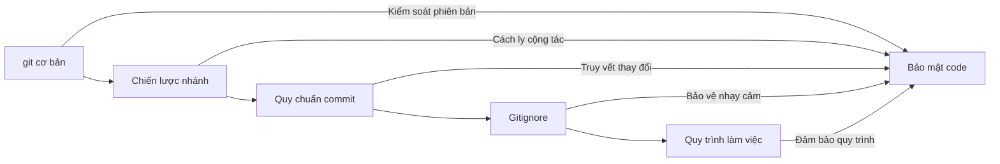

# 8 ｜Quy tắc dự án và Cộng tác

Code viết tốt đến đâu, không có quản lý phiên bản và quy chuẩn cộng tác, cuối cùng cũng sẽ thành một mớ hỗn độn.

## Tại sao cần quy tắc dự án?

Trong giai đoạn phát triển cá nhân, bạn có thể nghĩ rằng "mình phát triển một mình, viết thoải mái cũng được". Nhưng khi bạn gặp các tình huống sau, bạn sẽ hiểu sâu sắc giá trị của quy chuẩn:

- Code hôm qua hôm nay chạy không được, nhưng không biết đã sửa gì
- Nhiều người cộng tác ghi đè code của nhau
- Secret key bị lộ lên GitHub public repository
- Không biết tính năng nào do ai phát triển, tại sao lại viết như vậy

**Bản chất của quy tắc dự án là giảm chi phí cộng tác** — bao gồm cộng tác với người khác, cũng bao gồm cộng tác với "bản thân trong tương lai".

## Nội dung cốt lõi chương này

```
┌─────────────────────────────────────────────────────────────┐
│                    Quy tắc dự án và Cộng tác                  │
├─────────────────────────────────────────────────────────────┤
│  8.1 git cơ bản      │  Thao tác cơ bản kiểm soát phiên bản và cơ chế rollback  │
│  8.2 Chiến lược nhánh │  Quản lý nhánh cộng tác nhiều người và quy tắc bảo vệ   │
│  8.3 Quy chuẩn commit │  Conventional Commits và tự động hóa                    │
│  8.4 Gitignore       │  Chiến lược loại trừ file nhạy cảm và build artifact    │
│  8.5 Quy trình làm việc │  Vòng lặp đầy đủ: Đối chiếu→Nghiệm thu→Kiểm tra→Lên sóng │
└─────────────────────────────────────────────────────────────┘
```

## Quan hệ logic các mục



## Mục tiêu học tập

Sau khi hoàn thành chương này, bạn sẽ có thể:

| Năng lực | Biểu hiện cụ thể |
|------|----------|
| Thao tác git | Thành thạo add/commit/push/pull, xử lý conflict và rollback |
| Quản lý nhánh | Hiểu Git Flow và GitHub Flow, cấu hình bảo vệ nhánh |
| Quy chuẩn commit | Dùng Conventional Commits, cấu hình commitlint |
| Ý thức bảo mật | Cấu hình .gitignore đúng, tránh lộ thông tin nhạy cảm |
| Quy trình cộng tác | Nắm vững toàn quy trình: Nghiệm thu PRD, nghiệm thu kỹ thuật, kiểm tra, lên sóng |

## Gợi ý cộng tác AI

Trong cộng tác dự án, AI có thể giúp bạn:

- Sinh commit message chuẩn
- Viết mô tả PR và ý kiến review
- Cấu hình template .gitignore
- Soạn thảo tài liệu PRD và phương án kỹ thuật

**Từ khóa chính**: `git flow`, `conventional commits`, `branch protection`, `code review`, `.gitignore`
