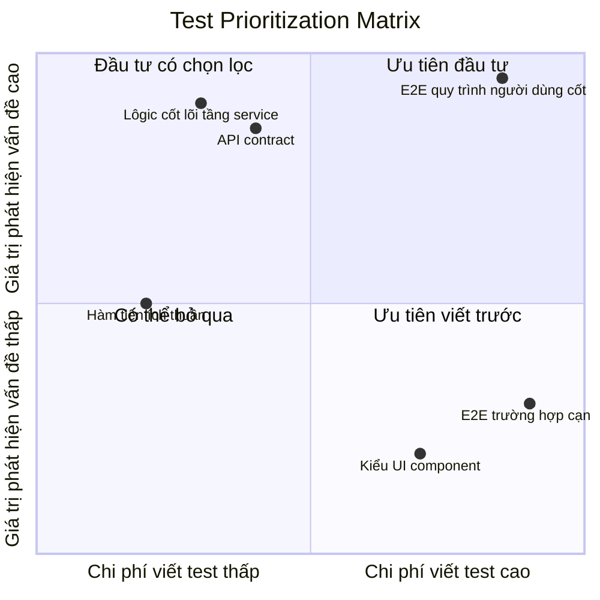
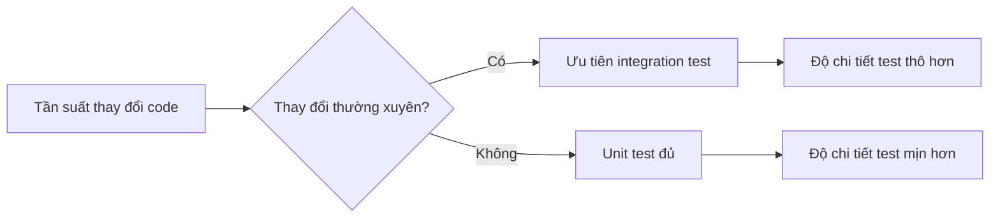

# 9.1.2 Thời gian phải dùng ở chỗ mũi nhọn — Test prioritization: Phân tích ROI

**Mục đích của test không phải để đạt được độ bao phủ 100%, mà là để có được bảo đảm chất lượng tối đa với đầu tư tối thiểu.**

## Ma trận ROI của test



## Nguyên tắc sắp xếp ưu tiên

### Ưu tiên cấp một: Logic kinh doanh tầng service

Tầng service là nơi tập trung các quy tắc kinh doanh, lỗi ở đây gây ra tổn thất lớn nhất.

```typescript
// Test ưu tiên cao: Tính toán tổng tiền đơn hàng
describe('OrderService.calculateTotal', () => {
  it('nên tính toán đúng tổng tiền đơn hàng (bao gồm chiết khấu)', async () => {
    const total = await orderService.calculateTotal({
      items: [
        { price: 100, quantity: 2 },
        { price: 50, quantity: 1 },
      ],
      discountCode: 'SAVE10',
    });

    // 250 * 0.9 = 225
    expect(total).toBe(225);
  });

  it('nên xử lý điều kiện biên tồn kho không đủ', async () => {
    await expect(
      orderService.createOrder({ productId: 'prod-1', quantity: 999 })
    ).rejects.toThrow('Tồn kho không đủ');
  });
});
```

### Ưu tiên cấp hai: API contract

API là cam kết với bên ngoài, một khi thay đổi sẽ ảnh hưởng rộng.

```typescript
// Test ưu tiên cao: Định dạng phản hồi API
describe('POST /api/orders', () => {
  it('nên trả về định dạng phản hồi chuẩn', async () => {
    const response = await request(app)
      .post('/api/orders')
      .send({ items: [{ productId: 'prod-1', quantity: 1 }] });

    expect(response.status).toBe(201);
    expect(response.body).toMatchObject({
      success: true,
      data: {
        id: expect.any(String),
        status: 'PENDING',
        createdAt: expect.any(String),
      },
    });
  });

  it('nên xử lý đúng lỗi xác thực tham số', async () => {
    const response = await request(app)
      .post('/api/orders')
      .send({ items: [] }); // Mảng rỗng

    expect(response.status).toBe(400);
    expect(response.body.error.code).toBe('VALIDATION_ERROR');
  });
});
```

### Ưu tiên cấp ba: Hàm tiện ích thuần

Tỷ lệ ROI cao, viết dễ, chạy nhanh.

```typescript
// Test ưu tiên trung bình: Hàm tiện ích
describe('formatCurrency', () => {
  it('nên định dạng đúng tiền tệ nhân dân tệ', () => {
    expect(formatCurrency(1234.5, 'CNY')).toBe('¥1,234.50');
    expect(formatCurrency(0, 'CNY')).toBe('¥0.00');
  });

  it('nên xử lý số âm', () => {
    expect(formatCurrency(-100, 'CNY')).toBe('-¥100.00');
  });
});
```

### Ưu tiên thấp: UI component và kiểu

UI thay đổi thường xuyên, chi phí bảo trì test cao, ưu tiên xem xét visual regression test.

## Danh sách kiểm tra nhanh để xác định giá trị test

| Mục kiểm tra | Giá trị cao | Giá trị thấp |
|-------------|-----------|-----------|
| Liên quan đến tính toán tiền tệ | ✅ | |
| Liên quan đến quyền người dùng | ✅ | |
| Liên quan đến bảo vệ dữ liệu | ✅ | |
| API interface đối ngoại | ✅ | |
| UI thuần hiển thị | | ✅ |
| Tính năng tạm thời/thử nghiệm | | ✅ |
| Code thay đổi thường xuyên | | ✅ |

## Hiểu đúng về test coverage

```
┌─────────────────────────────────────────────────────┐
│              Sự thật về coverage                    │
├─────────────────────────────────────────────────────┤
│                                                     │
│  ❌ Sai lầm: Theo đuổi 100% coverage               │
│  ✅ Cách đúng: Đường dẫn cốt lõi 100%, các trường  │
│     hợp cạnh 50%                                   │
│                                                     │
│  Code coverage 80% + Bao phủ kịch bản kinh doanh   │
│  100% = Bảo đảm chất lượng thực tế > 95%          │
│                                                     │
└─────────────────────────────────────────────────────┘
```

## Thực hành: Cách xác định các điểm test giá trị cao

### Phương pháp phân tích kịch bản

1. **Tự hỏi bản thân**: Nếu đoạn code này có lỗi, hậu quả tồi tệ nhất là gì?
2. **Đánh giá tác động**: Số lượng người dùng bị ảnh hưởng × Mức độ nghiêm trọng vấn đề
3. **Xác định ưu tiên**: Tác động càng lớn, ưu tiên test càng cao

```typescript
// Kịch bản tác động cao: Tính toán tiền thanh toán
// Nếu có lỗi → Tính nhiều/ít tiền cho người dùng → Phải test

// Kịch bản tác động thấp: Góc tròn avatar người dùng
// Nếu có lỗi → Xấu xí một chút → Không cần test
```

### Phương pháp tần suất thay đổi



- **Code thay đổi thường xuyên**: Sử dụng integration test chi tiết thô hơn, giảm chi phí bảo trì
- **Logic cốt lõi ổn định**: Sử dụng unit test chi tiết mịn hơn, xác định vấn đề chính xác

## Hướng dẫn hợp tác với AI

Để AI giúp bạn xác định ưu tiên test:

> **Ý định cốt lõi**: Phân tích code và khuyến nghị ưu tiên test
>
> **Mẫu prompt**:
> ```
> Phân tích code dưới đây, sắp xếp theo giá trị test từ cao xuống thấp, và giải thích lý do:
> 1. Những hàm/phương thức nào phải test
> 2. Những cái nào có thể test có chọn lọc
> 3. Những cái nào có thể tạm thời bỏ qua
>
> [Dán code]
> ```

**Các thuật ngữ chính**: `đường dẫn kinh doanh cốt lõi`, `điều kiện biên`, `xử lý lỗi`, `toàn vẹn dữ liệu`

## Kết luận phần này

Nguyên tắc cốt lõi của test prioritization là: **trước hết bảo đảm logic kinh doanh cốt lõi đúng, sau đó mở rộng phạm vi bao phủ từng bước**. Đầu tư 80% sức lực test vào 20% code quan trọng nhất, đó là chính thần của chiến lược test lười. Nhớ rằng, code không có test chưa chắc có lỗi, nhưng code quan trọng có test thì chắc chắn đáng tin cậy hơn.
