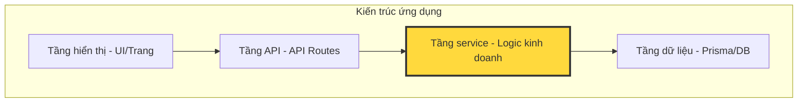

# 9.1.3 Logic kinh doanh là cốt lõi — Service layer test: Trọng tâm xác minh logic

**Tầng service là căn cứ của các quy tắc kinh doanh, test tốt tầng service cũng là bảo vệ cốt lõi của ứng dụng.**

## Tại sao test tầng service lại quan trọng nhất



Tầng service chịu trách nhiệm với những công việc cốt lõi:

| Trách nhiệm | Ví dụ | Tầm quan trọng test |
|----------|------|------------|
| Xác minh quy tắc kinh doanh | Tổng đơn hàng ≥ giá tối thiểu | ⭐⭐⭐ |
| Kiểm soát luồng trạng thái | Đơn hàng: chờ thanh toán → đã thanh toán → đang giao | ⭐⭐⭐ |
| Phối hợp giữa các thực thể | Khi đặt hàng cũng deduct kho, tạo phiếu thanh toán | ⭐⭐⭐ |
| Xác minh quyền | Người dùng chỉ có thể thao tác với đơn hàng của mình | ⭐⭐⭐ |
| Tổng hợp dữ liệu | Tính tổng giá trị giỏ hàng (bao gồm voucher) | ⭐⭐ |

## Các mẫu test cốt lõi tầng service

### Mẫu một: Xác minh quy tắc kinh doanh

```typescript
// services/order.service.ts
export class OrderService {
  private readonly MIN_ORDER_AMOUNT = 20; // Giá tối thiểu

  async createOrder(userId: string, items: CartItem[]): Promise<Order> {
    const totalAmount = this.calculateTotal(items);

    if (totalAmount < this.MIN_ORDER_AMOUNT) {
      throw new BusinessError('ORDER_BELOW_MINIMUM',
        `Tổng tiền đơn hàng không được dưới ${this.MIN_ORDER_AMOUNT} đồng`);
    }

    return this.prisma.order.create({
      data: { userId, items: { create: items }, totalAmount },
    });
  }
}

// __tests__/services/order.service.test.ts
describe('OrderService.createOrder', () => {
  it('nên từ chối đơn hàng dưới giá tối thiểu', async () => {
    const items = [{ productId: 'prod-1', price: 10, quantity: 1 }];

    await expect(
      orderService.createOrder('user-1', items)
    ).rejects.toThrow('Tổng tiền đơn hàng không được dưới 20 đồng');
  });

  it('nên chấp nhận đơn hàng đạt giá tối thiểu', async () => {
    const items = [{ productId: 'prod-1', price: 25, quantity: 1 }];

    const order = await orderService.createOrder('user-1', items);

    expect(order.totalAmount).toBe(25);
    expect(order.status).toBe('PENDING');
  });
});
```

### Mẫu hai: Test luồng trạng thái

```typescript
// services/order.service.ts
export class OrderService {
  private readonly STATUS_TRANSITIONS: Record<OrderStatus, OrderStatus[]> = {
    PENDING: ['PAID', 'CANCELLED'],
    PAID: ['SHIPPING', 'REFUNDING'],
    SHIPPING: ['DELIVERED'],
    DELIVERED: ['REFUNDING'],
    CANCELLED: [],
    REFUNDING: ['REFUNDED'],
    REFUNDED: [],
  };

  async updateStatus(orderId: string, newStatus: OrderStatus): Promise<Order> {
    const order = await this.prisma.order.findUnique({ where: { id: orderId } });

    if (!order) {
      throw new NotFoundError('ORDER_NOT_FOUND');
    }

    const allowedStatuses = this.STATUS_TRANSITIONS[order.status];
    if (!allowedStatuses.includes(newStatus)) {
      throw new BusinessError('INVALID_STATUS_TRANSITION',
        `Không thể chuyển từ ${order.status} sang ${newStatus}`);
    }

    return this.prisma.order.update({
      where: { id: orderId },
      data: { status: newStatus },
    });
  }
}

// __tests__/services/order.service.test.ts
describe('OrderService.updateStatus', () => {
  it('nên cho phép chuyển trạng thái hợp lệ', async () => {
    // Chuẩn bị: tạo đơn hàng chờ thanh toán
    const order = await createTestOrder({ status: 'PENDING' });

    // Thực hiện: chuyển sang đã thanh toán
    const updated = await orderService.updateStatus(order.id, 'PAID');

    // Xác minh
    expect(updated.status).toBe('PAID');
  });

  it('nên từ chối chuyển trạng thái không hợp lệ', async () => {
    const order = await createTestOrder({ status: 'DELIVERED' });

    // Đơn hàng đã giao không thể chuyển trực tiếp sang đã thanh toán
    await expect(
      orderService.updateStatus(order.id, 'PAID')
    ).rejects.toThrow('Không thể chuyển từ DELIVERED sang PAID');
  });

  it('nên bao phủ tất cả đường dẫn chuyển trạng thái', async () => {
    // Test toàn bộ chuỗi chuyển đổi trạng thái
    const order = await createTestOrder({ status: 'PENDING' });

    await orderService.updateStatus(order.id, 'PAID');
    await orderService.updateStatus(order.id, 'SHIPPING');
    await orderService.updateStatus(order.id, 'DELIVERED');

    const finalOrder = await prisma.order.findUnique({ where: { id: order.id } });
    expect(finalOrder?.status).toBe('DELIVERED');
  });
});
```

### Mẫu ba: Test phối hợp giữa các thực thể

```typescript
// __tests__/services/order.service.test.ts
describe('OrderService xử lý giữa các thực thể', () => {
  it('đặt hàng nên deduct tồn kho cùng lúc', async () => {
    // Chuẩn bị: tạo sản phẩm
    await prisma.product.create({
      data: { id: 'prod-1', name: 'Sản phẩm test', stock: 10 },
    });

    // Thực hiện: đặt hàng
    await orderService.createOrder('user-1', [
      { productId: 'prod-1', quantity: 3 },
    ]);

    // Xác minh: tồn kho nên giảm
    const product = await prisma.product.findUnique({ where: { id: 'prod-1' } });
    expect(product?.stock).toBe(7);
  });

  it('hủy đơn hàng nên khôi phục tồn kho', async () => {
    // Chuẩn bị
    const order = await createTestOrder({
      items: [{ productId: 'prod-1', quantity: 3 }],
    });

    // Thực hiện
    await orderService.cancelOrder(order.id);

    // Xác minh
    const product = await prisma.product.findUnique({ where: { id: 'prod-1' } });
    expect(product?.stock).toBe(10); // Khôi phục tồn kho gốc
  });

  it('đặt hàng không đủ tồn kho nên thất bại', async () => {
    await prisma.product.create({
      data: { id: 'prod-1', stock: 2 },
    });

    await expect(
      orderService.createOrder('user-1', [
        { productId: 'prod-1', quantity: 5 }, // Vượt tồn kho
      ])
    ).rejects.toThrow('Tồn kho không đủ');
  });
});
```

## Những phương pháp hay nhất cho service layer test

### Chiến lược chuẩn bị dữ liệu test

```typescript
// test/helpers/factory.ts
export async function createTestUser(overrides: Partial<User> = {}) {
  return prisma.user.create({
    data: {
      id: `user-${Date.now()}`,
      email: `test-${Date.now()}@example.com`,
      name: 'Test User',
      ...overrides,
    },
  });
}

export async function createTestOrder(overrides: Partial<CreateOrderInput> = {}) {
  const user = await createTestUser();

  return prisma.order.create({
    data: {
      userId: user.id,
      status: 'PENDING',
      totalAmount: 100,
      ...overrides,
    },
  });
}
```

### Test isolation và làm sạch

```typescript
// __tests__/services/order.service.test.ts
describe('OrderService', () => {
  beforeEach(async () => {
    // Làm sạch dữ liệu trước mỗi test
    await prisma.orderItem.deleteMany();
    await prisma.order.deleteMany();
    await prisma.product.deleteMany();
    await prisma.user.deleteMany();
  });

  afterAll(async () => {
    await prisma.$disconnect();
  });

  // Các test case...
});
```

## Hướng dẫn hợp tác với AI

Khi viết test cho tầng service, bạn có thể giao tiếp với AI như sau:

> **Ý định cốt lõi**: Tạo ra test case toàn diện cho phương thức tầng service
>
> **Công thức định nghĩa yêu cầu**:
> ```
> Viết test case cho [tên service].[tên phương thức]:
> 1. Test quy trình bình thường (happy path)
> 2. Test điều kiện biên (như mảng rỗng, giá trị 0, giá trị tối đa)
> 3. Test xử lý lỗi (như không có quyền, dữ liệu không tồn tại)
> 4. Test chuyển đổi trạng thái (nếu áp dụng)
> ```

**Các thuật ngữ chính**: `beforeEach`, `afterEach`, `transaction`, `rollback`, `factory`

## Kết luận phần này

Service layer test có tỷ lệ ROI cao nhất giữa các loại test. Nó trực tiếp xác minh tính đúng đắn của các quy tắc kinh doanh, bao gồm các kịch bản chuyển đổi trạng thái, phối hợp giữa các thực thể, v.v. Thông qua chiến lược chuẩn bị dữ liệu tốt và làm sạch, chúng ta có thể đảm bảo tính tin cậy và khả năng bảo trì của test. Hãy nhớ: **test tốt tầng service chính là bảo hiểm cho logic kinh doanh**.
