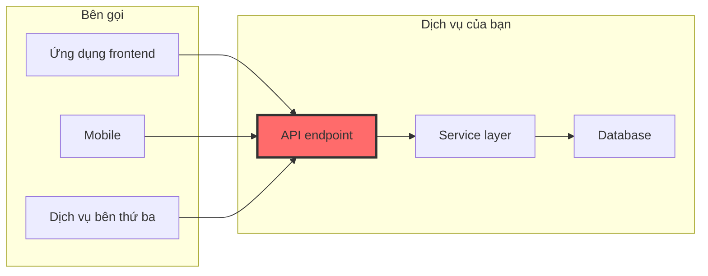

# 9.1.4 API là mặt tiền — API test: Contract và điều kiện biên

**API là cam kết của bạn với bên ngoài, test chính là để đảm bảo cam kết này sẽ không bị phá vỡ.**

## Tại sao API test lại vô cùng quan trọng



Giá trị của API test:

| Mục tiêu test | Tác dụng | Ví dụ |
|-------------|---------|------|
| Định dạng phản hồi | Đảm bảo frontend có thể phân tích đúng | `{ success: true, data: {...} }` |
| Status code | Đảm bảo loại lỗi đúng | 400/401/403/404/500 |
| Xác thực tham số | Chặn yêu cầu bất hợp lệ | Trường bắt buộc, định dạng, phạm vi |
| Điều kiện biên | Xử lý trường hợp cực đoan | Mảng rỗng, chuỗi siêu dài |

## Các mẫu test cốt lõi API

### Mẫu một: Xác minh định dạng phản hồi

```typescript
// app/api/orders/route.ts
export async function POST(request: Request) {
  try {
    const body = await request.json();
    const order = await orderService.createOrder(body);

    return Response.json({
      success: true,
      data: order,
    }, { status: 201 });
  } catch (error) {
    if (error instanceof ValidationError) {
      return Response.json({
        success: false,
        error: { code: 'VALIDATION_ERROR', message: error.message },
      }, { status: 400 });
    }
    throw error;
  }
}

// __tests__/api/orders.test.ts
describe('POST /api/orders', () => {
  it('tạo đơn hàng thành công nên trả về 201 và định dạng chuẩn', async () => {
    const response = await request(app)
      .post('/api/orders')
      .send({
        items: [{ productId: 'prod-1', quantity: 2 }],
      });

    expect(response.status).toBe(201);
    expect(response.body).toMatchObject({
      success: true,
      data: {
        id: expect.any(String),
        status: 'PENDING',
        createdAt: expect.any(String),
      },
    });
  });

  it('phản hồi danh sách nên chứa thông tin phân trang', async () => {
    const response = await request(app).get('/api/orders?page=1&limit=10');

    expect(response.body).toMatchObject({
      success: true,
      data: expect.any(Array),
      pagination: {
        page: 1,
        limit: 10,
        total: expect.any(Number),
        totalPages: expect.any(Number),
      },
    });
  });
});
```

### Mẫu hai: Xác thực tham số test

```typescript
// __tests__/api/orders.test.ts
describe('POST /api/orders xác thực tham số', () => {
  it('thiếu trường bắt buộc nên trả về 400', async () => {
    const response = await request(app)
      .post('/api/orders')
      .send({}); // Thiếu items

    expect(response.status).toBe(400);
    expect(response.body.error.code).toBe('VALIDATION_ERROR');
    expect(response.body.error.message).toContain('items');
  });

  it('items là mảng rỗng nên trả về 400', async () => {
    const response = await request(app)
      .post('/api/orders')
      .send({ items: [] });

    expect(response.status).toBe(400);
    expect(response.body.error.message).toContain('phải chứa ít nhất một sản phẩm');
  });

  it('quantity là số âm nên trả về 400', async () => {
    const response = await request(app)
      .post('/api/orders')
      .send({
        items: [{ productId: 'prod-1', quantity: -1 }],
      });

    expect(response.status).toBe(400);
    expect(response.body.error.message).toContain('số lượng phải lớn hơn 0');
  });

  it('định dạng productId sai nên trả về 400', async () => {
    const response = await request(app)
      .post('/api/orders')
      .send({
        items: [{ productId: '', quantity: 1 }], // Chuỗi rỗng
      });

    expect(response.status).toBe(400);
  });
});
```

### Mẫu ba: Xác thực xác thực và ủy quyền

```typescript
// __tests__/api/orders.test.ts
describe('Kiểm soát quyền API đơn hàng', () => {
  it('người dùng chưa đăng nhập nên trả về 401', async () => {
    const response = await request(app)
      .get('/api/orders');
    // Không gửi Authorization header

    expect(response.status).toBe(401);
    expect(response.body.error.code).toBe('UNAUTHORIZED');
  });

  it('người dùng chỉ có thể xem đơn hàng của mình', async () => {
    // Tạo đơn hàng của hai người dùng
    const user1Order = await createOrderForUser('user-1');
    const user2Order = await createOrderForUser('user-2');

    // user-1 cố truy cập đơn hàng của user-2
    const response = await request(app)
      .get(`/api/orders/${user2Order.id}`)
      .set('Authorization', `Bearer ${user1Token}`);

    expect(response.status).toBe(403);
    expect(response.body.error.code).toBe('FORBIDDEN');
  });

  it('admin có thể xem tất cả đơn hàng', async () => {
    const response = await request(app)
      .get('/api/admin/orders')
      .set('Authorization', `Bearer ${adminToken}`);

    expect(response.status).toBe(200);
  });
});
```

### Mẫu bốn: Test điều kiện biên

```typescript
// __tests__/api/orders.test.ts
describe('Test điều kiện biên', () => {
  it('nên xử lý chuỗi siêu dài', async () => {
    const longString = 'a'.repeat(10000);

    const response = await request(app)
      .post('/api/orders')
      .send({
        items: [{ productId: 'prod-1', quantity: 1 }],
        note: longString, // Ghi chú siêu dài
      });

    // Nên cắt ngắn hoặc từ chối, không phải crash
    expect([400, 201]).toContain(response.status);
  });

  it('nên xử lý số siêu lớn', async () => {
    const response = await request(app)
      .post('/api/orders')
      .send({
        items: [{ productId: 'prod-1', quantity: Number.MAX_SAFE_INTEGER }],
      });

    expect(response.status).toBe(400);
  });

  it('nên xử lý ký tự đặc biệt', async () => {
    const response = await request(app)
      .post('/api/orders')
      .send({
        items: [{ productId: 'prod-1', quantity: 1 }],
        note: '<script>alert("xss")</script>',
      });

    // Nên escape hoặc từ chối
    if (response.status === 201) {
      expect(response.body.data.note).not.toContain('<script>');
    }
  });

  it('nên xử lý yêu cầu đồng thời', async () => {
    // Gửi nhiều yêu cầu cùng lúc
    const requests = Array(10).fill(null).map(() =>
      request(app)
        .post('/api/orders')
        .send({ items: [{ productId: 'prod-1', quantity: 1 }] })
    );

    const responses = await Promise.all(requests);

    // Tất cả yêu cầu nên được xử lý bình thường
    responses.forEach(res => {
      expect([201, 400]).toContain(res.status); // Thành công hoặc tồn kho không đủ
    });
  });
});
```

## Danh sách kiểm tra template API test

```typescript
// Khi tạo test cho API endpoint, kiểm tra các mục sau:

describe('[METHOD] /api/[resource]', () => {
  // 1. Quy trình bình thường
  it('yêu cầu bình thường nên trả về status code và định dạng dữ liệu đúng');

  // 2. Xác thực tham số
  it('thiếu tham số bắt buộc nên trả về 400');
  it('định dạng tham số sai nên trả về 400');
  it('giá trị tham số ngoài phạm vi nên trả về 400');

  // 3. Xác thực và ủy quyền
  it('yêu cầu chưa xác thực nên trả về 401');
  it('yêu cầu không có quyền nên trả về 403');

  // 4. Tài nguyên không tồn tại
  it('tài nguyên không tồn tại nên trả về 404');

  // 5. Lỗi kinh doanh
  it('vi phạm quy tắc kinh doanh nên trả về mã lỗi thích hợp');

  // 6. Điều kiện biên
  it('mảng rỗng/chuỗi rỗng nên được xử lý đúng');
  it('dữ liệu siêu lớn nên được xử lý đúng');
});
```

## Sử dụng Supertest để test API

```typescript
// jest.setup.ts
import { createServer } from 'http';
import { parse } from 'url';
import next from 'next';

const dev = process.env.NODE_ENV !== 'production';
const app = next({ dev });
const handle = app.getRequestHandler();

let server: ReturnType<typeof createServer>;

beforeAll(async () => {
  await app.prepare();
  server = createServer((req, res) => {
    const parsedUrl = parse(req.url!, true);
    handle(req, res, parsedUrl);
  });
  await new Promise<void>((resolve) => server.listen(0, resolve));
});

afterAll(() => {
  server.close();
});

export { server };
```

## Hướng dẫn hợp tác với AI

Khi viết test cho API, bạn có thể giao tiếp với AI như sau:

> **Ý định cốt lõi**: Tạo ra test case toàn diện cho API endpoint
>
> **Công thức định nghĩa yêu cầu**:
> ```
> Viết test cho [METHOD] /api/[path]:
> - Ví dụ request body: [JSON]
> - Định dạng phản hồi dự kiến: [JSON]
> - Cần bao gồm các kịch bản: quy trình bình thường, xác thực tham số, kiểm soát quyền, xử lý lỗi
> ```

**Các thuật ngữ chính**: `supertest`, `request`, `expect`, `toMatchObject`, `status code`

## Kết luận phần này

API test là chìa khóa để đảm bảo interface đối ngoại ổn định và đáng tin cậy. Thông qua xác minh định dạng phản hồi, xác thực tham số, kiểm soát quyền và xử lý điều kiện biên, chúng ta có thể chặn vấn đề trước khi nó đến tay người dùng. Hãy nhớ: **mỗi thay đổi API nên có test tương ứng để bảo vệ**. Sử dụng danh sách kiểm tra template để đảm bảo mỗi endpoint được bao phủ toàn diện.
