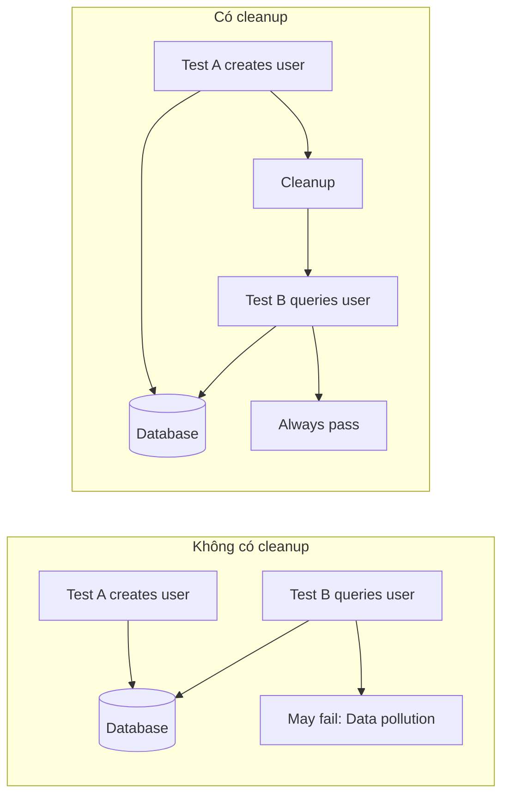
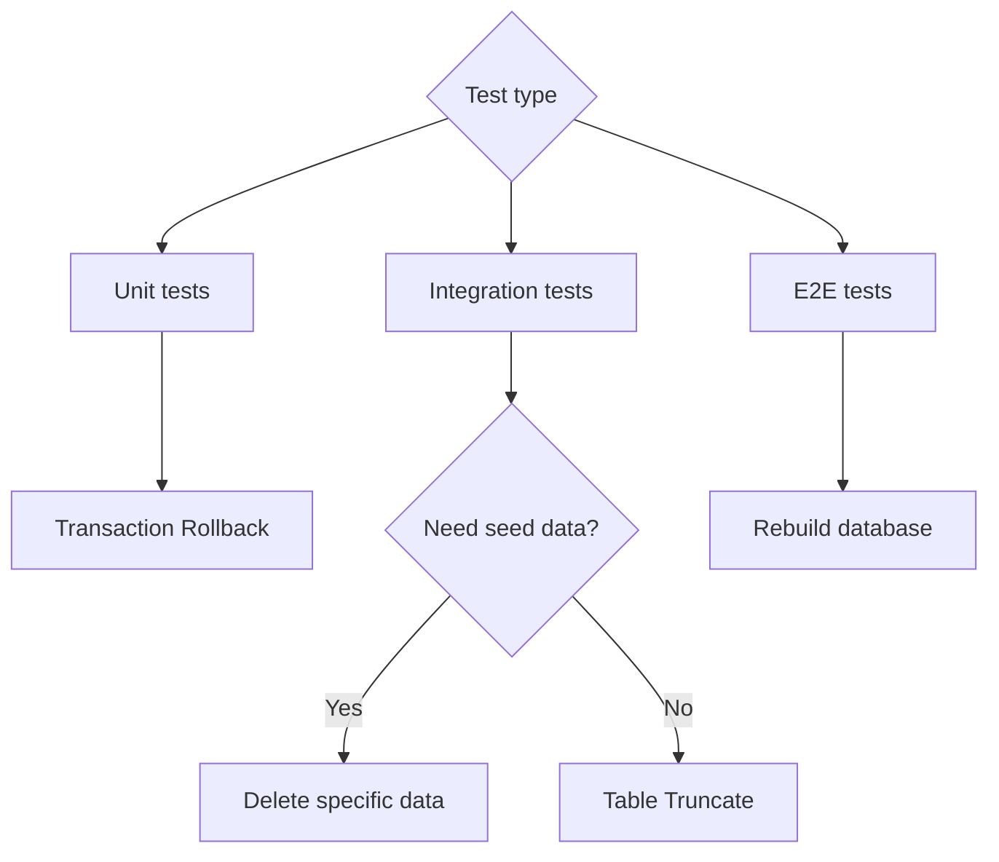

# 9.2.4 Mỗi test là hoàn toàn mới — Data Cleanup: State Isolation giữa các Tests

**Tests ảnh hưởng lẫn nhau là nguyên nhân hàng đầu khiến tests không ổn định, data cleanup là chìa khóa để giải quyết vấn đề này.**

## Tại sao cần data cleanup



## Data Cleanup Strategies

| Strategy | Principle | Applicable Scenarios | Performance |
|------|------|---------|------|
| Transaction Rollback | Mỗi test chạy trong transaction, kết thúc là rollback | Unit tests, integration tests | Fast |
| Table Truncate | Clear tất cả table data | Between test suites | Medium |
| Delete Specific Data | Chỉ xóa data được tạo bởi tests | Need preserve seed data | Medium |
| Rebuild Database | Rebuild toàn bộ database mỗi test | Complete E2E tests | Slow |

## Strategy 1: Transaction Rollback (Khuyến nghị)

```typescript
// test/helpers/transaction.ts
import { PrismaClient } from '@prisma/client';

const prisma = new PrismaClient();

export async function withTransaction<T>(
  fn: (tx: PrismaClient) => Promise<T>
): Promise<T> {
  return prisma.$transaction(async (tx) => {
    const result = await fn(tx as unknown as PrismaClient);
    // Throw error để trigger rollback
    throw new RollbackError(result);
  }).catch((error) => {
    if (error instanceof RollbackError) {
      return error.result;
    }
    throw error;
  });
}

class RollbackError<T> extends Error {
  constructor(public result: T) {
    super('Transaction rollback');
  }
}
```

```typescript
// __tests__/user.service.test.ts
import { withTransaction } from '@/test/helpers/transaction';

describe('UserService', () => {
  it('should create user', async () => {
    await withTransaction(async (tx) => {
      const user = await userService.create(tx, {
        email: 'test@example.com',
        name: 'Test User',
      });

      expect(user.email).toBe('test@example.com');
      // Transaction kết thúc tự động rollback, data không được giữ lại
    });
  });
});
```

## Strategy 2: beforeEach Cleanup

```typescript
// test/helpers/cleanup.ts
import { PrismaClient } from '@prisma/client';

const prisma = new PrismaClient();

// Delete theo thứ tự dependency (xóa table có foreign key trước)
const tablesToClean = [
  'OrderItem',
  'Order',
  'Product',
  'User',
];

export async function cleanDatabase() {
  for (const table of tablesToClean) {
    await prisma.$executeRawUnsafe(`TRUNCATE TABLE "${table}" CASCADE`);
  }
}

// Hoặc sử dụng deleteMany (an toàn hơn nhưng chậm hơn)
export async function cleanDatabaseSafe() {
  await prisma.orderItem.deleteMany();
  await prisma.order.deleteMany();
  await prisma.product.deleteMany();
  await prisma.user.deleteMany();
}
```

```typescript
// __tests__/order.service.test.ts
import { cleanDatabase } from '@/test/helpers/cleanup';

describe('OrderService', () => {
  beforeEach(async () => {
    await cleanDatabase();
  });

  it('should create order', async () => {
    // Mỗi test bắt đầu từ clean state
    const user = await createTestUser();
    const order = await orderService.create(user.id, items);
    expect(order.status).toBe('PENDING');
  });
});
```

## Strategy 3: Sử dụng Prisma soft reset

```typescript
// test/helpers/reset.ts
import { execSync } from 'child_process';

export function resetDatabase() {
  execSync('dotenv -e .env.test -- npx prisma migrate reset --force --skip-seed', {
    stdio: 'inherit',
  });
}
```

## Jest Configuration Best Practices

```typescript
// jest.setup.ts
import { PrismaClient } from '@prisma/client';

const prisma = new PrismaClient();

// Global cleanup: trước khi mỗi test file chạy
beforeAll(async () => {
  await prisma.$connect();
});

// Global cleanup: sau khi mỗi test file chạy
afterAll(async () => {
  await prisma.$disconnect();
});

// Optional: cleanup trước mỗi test
// beforeEach(async () => {
//   await cleanDatabase();
// });
```

```typescript
// jest.config.ts
export default {
  // Run tests serially để tránh concurrent conflicts
  maxWorkers: 1,
  // Hoặc dùng runInBand
  // runInBand: true,

  setupFilesAfterEnv: ['<rootDir>/jest.setup.ts'],
};
```

## Xử lý foreign key constraints

```typescript
// test/helpers/cleanup.ts

// Phương án 1: Disable foreign key checks (PostgreSQL)
export async function cleanWithDisabledFK() {
  await prisma.$executeRaw`SET session_replication_role = 'replica'`;

  await prisma.orderItem.deleteMany();
  await prisma.order.deleteMany();
  await prisma.user.deleteMany();

  await prisma.$executeRaw`SET session_replication_role = 'origin'`;
}

// Phương án 2: Sử dụng CASCADE (PostgreSQL)
export async function truncateWithCascade() {
  const tables = ['User', 'Order', 'OrderItem'];

  for (const table of tables) {
    await prisma.$executeRawUnsafe(`TRUNCATE TABLE "${table}" CASCADE`);
  }
}

// Phương án 3: Delete theo đúng thứ tự
export async function deleteInOrder() {
  // Xóa child tables trước (tables có foreign keys)
  await prisma.orderItem.deleteMany();
  await prisma.order.deleteMany();
  // Sau đó xóa parent tables
  await prisma.user.deleteMany();
}
```

## Preserve seed data khi cleanup

```typescript
// test/helpers/cleanup.ts

// Chỉ cleanup test data (dùng ID prefix để nhận dạng)
export async function cleanTestData() {
  await prisma.user.deleteMany({
    where: {
      id: { startsWith: 'test-' },
    },
  });
}

// Hoặc dùng creation time
export async function cleanRecentData() {
  const oneMinuteAgo = new Date(Date.now() - 60 * 1000);

  await prisma.user.deleteMany({
    where: {
      createdAt: { gte: oneMinuteAgo },
    },
  });
}
```

## Data Isolation cho parallel tests

```typescript
// test/helpers/isolated-db.ts
import { v4 as uuid } from 'uuid';

export function createIsolatedContext() {
  const testId = uuid();

  return {
    testId,
    createUser: (data: Partial<User>) => ({
      id: `test-${testId}-${uuid()}`,
      ...data,
    }),
    cleanup: async () => {
      await prisma.user.deleteMany({
        where: { id: { contains: testId } },
      });
    },
  };
}

// Usage
describe('UserService', () => {
  const ctx = createIsolatedContext();

  afterAll(async () => {
    await ctx.cleanup();
  });

  it('should create user', async () => {
    const userData = ctx.createUser({ name: 'Test' });
    // ...
  });
});
```

## Cleanup strategy selection



## Tóm tắt phần này

Mục tiêu cốt lõi của data cleanup là **đảm bảo mỗi test chạy trong một initial state có thể dự đoán được**. Transaction rollback là giải pháp performance tốt nhất, phù hợp với hầu hết cases; table truncate phù hợp với scenarios cần complete reset; delete specific data phù hợp với scenarios cần preserve seed data. Chọn đúng strategy, để tests vừa nhanh vừa ổn định.
