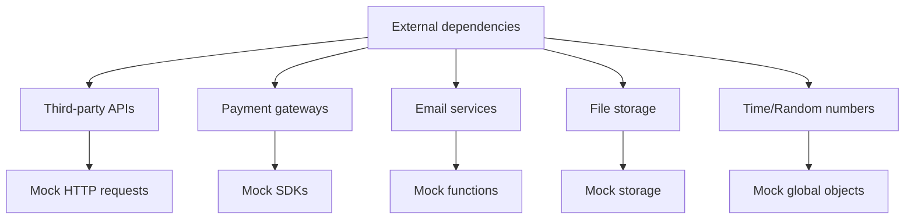

# 9.3.4 Xử lý external dependencies như thế nào——Mock Strategy: Mô phỏng external dependencies

**Mục đích của Mock là cô lập test, giúp bạn tập trung vào việc test mã của chính mình, thay vì hành vi của third-party services.**

## Scenarios cần Mock



## Jest Mock cơ bản

### Mô phỏng functions

```typescript
// Tạo Mock function
const mockFn = jest.fn();

// Thiết lập return value
mockFn.mockReturnValue('hello');
mockFn.mockReturnValueOnce('first').mockReturnValueOnce('second');

// Thiết lập async return value
mockFn.mockResolvedValue({ data: 'async result' });
mockFn.mockRejectedValue(new Error('failed'));

// Kiểm tra gọi
expect(mockFn).toHaveBeenCalled();
expect(mockFn).toHaveBeenCalledWith('arg1', 'arg2');
expect(mockFn).toHaveBeenCalledTimes(2);
```

### Mô phỏng modules

```typescript
// Auto mock toàn bộ module
jest.mock('@/lib/stripe');

// Triển khai mock thủ công
jest.mock('@/lib/email', () => ({
  sendEmail: jest.fn().mockResolvedValue({ success: true }),
  sendBulkEmail: jest.fn().mockResolvedValue({ sent: 10 }),
}));
```

## Common Mock scenarios

### Scenario một: Mock HTTP requests

```typescript
// Phương pháp một: Sử dụng msw (khuyên dùng)
// test/mocks/handlers.ts
import { rest } from 'msw';

export const handlers = [
  rest.get('https://api.example.com/users/:id', (req, res, ctx) => {
    return res(
      ctx.status(200),
      ctx.json({ id: req.params.id, name: 'Test User' })
    );
  }),

  rest.post('https://api.example.com/orders', async (req, res, ctx) => {
    const body = await req.json();
    return res(
      ctx.status(201),
      ctx.json({ id: 'order-123', ...body })
    );
  }),
];

// test/mocks/server.ts
import { setupServer } from 'msw/node';
import { handlers } from './handlers';

export const server = setupServer(...handlers);

// jest.setup.ts
import { server } from './test/mocks/server';

beforeAll(() => server.listen());
afterEach(() => server.resetHandlers());
afterAll(() => server.close());
```

```typescript
// Phương pháp hai: Mock fetch
global.fetch = jest.fn().mockResolvedValue({
  ok: true,
  json: async () => ({ data: 'mocked' }),
});
```

### Scenario hai: Mock payment service

```typescript
// __mocks__/stripe.ts
export const createPaymentIntent = jest.fn().mockResolvedValue({
  id: 'pi_test_123',
  client_secret: 'secret_123',
  status: 'requires_payment_method',
});

export const confirmPayment = jest.fn().mockResolvedValue({
  id: 'pi_test_123',
  status: 'succeeded',
});

export const refundPayment = jest.fn().mockResolvedValue({
  id: 're_test_123',
  status: 'succeeded',
});

// Sử dụng trong test
jest.mock('@/lib/stripe');

describe('PaymentService', () => {
  it('nên tạo payment intent', async () => {
    const result = await paymentService.createIntent(1000, 'CNY');

    expect(createPaymentIntent).toHaveBeenCalledWith({
      amount: 1000,
      currency: 'CNY',
    });
    expect(result.client_secret).toBe('secret_123');
  });
});
```

### Scenario ba: Mock email service

```typescript
// services/email.service.ts
export class EmailService {
  async sendWelcomeEmail(user: User): Promise<void> {
    await this.send({
      to: user.email,
      subject: 'Chào mừng',
      template: 'welcome',
      data: { name: user.name },
    });
  }
}

// __tests__/services/email.service.test.ts
import { EmailService } from '@/services/email.service';

jest.mock('@/lib/mailer', () => ({
  send: jest.fn().mockResolvedValue({ messageId: 'msg-123' }),
}));

import { send } from '@/lib/mailer';

describe('EmailService', () => {
  it('nên gửi email chào mừng', async () => {
    const emailService = new EmailService();
    const user = { email: 'test@example.com', name: 'Test' };

    await emailService.sendWelcomeEmail(user);

    expect(send).toHaveBeenCalledWith(
      expect.objectContaining({
        to: 'test@example.com',
        subject: 'Chào mừng',
      })
    );
  });
});
```

### Scenario bốn: Mock time

```typescript
// __tests__/services/subscription.service.test.ts
describe('SubscriptionService', () => {
  beforeEach(() => {
    jest.useFakeTimers();
    jest.setSystemTime(new Date('2024-01-15'));
  });

  afterEach(() => {
    jest.useRealTimers();
  });

  it('nên tính ngày hết hạn subscription chính xác', async () => {
    const subscription = await subscriptionService.create({
      userId: 'user-1',
      plan: 'monthly',
    });

    expect(subscription.expiresAt).toEqual(new Date('2024-02-15'));
  });

  it('nên nhận biết subscription hết hạn', async () => {
    const subscription = await createSubscription({
      expiresAt: new Date('2024-01-10'), // Đã hết hạn
    });

    expect(subscription.isExpired()).toBe(true);
  });
});
```

### Scenario năm: Mock file upload

```typescript
// __mocks__/@/lib/storage.ts
export const uploadFile = jest.fn().mockResolvedValue({
  url: 'https://cdn.example.com/files/test.jpg',
  key: 'files/test.jpg',
});

export const deleteFile = jest.fn().mockResolvedValue(undefined);

// Test
describe('FileService', () => {
  it('nên upload file và trả về URL', async () => {
    const file = new File(['test'], 'test.jpg', { type: 'image/jpeg' });

    const result = await fileService.upload(file);

    expect(result.url).toBe('https://cdn.example.com/files/test.jpg');
    expect(uploadFile).toHaveBeenCalledWith(file, expect.any(Object));
  });
});
```

## Mock best practices

### 1. Chỉ Mock boundaries

```typescript
// ✅ Tốt: Mock external service boundaries
jest.mock('@/lib/stripe');

// ❌ Xấu: Mock internal modules
jest.mock('@/services/order.service');
```

### 2. Kiểm tra Mock được gọi

```typescript
it('nên gọi payment service', async () => {
  await orderService.checkout(orderId);

  // Kiểm tra external service được gọi chính xác
  expect(createPaymentIntent).toHaveBeenCalledWith(
    expect.objectContaining({
      amount: 1000,
      currency: 'CNY',
    })
  );
});
```

### 3. Test error scenarios

```typescript
it('nên rollback order khi payment thất bại', async () => {
  confirmPayment.mockRejectedValueOnce(new Error('Card declined'));

  await expect(orderService.checkout(orderId)).rejects.toThrow('Payment failed');

  const order = await prisma.order.findUnique({ where: { id: orderId } });
  expect(order?.status).toBe('CANCELLED');
});
```

### 4. Dọn sạch Mock state

```typescript
// jest.config.ts
export default {
  clearMocks: true,    // Dọn sạch call records sau mỗi test
  restoreMocks: true,  // Khôi phục original implementation sau mỗi test
};

// Hoặc dọn sạch thủ công
afterEach(() => {
  jest.clearAllMocks();
});
```

## Tóm tắt phần này

Mock là công cụ quan trọng để cô lập test. Chỉ Mock external boundaries (third-party APIs, payment, email, etc.), giữ logic bên trong tested thực. Sử dụng MSW để xử lý HTTP requests, sử dụng `jest.fn()` để xử lý function calls, sử dụng `jest.useFakeTimers()` để xử lý time-related tests. Nhớ: **Mock càng ít càng tốt, nhưng boundaries phải Mock**.
