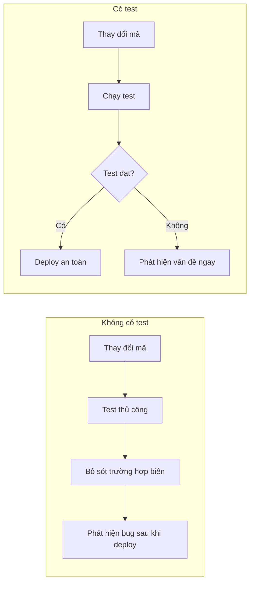

# 9.3 Bảo hiểm cho mã của bạn——Unit Tests/Integration Tests: Jest + Test DB; seed trước

**Automated testing là bảo hiểm cho mã của bạn——mỗi lần thay đổi đều tự động xác minh liệu bạn đã phá vỡ chức năng hiện có hay không.**

## Tại sao cần automated testing



## Tech stack của phần này

| Công cụ | Mục đích | Lý do lựa chọn |
|---------|---------|----------------|
| Jest | Framework test | Zero config, snapshot testing, Mock support |
| ts-jest | TypeScript support | Chạy trực tiếp TS test |
| @testing-library | React testing | Test theo hành vi người dùng |
| supertest | API testing | Assertion HTTP đơn giản |

## Cấu hình bắt đầu nhanh

```bash
# Cài đặt dependencies
npm install -D jest ts-jest @types/jest

# Khởi tạo cấu hình
npx ts-jest config:init
```

```typescript
// jest.config.ts
import type { Config } from 'jest';

const config: Config = {
  preset: 'ts-jest',
  testEnvironment: 'node',
  roots: ['<rootDir>/src', '<rootDir>/__tests__'],
  testMatch: ['**/*.test.ts', '**/*.spec.ts'],
  setupFilesAfterEnv: ['<rootDir>/jest.setup.ts'],
  moduleNameMapper: {
    '^@/(.*)$': '<rootDir>/src/$1',
  },
};

export default config;
```

## Nội dung cốt lõi của phần này

| Tiểu mục | Chủ đề | Vấn đề giải quyết |
|---------|--------|-----------------|
| 9.3.1 | Jest configuration | Cách cấu hình framework test và assertion library |
| 9.3.2 | Test database | Lựa chọn giữa in-memory database vs real database |
| 9.3.3 | Seed data | Cách chuẩn bị dữ liệu cần thiết cho test cases |
| 9.3.4 | Mock strategy | Cách mock external dependencies |

## Tổ chức test files

```
project/
├── src/
│   ├── services/
│   │   └── order.service.ts
│   └── utils/
│       └── price.ts
├── __tests__/
│   ├── services/
│   │   └── order.service.test.ts
│   ├── api/
│   │   └── orders.test.ts
│   └── helpers/
│       ├── factory.ts
│       └── cleanup.ts
├── jest.config.ts
└── jest.setup.ts
```

## Tóm tắt phần này

Automated testing là cơ sở hạ tầng của phát triển phần mềm hiện đại. Thông qua Jest và test database, bạn có thể triển khai coverage hoàn chỉnh từ unit test đến integration test. Chìa khóa là lựa chọn công cụ phù hợp, tổ chức mã test tốt, chuẩn bị dữ liệu test. Những tiểu mục tiếp theo sẽ giải thích chi tiết cách triển khai từng khía cạnh.
