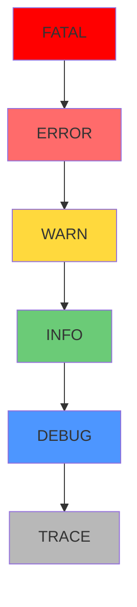

# 9.4.1 Lỗi cũng có mức độ——Log level: Sử dụng ERROR/WARN/INFO/DEBUG

**Log level quyết định thông tin nào được ghi lại, khi nào cần cảnh báo.**

## Hệ thống phân cấp log level



## Hướng dẫn sử dụng mức độ log

| Mức độ | Trường hợp sử dụng | Cảnh báo không | Ví dụ |
|------|----------|----------|------|
| ERROR | Lỗi cần can thiệp thủ công | ✅ Ngay lập tức | Thanh toán thất bại, mất kết nối cơ sở dữ liệu |
| WARN | Vấn đề tiềm ẩn nhưng có thể phục hồi | ⚠️ Tổng hợp | Thử lại thành công, giảm cấp |
| INFO | Sự kiện kinh doanh quan trọng | ❌ | Đăng ký người dùng, tạo đơn hàng |
| DEBUG | Thông tin gỡ lỗi phát triển | ❌ | Truy vấn SQL, tham số hàm |

## ERROR: Cần xử lý ngay lập tức

```typescript
// ✅ Sử dụng ERROR đúng cách
try {
  await stripe.charges.create(paymentData);
} catch (err) {
  logger.error({
    err,
    userId,
    orderId,
    amount,
  }, 'Xử lý thanh toán thất bại, cần can thiệp thủ công');

  // Gửi cảnh báo cùng lúc
  await alertService.sendCritical({
    title: 'Thanh toán thất bại',
    details: { orderId, error: err.message },
  });

  throw new PaymentError('Thanh toán thất bại, vui lòng thử lại sau');
}

// ❌ Ví dụ sai: Không phải tất cả ngoại lệ đều là ERROR
try {
  const user = await prisma.user.findUnique({ where: { id } });
  if (!user) {
    logger.error('Người dùng không tồn tại'); // ❌ Đây là logic kinh doanh, không phải ERROR
  }
} catch (err) {
  // ...
}
```

## WARN: Đáng chú ý nhưng không khẩn cấp

```typescript
// ✅ Sử dụng WARN đúng cách
async function getInventory(productId: string) {
  try {
    return await inventoryService.getStock(productId);
  } catch (err) {
    logger.warn({
      productId,
      err,
      fallback: 'cache',
    }, 'Dịch vụ tồn kho không khả dụng, sử dụng dữ liệu từ bộ nhớ đệm');

    return await cache.get(`inventory:${productId}`);
  }
}

// ✅ Trường hợp thử lại thành công
async function sendEmailWithRetry(email: EmailData) {
  for (let i = 0; i < 3; i++) {
    try {
      return await emailService.send(email);
    } catch (err) {
      if (i < 2) {
        logger.warn({
          attempt: i + 1,
          email: email.to,
          err,
        }, 'Gửi email thất bại, đang thử lại');
        await sleep(1000 * (i + 1));
      } else {
        throw err;
      }
    }
  }
}
```

## INFO: Sự kiện kinh doanh quan trọng

```typescript
// ✅ Sử dụng INFO đúng cách
export async function createOrder(userId: string, items: OrderItem[]) {
  const order = await prisma.order.create({
    data: {
      userId,
      items: { create: items },
      status: 'PENDING',
    },
  });

  logger.info({
    action: 'order.created',
    orderId: order.id,
    userId,
    itemCount: items.length,
    total: order.total,
  }, 'Đơn hàng được tạo thành công');

  return order;
}

// ✅ Sự kiện xác thực người dùng
logger.info({
  action: 'user.login',
  userId,
  method: 'password',
  ip: req.ip,
}, 'Người dùng đăng nhập thành công');

logger.info({
  action: 'user.logout',
  userId,
  sessionDuration: Date.now() - session.createdAt,
}, 'Người dùng đăng xuất');
```

## DEBUG: Gỡ lỗi phát triển

```typescript
// ✅ Sử dụng DEBUG đúng cách
export async function searchProducts(query: SearchQuery) {
  logger.debug({ query }, 'Tham số tìm kiếm');

  const results = await prisma.product.findMany({
    where: buildWhereClause(query),
    orderBy: buildOrderBy(query.sort),
    take: query.limit,
    skip: query.offset,
  });

  logger.debug({
    query,
    resultCount: results.length,
    executionTime: Date.now() - startTime,
  }, 'Tìm kiếm hoàn tất');

  return results;
}
```

## Cấu hình môi trường

```typescript
// lib/logger.ts
import pino from 'pino';

const levels = {
  production: 'info',
  development: 'debug',
  test: 'warn',
};

export const logger = pino({
  level: process.env.LOG_LEVEL || levels[process.env.NODE_ENV] || 'info',
});
```

```bash
# .env.production
LOG_LEVEL=info

# .env.development
LOG_LEVEL=debug

# .env.test
LOG_LEVEL=warn
```

## Lỗi thường gặp

```typescript
// ❌ Sử dụng console.log thay vì logging
console.log('Người dùng được tạo thành công', user);

// ✅ Sử dụng structured logging
logger.info({ action: 'user.created', userId: user.id }, 'Người dùng được tạo thành công');

// ❌ Sử dụng ERROR cho tất cả lỗi
logger.error('Người dùng không tồn tại'); // Đây là logic thông thường

// ✅ Phân biệt logic kinh doanh và lỗi hệ thống
if (!user) {
  logger.debug({ userId }, 'Người dùng không tồn tại');
  throw new NotFoundError('Người dùng không tồn tại');
}

// ❌ Log DEBUG quá chi tiết
logger.debug({ request: req }); // Chứa thông tin nhạy cảm

// ✅ Chỉ ghi thông tin cần thiết
logger.debug({
  method: req.method,
  path: req.path,
  query: req.query,
}, 'Nhận yêu cầu');
```

## Tóm tắt chương này

Log level là công cụ để phân loại thông tin: ERROR cần xử lý ngay, WARN đáng chú ý, INFO ghi lại sự kiện kinh doanh, DEBUG dùng để gỡ lỗi phát triển. Sử dụng đúng mức độ giúp cảnh báo chính xác hơn, khắc phục sự cố hiệu quả hơn.
