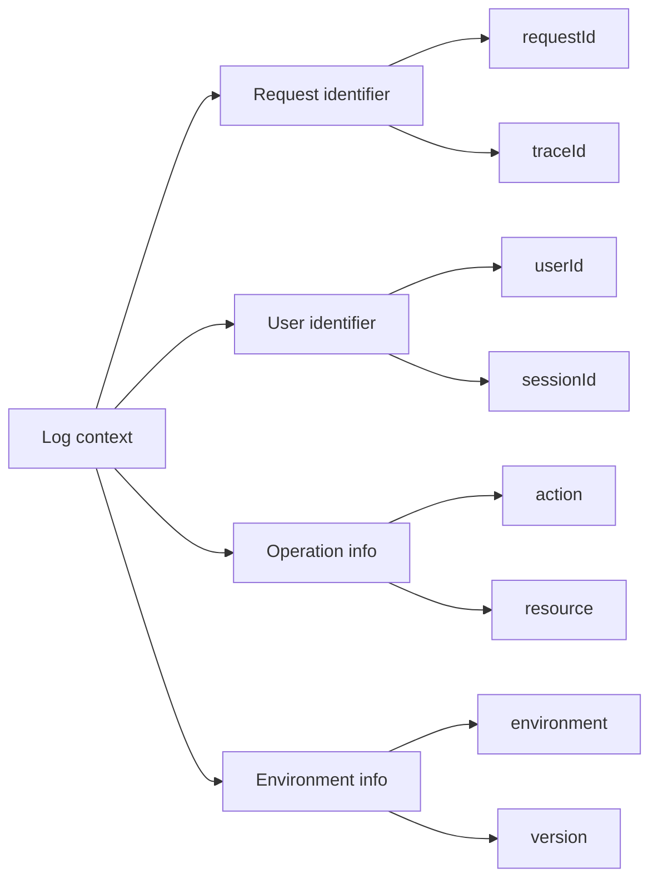

# 9.4.2 Ai làm gì vào lúc nào——Thông tin ngữ cảnh: Request ID/User ID/Loại hoạt động

**Log không có ngữ cảnh giống như đoạn video giám sát không có timestamp——nhìn thấy chuyện gì xảy ra nhưng không tìm được ai, thời gian nào.**

## Các loại thông tin ngữ cảnh



## Triển khai Request ID

Request ID dùng để theo dõi toàn bộ chuỗi xử lý của một yêu cầu.

```typescript
// middleware/request-id.ts
import { nanoid } from 'nanoid';
import { NextRequest, NextResponse } from 'next/server';

export function requestIdMiddleware(request: NextRequest) {
  const requestId = request.headers.get('x-request-id') || nanoid();

  const response = NextResponse.next();
  response.headers.set('x-request-id', requestId);

  return response;
}
```

```typescript
// lib/logger.ts
import pino from 'pino';
import { AsyncLocalStorage } from 'async_hooks';

interface RequestContext {
  requestId: string;
  userId?: string;
  path?: string;
}

export const contextStorage = new AsyncLocalStorage<RequestContext>();

export const logger = pino({
  mixin() {
    const context = contextStorage.getStore();
    return context ? { ...context } : {};
  },
});
```

```typescript
// middleware/context.ts
import { NextRequest } from 'next/server';
import { contextStorage, logger } from '@/lib/logger';
import { nanoid } from 'nanoid';

export async function withContext<T>(
  request: NextRequest,
  handler: () => Promise<T>
): Promise<T> {
  const requestId = request.headers.get('x-request-id') || nanoid();
  const userId = request.headers.get('x-user-id');

  return contextStorage.run(
    {
      requestId,
      userId,
      path: request.nextUrl.pathname,
    },
    handler
  );
}
```

## Ví dụ sử dụng

```typescript
// app/api/orders/route.ts
import { withContext } from '@/middleware/context';
import { logger } from '@/lib/logger';

export async function POST(request: NextRequest) {
  return withContext(request, async () => {
    const body = await request.json();

    // Tự động bao gồm requestId, userId, path
    logger.info({ items: body.items.length }, 'Yêu cầu tạo đơn hàng');

    const order = await orderService.create(body);

    logger.info({ orderId: order.id }, 'Đơn hàng được tạo thành công');

    return NextResponse.json(order);
  });
}
```

Ví dụ đầu ra:
```json
{
  "level": 30,
  "time": 1699123456789,
  "requestId": "abc123",
  "userId": "user_456",
  "path": "/api/orders",
  "items": 3,
  "msg": "Yêu cầu tạo đơn hàng"
}
```

## Logger con

Tạo logger con với context mặc định cho các module khác nhau.

```typescript
// services/order.service.ts
import { logger } from '@/lib/logger';

const log = logger.child({ service: 'order' });

export class OrderService {
  async create(data: CreateOrderInput) {
    log.info({ action: 'create', input: data }, 'Bắt đầu tạo đơn hàng');

    const order = await prisma.$transaction(async (tx) => {
      // Tạo đơn hàng
      const order = await tx.order.create({ data: { ... } });

      log.debug({ orderId: order.id }, 'Bản ghi đơn hàng đã tạo');

      // Trừ tồn kho
      await this.deductInventory(tx, data.items);

      log.debug({ orderId: order.id }, 'Tồn kho đã được trừ');

      return order;
    });

    log.info({
      action: 'create.success',
      orderId: order.id,
      total: order.total,
    }, 'Đơn hàng được tạo thành công');

    return order;
  }
}
```

## Phân tán theo dõi

Sử dụng traceId để theo dõi các lệnh gọi giữa các dịch vụ.

```typescript
// lib/tracing.ts
import { logger } from './logger';

export async function callExternalService<T>(
  url: string,
  options: RequestInit = {}
): Promise<T> {
  const context = contextStorage.getStore();

  const response = await fetch(url, {
    ...options,
    headers: {
      ...options.headers,
      'x-request-id': context?.requestId,
      'x-trace-id': context?.traceId,
    },
  });

  logger.debug({
    url,
    status: response.status,
    duration: Date.now() - startTime,
  }, 'Lệnh gọi dịch vụ bên ngoài hoàn tất');

  return response.json();
}
```

## Các trường context tiêu chuẩn

| Trường | Mô tả | Ví dụ |
|------|------|------|
| requestId | Định danh duy nhất yêu cầu | `req_abc123` |
| traceId | Distributed trace ID | `trace_xyz789` |
| userId | ID người dùng hiện tại | `user_456` |
| sessionId | ID phiên | `sess_def` |
| action | Loại hoạt động | `order.create` |
| service | Tên dịch vụ | `order-service` |
| environment | Môi trường chạy | `production` |
| version | Phiên bản ứng dụng | `1.2.3` |

## Thực hành tốt nhất

```typescript
// ✅ Tốt: Bao gồm context đầy đủ
logger.info({
  action: 'payment.process',
  orderId,
  amount,
  currency,
  paymentMethod,
}, 'Bắt đầu xử lý thanh toán');

// ❌ Tồi: Thiếu context
logger.info('Xử lý thanh toán');

// ✅ Tốt: Lỗi bao gồm context
logger.error({
  err,
  action: 'payment.failed',
  orderId,
  amount,
  retryCount,
}, 'Xử lý thanh toán thất bại');

// ❌ Tồi: Chỉ ghi thông báo lỗi
logger.error('Thanh toán thất bại');
```

## Tóm tắt chương này

Thông tin ngữ cảnh là "chứng minh thân phận" của log. Thông qua requestId theo dõi chuỗi yêu cầu, thông qua userId định vị hành vi người dùng, thông qua action hiểu loại hoạt động. Sử dụng AsyncLocalStorage tự động truyền context, giúp log tự động mang thông tin cần thiết.
