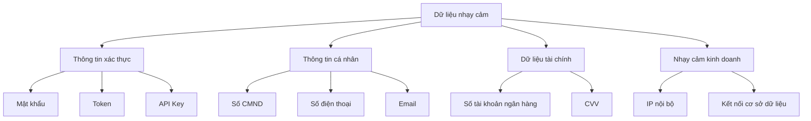

# 9.4.3 Log không thể bị rò rỉ mật khẩu——Mặt nạ thông tin nhạy cảm: Hướng dẫn thực hiện và nguyên tắc thiết kế bảo mật

**Log là điểm nóng của lỗ hổng bảo mật——rất nhiều trường hợp rò rỉ dữ liệu do log chứa thông tin nhạy cảm.**

## Các loại dữ liệu cần được mặt nạ



## Tự động mặt nạ bằng Pino

```typescript
// lib/logger.ts
import pino from 'pino';

export const logger = pino({
  redact: {
    paths: [
      // Thông tin xác thực
      'password',
      'token',
      'accessToken',
      'refreshToken',
      'authorization',
      'apiKey',
      'secret',

      // Thông tin cá nhân
      '*.password',
      '*.idCard',
      '*.bankCard',
      'user.password',
      'req.headers.authorization',
      'req.headers.cookie',

      // Đối tượng lồng nhau
      'data.*.password',
      'users[*].password',
    ],
    censor: '[REDACTED]',
  },
});
```

## Hàm mặt nạ tùy chỉnh

```typescript
// lib/mask.ts
export const mask = {
  // Số điện thoại: 138****8888
  phone: (phone: string): string => {
    if (!phone || phone.length < 7) return phone;
    return phone.slice(0, 3) + '****' + phone.slice(-4);
  },

  // Email: t***@example.com
  email: (email: string): string => {
    const [local, domain] = email.split('@');
    if (!domain) return email;
    return local[0] + '***@' + domain;
  },

  // Số CMND: 110***********1234
  idCard: (id: string): string => {
    if (!id || id.length < 8) return id;
    return id.slice(0, 3) + '*'.repeat(id.length - 7) + id.slice(-4);
  },

  // Số tài khoản ngân hàng: ****8888
  bankCard: (card: string): string => {
    if (!card || card.length < 4) return card;
    return '****' + card.slice(-4);
  },

  // Token: eyJh...abc (chỉ hiển thị đầu cuối)
  token: (token: string): string => {
    if (!token || token.length < 10) return '[REDACTED]';
    return token.slice(0, 4) + '...' + token.slice(-3);
  },
};
```

## Sử dụng hàm mặt nạ

```typescript
// services/user.service.ts
import { logger } from '@/lib/logger';
import { mask } from '@/lib/mask';

export async function createUser(data: CreateUserInput) {
  logger.info({
    action: 'user.create',
    email: mask.email(data.email),
    phone: mask.phone(data.phone),
  }, 'Tạo người dùng');

  const user = await prisma.user.create({
    data: {
      email: data.email,
      phone: data.phone,
      password: await hash(data.password),
    },
  });

  logger.info({
    action: 'user.created',
    userId: user.id,
    email: mask.email(user.email),
  }, 'Người dùng được tạo thành công');

  return user;
}
```

## Mặt nạ yêu cầu HTTP

```typescript
// middleware/logging.ts
import { NextRequest } from 'next/server';
import { logger } from '@/lib/logger';

const sensitiveHeaders = [
  'authorization',
  'cookie',
  'x-api-key',
  'x-auth-token',
];

function sanitizeHeaders(headers: Headers): Record<string, string> {
  const result: Record<string, string> = {};

  headers.forEach((value, key) => {
    if (sensitiveHeaders.includes(key.toLowerCase())) {
      result[key] = '[REDACTED]';
    } else {
      result[key] = value;
    }
  });

  return result;
}

export function logRequest(request: NextRequest) {
  logger.info({
    method: request.method,
    path: request.nextUrl.pathname,
    headers: sanitizeHeaders(request.headers),
  }, 'Nhận yêu cầu');
}
```

## Mặt nạ thân yêu cầu

```typescript
// lib/sanitize.ts
const sensitiveFields = [
  'password',
  'confirmPassword',
  'currentPassword',
  'newPassword',
  'token',
  'accessToken',
  'refreshToken',
  'apiKey',
  'secret',
  'creditCard',
  'cvv',
  'ssn',
  'idCard',
];

export function sanitizeBody(body: unknown): unknown {
  if (!body || typeof body !== 'object') {
    return body;
  }

  if (Array.isArray(body)) {
    return body.map(sanitizeBody);
  }

  const result: Record<string, unknown> = {};

  for (const [key, value] of Object.entries(body)) {
    if (sensitiveFields.includes(key)) {
      result[key] = '[REDACTED]';
    } else if (typeof value === 'object' && value !== null) {
      result[key] = sanitizeBody(value);
    } else {
      result[key] = value;
    }
  }

  return result;
}
```

## Mặt nạ stack trace lỗi

```typescript
// lib/error-sanitizer.ts
export function sanitizeError(err: Error): object {
  return {
    name: err.name,
    message: sanitizeMessage(err.message),
    // Không phơi bày stack trace đầy đủ cho log
    stack: process.env.NODE_ENV === 'development'
      ? err.stack
      : undefined,
  };
}

function sanitizeMessage(message: string): string {
  // Xóa các chuỗi kết nối có thể
  return message
    .replace(/postgresql:\/\/[^@]+@[^\s]+/g, 'postgresql://[REDACTED]')
    .replace(/mongodb:\/\/[^@]+@[^\s]+/g, 'mongodb://[REDACTED]')
    .replace(/redis:\/\/[^@]+@[^\s]+/g, 'redis://[REDACTED]');
}
```

## Xác minh hiệu quả mặt nạ

```typescript
// __tests__/lib/logger.test.ts
describe('Logger Redaction', () => {
  it('nên mặt nạ trường mật khẩu', () => {
    const output = captureLogOutput(() => {
      logger.info({ password: 'secret123' }, 'test');
    });

    expect(output).not.toContain('secret123');
    expect(output).toContain('[REDACTED]');
  });

  it('nên mặt nạ mật khẩu lồng nhau', () => {
    const output = captureLogOutput(() => {
      logger.info({
        user: {
          email: 'test@example.com',
          password: 'secret123',
        },
      }, 'test');
    });

    expect(output).not.toContain('secret123');
    expect(output).toContain('test@example.com');
  });
});
```

## Danh sách kiểm tra bảo mật

| Mục kiểm tra | Mô tả |
|--------|------|
| ✅ Trường mật khẩu đã mặt nạ | password, secret, apiKey, v.v. |
| ✅ Token đã mặt nạ | JWT, OAuth Token, Session ID |
| ✅ Thông tin cá nhân đã mặt nạ | CMND, số điện thoại, số ngân hàng |
| ✅ Header yêu cầu đã lọc | Authorization, Cookie |
| ✅ Chuỗi kết nối đã loại bỏ | URL cơ sở dữ liệu, URL Redis |
| ✅ Stack trace lỗi đã xử lý | Production không phơi bày stack trace đầy đủ |

## Tóm tắt chương này

Mặt nạ thông tin nhạy cảm là yêu cầu bảo mật cơ bản. Sử dụng cấu hình redact của Pino tự động mặt nạ các trường phổ biến, sử dụng hàm mặt nạ tùy chỉnh cho thông tin cá nhân giữ lại tính nhận dạng. Thường xuyên kiểm tra đầu ra log để đảm bảo không có thông tin nhạy cảm bị rò rỉ.
