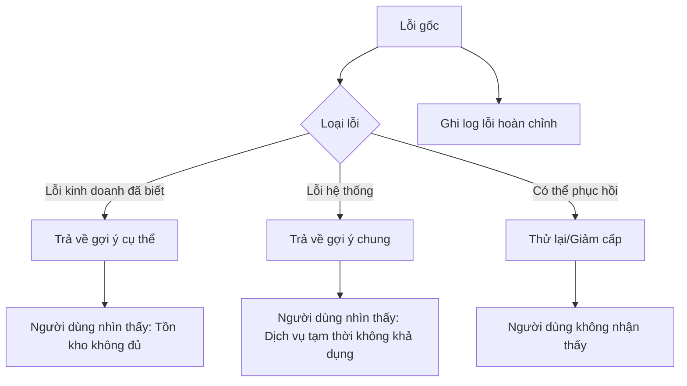

# 9.4.4 Sập cũng phải thanh lịch——Phục hồi lỗi: Xử lý ngoại lệ và gợi ý người dùng

**Người dùng không cần biết timeout kết nối cơ sở dữ liệu——họ chỉ cần biết "vui lòng thử lại sau".**

## Tầng xử lý lỗi



## Lớp lỗi tùy chỉnh

```typescript
// lib/errors.ts
export class AppError extends Error {
  constructor(
    message: string,
    public code: string,
    public statusCode: number = 500,
    public isOperational: boolean = true
  ) {
    super(message);
    this.name = 'AppError';
  }
}

export class ValidationError extends AppError {
  constructor(message: string, public field?: string) {
    super(message, 'VALIDATION_ERROR', 400);
  }
}

export class NotFoundError extends AppError {
  constructor(resource: string) {
    super(`${resource} không tồn tại`, 'NOT_FOUND', 404);
  }
}

export class AuthenticationError extends AppError {
  constructor(message = 'Vui lòng đăng nhập trước') {
    super(message, 'UNAUTHORIZED', 401);
  }
}

export class ForbiddenError extends AppError {
  constructor(message = 'Bạn không có quyền thực hiện thao tác này') {
    super(message, 'FORBIDDEN', 403);
  }
}

export class ConflictError extends AppError {
  constructor(message: string) {
    super(message, 'CONFLICT', 409);
  }
}

export class RateLimitError extends AppError {
  constructor() {
    super('Yêu cầu quá tần xuất, vui lòng thử lại sau', 'RATE_LIMIT', 429);
  }
}
```

## Xử lý lỗi toàn cục

```typescript
// lib/error-handler.ts
import { NextResponse } from 'next/server';
import { logger } from './logger';
import { AppError } from './errors';

export function handleError(err: unknown) {
  // Lỗi kinh doanh đã biết
  if (err instanceof AppError) {
    logger.warn({
      code: err.code,
      message: err.message,
      statusCode: err.statusCode,
    }, 'Lỗi kinh doanh');

    return NextResponse.json(
      { error: { code: err.code, message: err.message } },
      { status: err.statusCode }
    );
  }

  // Lỗi Prisma
  if (err instanceof Prisma.PrismaClientKnownRequestError) {
    return handlePrismaError(err);
  }

  // Lỗi không rõ
  logger.error({ err }, 'Lỗi chưa được xử lý');

  return NextResponse.json(
    { error: { code: 'INTERNAL_ERROR', message: 'Dịch vụ tạm thời không khả dụng, vui lòng thử lại sau' } },
    { status: 500 }
  );
}

function handlePrismaError(err: Prisma.PrismaClientKnownRequestError) {
  switch (err.code) {
    case 'P2002':
      return NextResponse.json(
        { error: { code: 'DUPLICATE', message: 'Dữ liệu đã tồn tại' } },
        { status: 409 }
      );
    case 'P2025':
      return NextResponse.json(
        { error: { code: 'NOT_FOUND', message: 'Dữ liệu không tồn tại' } },
        { status: 404 }
      );
    default:
      logger.error({ err, code: err.code }, 'Lỗi Prisma');
      return NextResponse.json(
        { error: { code: 'DATABASE_ERROR', message: 'Thao tác cơ sở dữ liệu thất bại' } },
        { status: 500 }
      );
  }
}
```

## Sử dụng trong API route

```typescript
// app/api/orders/route.ts
import { handleError } from '@/lib/error-handler';
import { ValidationError, NotFoundError } from '@/lib/errors';

export async function POST(request: NextRequest) {
  try {
    const body = await request.json();

    // Xác thực kinh doanh
    if (!body.items?.length) {
      throw new ValidationError('Vui lòng chọn sản phẩm', 'items');
    }

    // Kiểm tra tồn kho
    const outOfStock = await checkStock(body.items);
    if (outOfStock.length) {
      throw new ValidationError(
        `Các sản phẩm sau không đủ tồn kho: ${outOfStock.join('、')}`
      );
    }

    const order = await orderService.create(body);
    return NextResponse.json(order, { status: 201 });

  } catch (err) {
    return handleError(err);
  }
}
```

## Cơ chế thử lại

```typescript
// lib/retry.ts
interface RetryOptions {
  maxRetries?: number;
  delay?: number;
  backoff?: number;
  shouldRetry?: (err: Error) => boolean;
}

export async function withRetry<T>(
  fn: () => Promise<T>,
  options: RetryOptions = {}
): Promise<T> {
  const {
    maxRetries = 3,
    delay = 1000,
    backoff = 2,
    shouldRetry = () => true,
  } = options;

  let lastError: Error;

  for (let attempt = 0; attempt <= maxRetries; attempt++) {
    try {
      return await fn();
    } catch (err) {
      lastError = err as Error;

      if (attempt === maxRetries || !shouldRetry(lastError)) {
        throw lastError;
      }

      logger.warn({
        attempt: attempt + 1,
        maxRetries,
        error: lastError.message,
      }, 'Thao tác thất bại, chuẩn bị thử lại');

      await sleep(delay * Math.pow(backoff, attempt));
    }
  }

  throw lastError!;
}
```

```typescript
// Sử dụng thử lại
const result = await withRetry(
  () => externalApi.call(data),
  {
    maxRetries: 3,
    delay: 1000,
    shouldRetry: (err) => err.message.includes('timeout'),
  }
);
```

## Xử lý giảm cấp

```typescript
// services/recommendation.service.ts
export async function getRecommendations(userId: string) {
  try {
    return await recommendationApi.get(userId);
  } catch (err) {
    logger.warn({ err, userId }, 'Dịch vụ gợi ý không khả dụng, sử dụng dữ liệu giảm cấp');

    // Giảm cấp về sản phẩm phổ biến
    return await getPopularProducts();
  }
}
```

## Thông báo lỗi thân thiện người dùng

```typescript
// lib/user-messages.ts
const errorMessages: Record<string, string> = {
  VALIDATION_ERROR: 'Vui lòng kiểm tra thông tin nhập',
  NOT_FOUND: 'Không tìm thấy nội dung liên quan',
  UNAUTHORIZED: 'Vui lòng đăng nhập',
  FORBIDDEN: 'Bạn không có quyền',
  RATE_LIMIT: 'Thao tác quá tần xuất, vui lòng thử lại sau',
  PAYMENT_FAILED: 'Thanh toán thất bại, vui lòng thử lại hoặc đổi phương thức thanh toán',
  STOCK_INSUFFICIENT: 'Tồn kho không đủ',
  INTERNAL_ERROR: 'Dịch vụ tạm thời không khả dụng, vui lòng thử lại sau',
};

export function getUserMessage(code: string): string {
  return errorMessages[code] || 'Xảy ra lỗi không rõ, vui lòng thử lại sau';
}
```

## Xử lý lỗi phía trước

```typescript
// lib/api-client.ts
export async function apiRequest<T>(url: string, options?: RequestInit): Promise<T> {
  const response = await fetch(url, options);

  if (!response.ok) {
    const error = await response.json();

    // Hiển thị thông báo lỗi thân thiện với người dùng
    toast.error(error.error?.message || 'Yêu cầu thất bại');

    throw new ApiError(
      error.error?.code || 'UNKNOWN',
      error.error?.message || 'Yêu cầu thất bại',
      response.status
    );
  }

  return response.json();
}
```

## Tóm tắt chương này

Cốt lõi của phục hồi lỗi là **thân thiện với người dùng bên ngoài, chi tiết bên trong**. Người dùng thấy thông báo lỗi ngắn gọn, nhà phát triển thấy context lỗi hoàn chỉnh. Thông qua lớp lỗi tùy chỉnh phân biệt lỗi kinh doanh và lỗi hệ thống, thông qua thử lại và giảm cấp nâng cao khả năng phục hồi của hệ thống.
