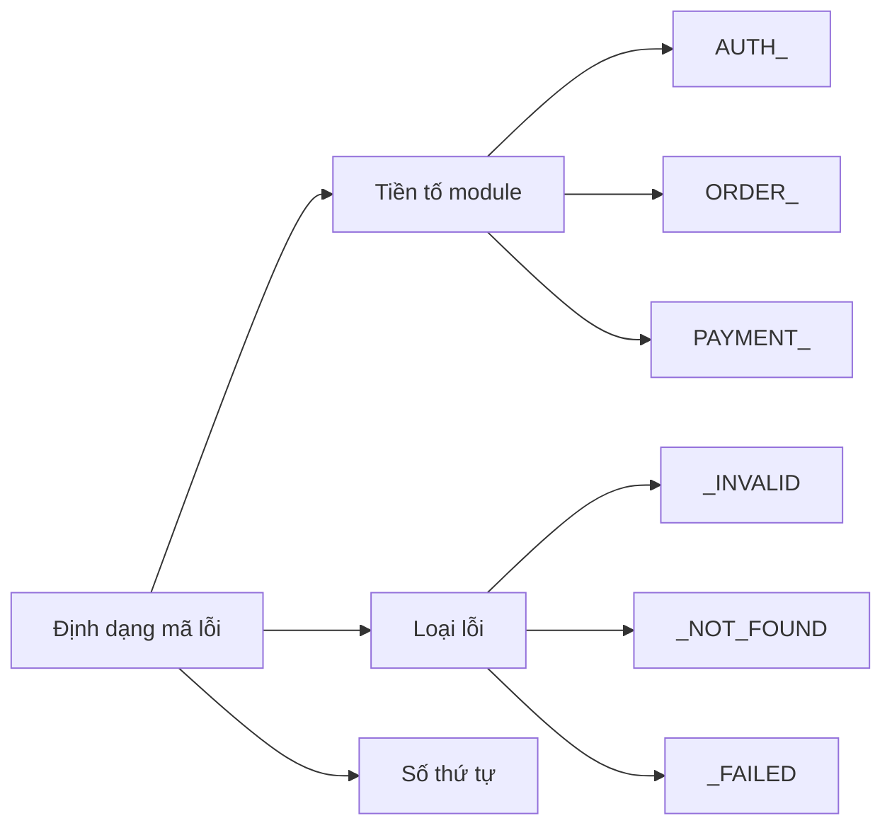

# 9.4.5 Lỗi phải được ghi chép——Đồng bộ tài liệu: Tài liệu mã lỗi và hướng dẫn xử lý

**Tài liệu mã lỗi là "hợp đồng" của sự hợp tác giữa phía trước và phía sau——thay đổi mã phải cập nhật tài liệu.**

## Quy chuẩn thiết kế mã lỗi



## Định nghĩa mã lỗi

```typescript
// lib/error-codes.ts
export const ErrorCodes = {
  // Lỗi xác thực (1xxx)
  AUTH_INVALID_CREDENTIALS: {
    code: 'AUTH_1001',
    message: 'Email hoặc mật khẩu không đúng',
    httpStatus: 401,
  },
  AUTH_TOKEN_EXPIRED: {
    code: 'AUTH_1002',
    message: 'Phiên đăng nhập hết hạn, vui lòng đăng nhập lại',
    httpStatus: 401,
  },
  AUTH_INSUFFICIENT_PERMISSION: {
    code: 'AUTH_1003',
    message: 'Bạn không có quyền thực hiện thao tác này',
    httpStatus: 403,
  },

  // Lỗi đơn hàng (2xxx)
  ORDER_NOT_FOUND: {
    code: 'ORDER_2001',
    message: 'Đơn hàng không tồn tại',
    httpStatus: 404,
  },
  ORDER_ALREADY_PAID: {
    code: 'ORDER_2002',
    message: 'Đơn hàng đã được thanh toán',
    httpStatus: 409,
  },
  ORDER_STOCK_INSUFFICIENT: {
    code: 'ORDER_2003',
    message: 'Tồn kho không đủ',
    httpStatus: 400,
  },

  // Lỗi thanh toán (3xxx)
  PAYMENT_FAILED: {
    code: 'PAYMENT_3001',
    message: 'Thanh toán thất bại, vui lòng thử lại',
    httpStatus: 400,
  },
  PAYMENT_TIMEOUT: {
    code: 'PAYMENT_3002',
    message: 'Thanh toán hết thời gian chờ',
    httpStatus: 408,
  },

  // Lỗi hệ thống (9xxx)
  SYSTEM_ERROR: {
    code: 'SYSTEM_9001',
    message: 'Dịch vụ tạm thời không khả dụng, vui lòng thử lại sau',
    httpStatus: 500,
  },
  SYSTEM_MAINTENANCE: {
    code: 'SYSTEM_9002',
    message: 'Hệ thống đang bảo trì, vui lòng truy cập lại sau',
    httpStatus: 503,
  },
} as const;

export type ErrorCode = keyof typeof ErrorCodes;
```

## Sử dụng mã lỗi

```typescript
// lib/errors.ts
import { ErrorCodes, ErrorCode } from './error-codes';

export class AppError extends Error {
  public code: string;
  public httpStatus: number;

  constructor(errorCode: ErrorCode, customMessage?: string) {
    const errorDef = ErrorCodes[errorCode];
    super(customMessage || errorDef.message);

    this.code = errorDef.code;
    this.httpStatus = errorDef.httpStatus;
  }
}

// Sử dụng
throw new AppError('ORDER_STOCK_INSUFFICIENT');
throw new AppError('ORDER_NOT_FOUND', `Đơn hàng ${orderId} không tồn tại`);
```

## Tự động tạo tài liệu

```typescript
// scripts/generate-error-docs.ts
import { ErrorCodes } from '../lib/error-codes';
import * as fs from 'fs';

function generateErrorDocs() {
  const grouped = groupByModule(ErrorCodes);

  let markdown = '# Tài liệu mã lỗi API\n\n';
  markdown += `> Thời gian cập nhật: ${new Date().toISOString()}\n\n`;

  for (const [module, errors] of Object.entries(grouped)) {
    markdown += `## ${module}\n\n`;
    markdown += '| Mã lỗi | HTTP Status | Mô tả | Gợi ý xử lý |\n';
    markdown += '|--------|----------|------|----------|\n';

    for (const [key, error] of Object.entries(errors)) {
      markdown += `| ${error.code} | ${error.httpStatus} | ${error.message} | ${getHandlingTip(key)} |\n`;
    }

    markdown += '\n';
  }

  fs.writeFileSync('docs/api/error-codes.md', markdown);
  console.log('Tài liệu mã lỗi đã được tạo');
}

function groupByModule(codes: typeof ErrorCodes) {
  const groups: Record<string, typeof ErrorCodes> = {};

  for (const [key, value] of Object.entries(codes)) {
    const module = key.split('_')[0];
    if (!groups[module]) groups[module] = {};
    groups[module][key] = value;
  }

  return groups;
}

function getHandlingTip(key: string): string {
  const tips: Record<string, string> = {
    AUTH_INVALID_CREDENTIALS: 'Kiểm tra email và mật khẩu có đúng không',
    AUTH_TOKEN_EXPIRED: 'Đăng nhập lại để lấy Token mới',
    ORDER_STOCK_INSUFFICIENT: 'Giảm số lượng mua hoặc chọn sản phẩm khác',
    PAYMENT_FAILED: 'Kiểm tra thông tin thanh toán hoặc đổi phương thức',
    SYSTEM_ERROR: 'Thử lại sau, nếu lỗi vẫn xảy ra hãy liên hệ bộ phận hỗ trợ',
  };

  return tips[key] || 'Vui lòng liên hệ bộ phận hỗ trợ';
}

generateErrorDocs();
```

## Kiểm tra CI xác thực đồng bộ tài liệu

```yaml
# .github/workflows/check-error-docs.yml
name: Check Error Docs

on:
  pull_request:
    paths:
      - 'lib/error-codes.ts'

jobs:
  check:
    runs-on: ubuntu-latest
    steps:
      - uses: actions/checkout@v4

      - name: Setup Node
        uses: actions/setup-node@v4
        with:
          node-version: '20'

      - name: Install dependencies
        run: npm ci

      - name: Generate docs
        run: npx ts-node scripts/generate-error-docs.ts

      - name: Check for changes
        run: |
          if git diff --exit-code docs/api/error-codes.md; then
            echo "✅ Tài liệu mã lỗi đã được đồng bộ"
          else
            echo "❌ Mã lỗi đã thay đổi, vui lòng cập nhật tài liệu"
            echo "Chạy: npm run generate:error-docs"
            exit 1
          fi
```

## Mẫu tài liệu mã lỗi

```markdown
# Tài liệu mã lỗi API

## Mô-đun xác thực (AUTH)

| Mã lỗi | HTTP Status | Mô tả | Gợi ý xử lý |
|--------|----------|------|----------|
| AUTH_1001 | 401 | Email hoặc mật khẩu không đúng | Kiểm tra thông tin đăng nhập |
| AUTH_1002 | 401 | Phiên đăng nhập hết hạn | Đăng nhập lại |
| AUTH_1003 | 403 | Không có quyền | Liên hệ quản trị viên |

## Mô-đun đơn hàng (ORDER)

| Mã lỗi | HTTP Status | Mô tả | Gợi ý xử lý |
|--------|----------|------|----------|
| ORDER_2001 | 404 | Đơn hàng không tồn tại | Kiểm tra mã đơn hàng |
| ORDER_2002 | 409 | Đơn hàng đã được thanh toán | Không cần thanh toán lại |
| ORDER_2003 | 400 | Tồn kho không đủ | Giảm số lượng |

## Ví dụ xử lý phía trước

\`\`\`typescript
try {
  await api.createOrder(data);
} catch (err) {
  if (err.code === 'ORDER_2003') {
    showStockWarning(err.message);
  } else {
    showError(err.message);
  }
}
\`\`\`
```

## Quản lý phiên bản

```typescript
// lib/error-codes.ts
export const ERROR_CODES_VERSION = '1.2.0';

// Nhật ký thay đổi
export const CHANGELOG = {
  '1.2.0': ['Thêm mã lỗi PAYMENT_TIMEOUT'],
  '1.1.0': ['Thêm mã lỗi ORDER_STOCK_INSUFFICIENT'],
  '1.0.0': ['Phiên bản ban đầu'],
};
```

## Tóm tắt chương này

Tài liệu mã lỗi là nền tảng của sự hợp tác giữa phía trước và phía sau. Thông qua định nghĩa mã trong code (nguồn dữ liệu duy nhất), tự động tạo tài liệu (giữ đồng bộ), kiểm tra CI (buộc cập nhật). Khi thay đổi mã lỗi cùng lúc phải cập nhật tài liệu, đây là kỷ luật cơ bản của hợp tác nhóm.
