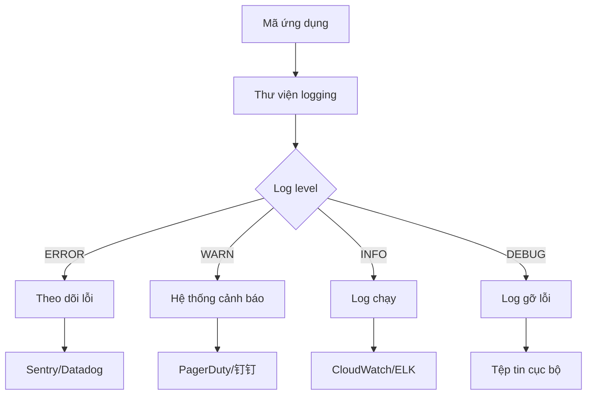

# 9.4 Lỗi xảy ra rồi định vị nhanh như thế nào——Xử lý lỗi và quy chuẩn logging: Mức độ/Ngữ cảnh/Mặt nạ; Sửa chữa → Đồng bộ tài liệu

**Một hệ thống logging tốt là "hộp đen" của môi trường production——khi có vấn đề có thể định vị nhanh, bình thường không gây trở ngại.**

## Kiến trúc hệ thống logging



## Nội dung của chương này

| Phần | Chủ đề | Nội dung cốt lõi |
|------|------|----------|
| 9.4.1 | Log level | Sử dụng đúng cách ERROR/WARN/INFO/DEBUG |
| 9.4.2 | Thông tin ngữ cảnh | Tiêm Request ID, User ID, loại hoạt động |
| 9.4.3 | Mặt nạ thông tin nhạy cảm | Xử lý an toàn mật khẩu, Token, số CMND |
| 9.4.4 | Phục hồi lỗi | Xử lý ngoại lệ và gợi ý thân thiện người dùng |
| 9.4.5 | Đồng bộ tài liệu | Duy trì và cập nhật tài liệu mã lỗi |

## Chọn thư viện logging

| Thư viện | Đặc điểm | Trường hợp áp dụng |
|----|------|----------|
| pino | JSON logging hiệu suất cao | Môi trường production |
| winston | Chức năng phong phú, có thể mở rộng | Nhu cầu phức tạp |
| console | Không phụ thuộc | Gỡ lỗi phát triển |

## Cấu hình nhanh

```typescript
// lib/logger.ts
import pino from 'pino';

export const logger = pino({
  level: process.env.LOG_LEVEL || 'info',
  transport: process.env.NODE_ENV === 'development'
    ? { target: 'pino-pretty' }
    : undefined,
  redact: ['password', 'token', 'authorization'],
});
```

```typescript
// Ví dụ sử dụng
import { logger } from '@/lib/logger';

// Ghi log ở các mức độ khác nhau
logger.error({ err, userId }, 'Xử lý thanh toán thất bại');
logger.warn({ orderId }, 'Tồn kho không đủ, đã giảm cấp');
logger.info({ action: 'login', userId }, 'Người dùng đăng nhập');
logger.debug({ query }, 'Truy vấn cơ sở dữ liệu');
```

## Các nguyên tắc cốt lõi

1. **Production chỉ ghi log INFO trở lên**: Volume log DEBUG quá lớn
2. **Structured logging**: Sử dụng định dạng JSON, thuận tiện cho tìm kiếm và tổng hợp
3. **Thông tin nhạy cảm phải được mặt nạ**: Mật khẩu, Token, thông tin cá nhân
4. **Lỗi phải có ngữ cảnh**: Ai, ở đâu, làm gì, tại sao thất bại
5. **Tài liệu và mã đồng bộ**: Khi thay đổi mã lỗi phải cập nhật tài liệu

## Tóm tắt chương này

Logging là "mắt" của môi trường production. Thông qua ghi log theo phân cấp, xuất kết quả có cấu trúc, mặt nạ thông tin nhạy cảm, log vừa có thể giúp khắc phục sự cố, vừa không bị lộ lực riêng tư người dùng. Các phần tiếp theo sẽ giải thích chi tiết cách thực hiện từng khía cạnh.
