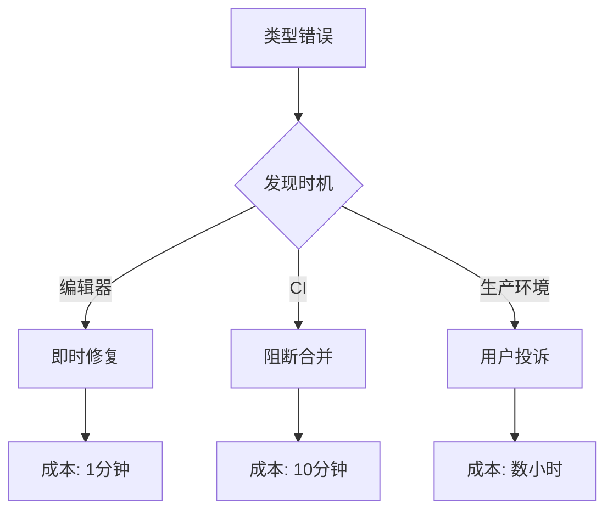

# 9.5.1 Không thể biên dịch TypeScript——Kiểm tra kiểu: Xác minh biên dịch TypeScript

**Kiểm tra kiểu là tuyến phòng thủ đầu tiên của CI——lỗi kiểu là Bug, phải loại bỏ trước khi hợp nhất.**

## Giá trị của kiểm tra kiểu



## Cấu hình tsconfig.json

```json
{
  "compilerOptions": {
    "target": "ES2022",
    "lib": ["dom", "dom.iterable", "esnext"],
    "allowJs": true,
    "skipLibCheck": true,
    "strict": true,
    "noEmit": true,
    "esModuleInterop": true,
    "module": "esnext",
    "moduleResolution": "bundler",
    "resolveJsonModule": true,
    "isolatedModules": true,
    "jsx": "preserve",
    "incremental": true,
    "plugins": [{ "name": "next" }],
    "paths": {
      "@/*": ["./*"]
    }
  },
  "include": ["next-env.d.ts", "**/*.ts", "**/*.tsx", ".next/types/**/*.ts"],
  "exclude": ["node_modules"]
}
```

## Tùy chọn chế độ strict

```json
{
  "compilerOptions": {
    // strict bao gồm tất cả những cái sau
    "strict": true,

    // hoặc cấu hình riêng lẻ
    "noImplicitAny": true,
    "strictNullChecks": true,
    "strictFunctionTypes": true,
    "strictBindCallApply": true,
    "strictPropertyInitialization": true,
    "noImplicitThis": true,
    "alwaysStrict": true,

    // Kiểm tra strict bổ sung
    "noUnusedLocals": true,
    "noUnusedParameters": true,
    "noImplicitReturns": true,
    "noFallthroughCasesInSwitch": true,
    "noUncheckedIndexedAccess": true
  }
}
```

## Cấu hình CI

```yaml
# .github/workflows/ci.yml
jobs:
  type-check:
    runs-on: ubuntu-latest
    steps:
      - uses: actions/checkout@v4

      - uses: actions/setup-node@v4
        with:
          node-version: '20'
          cache: 'npm'

      - run: npm ci

      - name: Type check
        run: npx tsc --noEmit
```

## Kịch bản package.json

```json
{
  "scripts": {
    "type-check": "tsc --noEmit",
    "type-check:watch": "tsc --noEmit --watch"
  }
}
```

## Lỗi kiểu phổ biến

### 1. Any ẩn

```typescript
// ❌ Sai: tham số any ẩn
function greet(name) {
  return `Hello, ${name}`;
}

// ✅ Đúng: kiểu rõ ràng
function greet(name: string): string {
  return `Hello, ${name}`;
}
```

### 2. Có thể là null

```typescript
// ❌ Sai: không xử lý null
const user = await prisma.user.findUnique({ where: { id } });
console.log(user.name); // user có thể là null

// ✅ Đúng: xử lý giá trị trống
const user = await prisma.user.findUnique({ where: { id } });
if (!user) {
  throw new NotFoundError('Người dùng không tồn tại');
}
console.log(user.name);
```

### 3. Kiểu không khớp

```typescript
// ❌ Sai: kiểu không khớp
interface User {
  id: string;
  name: string;
}

const user: User = {
  id: 123, // number không thể gán cho string
  name: 'Test',
};

// ✅ Đúng: kiểu nhất quán
const user: User = {
  id: '123',
  name: 'Test',
};
```

## Kiểm tra kiểu tăng dần

```json
{
  "compilerOptions": {
    "incremental": true,
    "tsBuildInfoFile": ".tsbuildinfo"
  }
}
```

```yaml
# CI bộ nhớ đệm tsBuildInfo
- name: Cache TypeScript build info
  uses: actions/cache@v3
  with:
    path: .tsbuildinfo
    key: ${{ runner.os }}-tsbuildinfo-${{ hashFiles('**/*.ts', '**/*.tsx') }}
```

## Tạo khai báo kiểu

```json
{
  "compilerOptions": {
    "declaration": true,
    "declarationDir": "./dist/types"
  }
}
```

## Gỡ lỗi lỗi kiểu

```bash
# Xem lỗi chi tiết
npx tsc --noEmit --extendedDiagnostics

# Chỉ kiểm tra tệp cụ thể
npx tsc --noEmit src/services/user.service.ts

# Xem suy luận kiểu
npx tsc --noEmit --generateTrace ./trace
```

## Tóm tắt chương

Kiểm tra kiểu là 门禁 chất lượng cơ bản nhất. Bật chế độ `strict`, chạy `tsc --noEmit` trong CI, đảm bảo tất cả lỗi kiểu được phát hiện trước khi hợp nhất. Lỗi kiểu được phát hiện sớm hơn, chi phí sửa chữa càng thấp.
