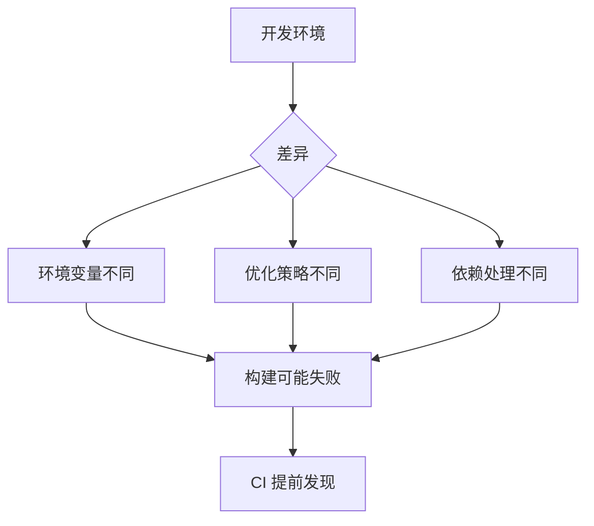

# 9.5.3 Dự án có thể đóng gói thành công không——Xác minh build: Kiểm tra thành công xây dựng production

**Có thể chạy trong môi trường phát triển không có nghĩa là chạy được trong môi trường production——phải xác minh build production trước mỗi lần hợp nhất.**

## Tính cần thiết của xác minh build



## Cấu hình Next.js build

```typescript
// next.config.ts
import type { NextConfig } from 'next';

const nextConfig: NextConfig = {
  // Chế độ strict
  reactStrictMode: true,

  // Kiểm tra TypeScript strict
  typescript: {
    ignoreBuildErrors: false,
  },

  // Kiểm tra ESLint
  eslint: {
    ignoreDuringBuilds: false,
  },

  // Cấu hình đầu ra
  output: 'standalone',

  // Tính năng thử nghiệm
  experimental: {
    typedRoutes: true,
  },
};

export default nextConfig;
```

## Cấu hình build CI

```yaml
# .github/workflows/ci.yml
jobs:
  build:
    runs-on: ubuntu-latest

    steps:
      - uses: actions/checkout@v4

      - uses: actions/setup-node@v4
        with:
          node-version: '20'
          cache: 'npm'

      - run: npm ci

      - name: Build
        run: npm run build
        env:
          # Biến môi trường cần thiết để xây dựng
          NEXT_PUBLIC_API_URL: https://api.example.com
          DATABASE_URL: ${{ secrets.DATABASE_URL }}

      - name: Check bundle size
        run: |
          du -sh .next/static
          du -sh .next/server
```

## Xác minh biến môi trường

```typescript
// lib/env.ts
import { z } from 'zod';

const envSchema = z.object({
  DATABASE_URL: z.string().url(),
  NEXT_PUBLIC_API_URL: z.string().url(),
  JWT_SECRET: z.string().min(32),
});

// Xác minh lúc xây dựng
export const env = envSchema.parse({
  DATABASE_URL: process.env.DATABASE_URL,
  NEXT_PUBLIC_API_URL: process.env.NEXT_PUBLIC_API_URL,
  JWT_SECRET: process.env.JWT_SECRET,
});
```

```typescript
// next.config.ts
import './lib/env'; // Xác minh biến môi trường lúc xây dựng
```

## Kiểm tra sản phẩm build

```yaml
# .github/workflows/ci.yml
- name: Verify build output
  run: |
    # Kiểm tra tệp quan trọng tồn tại
    test -f .next/BUILD_ID
    test -d .next/static
    test -d .next/server

    # Kiểm tra kích thước build
    SIZE=$(du -sm .next | cut -f1)
    if [ "$SIZE" -gt 500 ]; then
      echo "Warning: Build size ${SIZE}MB exceeds 500MB"
    fi
```

## Bộ nhớ đệm build

```yaml
# .github/workflows/ci.yml
- name: Cache Next.js build
  uses: actions/cache@v3
  with:
    path: |
      .next/cache
    key: ${{ runner.os }}-nextjs-${{ hashFiles('**/package-lock.json') }}-${{ hashFiles('**/*.ts', '**/*.tsx') }}
    restore-keys: |
      ${{ runner.os }}-nextjs-${{ hashFiles('**/package-lock.json') }}-
      ${{ runner.os }}-nextjs-
```

## Lỗi build phổ biến

### 1. Biến môi trường bị thiếu

```typescript
// ❌ Báo lỗi lúc xây dựng
const apiUrl = process.env.NEXT_PUBLIC_API_URL!;
// Nếu không được đặt, build sẽ vượt qua nhưng lỗi runtime

// ✅ Xác minh lúc xây dựng
if (!process.env.NEXT_PUBLIC_API_URL) {
  throw new Error('Missing NEXT_PUBLIC_API_URL');
}
```

### 2. Code phía máy chủ/phía client bị nhầm lẫn

```typescript
// ❌ Code phía client sử dụng module phía server
'use client';
import { prisma } from '@/lib/prisma'; // Xây dựng thất bại

// ✅ Gọi qua API
'use client';
const data = await fetch('/api/users').then(r => r.json());
```

### 3. Vấn đề nhập động

```typescript
// ❌ Không tìm thấy module lúc xây dựng
const Component = dynamic(() => import('./Component'), {
  ssr: false,
});

// ✅ Đảm bảo đường dẫn chính xác và module tồn tại
const Component = dynamic(() => import('@/components/Component'), {
  ssr: false,
  loading: () => <Skeleton />,
});
```

## Phân tích build

```json
// package.json
{
  "scripts": {
    "build": "next build",
    "build:analyze": "ANALYZE=true next build"
  }
}
```

```typescript
// next.config.ts
import bundleAnalyzer from '@next/bundle-analyzer';

const withBundleAnalyzer = bundleAnalyzer({
  enabled: process.env.ANALYZE === 'true',
});

export default withBundleAnalyzer(nextConfig);
```

## Tóm tắt chương

Xác minh build là kiểm tra cuối cùng trước triển khai. Đảm bảo `next.config.ts` không bỏ qua lỗi TypeScript và ESLint, đặt biến môi trường cần thiết trong CI, xác minh tính toàn vẹn của sản phẩm build. Lỗi build phải chặn hợp nhất PR.
