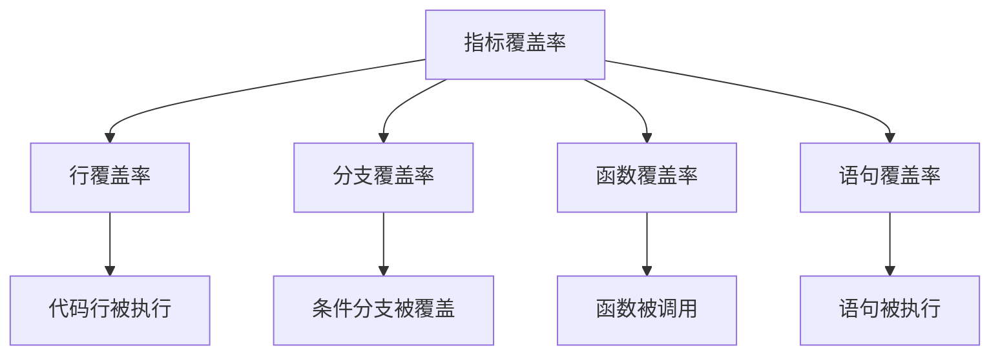

# 9.5.4 Test phủ bao nhiêu code——Độ phủ test: Thiết lập ngưỡng độ phủ code

**Độ phủ không phải mục tiêu, mà là chỉ số——80% độ phủ thực tế có giá trị hơn 100% độ phủ giả.**

## Các loại độ phủ



## Cấu hình độ phủ Jest

```typescript
// jest.config.ts
import type { Config } from 'jest';

const config: Config = {
  collectCoverage: true,
  coverageDirectory: 'coverage',
  coverageProvider: 'v8',

  collectCoverageFrom: [
    'src/**/*.{ts,tsx}',
    '!src/**/*.d.ts',
    '!src/**/*.test.{ts,tsx}',
    '!src/**/*.stories.{ts,tsx}',
    '!src/types/**/*',
  ],

  coverageThreshold: {
    global: {
      branches: 80,
      functions: 80,
      lines: 80,
      statements: 80,
    },
    // Các module quan trọng yêu cầu cao hơn
    './src/services/': {
      branches: 90,
      functions: 90,
      lines: 90,
      statements: 90,
    },
  },

  coverageReporters: ['text', 'lcov', 'html'],
};

export default config;
```

## Cấu hình CI

```yaml
# .github/workflows/ci.yml
jobs:
  test:
    runs-on: ubuntu-latest

    steps:
      - uses: actions/checkout@v4

      - uses: actions/setup-node@v4
        with:
          node-version: '20'
          cache: 'npm'

      - run: npm ci

      - name: Run tests with coverage
        run: npm run test:ci

      - name: Upload coverage to Codecov
        uses: codecov/codecov-action@v3
        with:
          token: ${{ secrets.CODECOV_TOKEN }}
          files: ./coverage/lcov.info
          fail_ci_if_error: true
          verbose: true
```

## Kịch bản package.json

```json
{
  "scripts": {
    "test": "jest",
    "test:ci": "jest --ci --coverage --maxWorkers=2",
    "test:coverage": "jest --coverage --coverageReporters=text"
  }
}
```

## Cấu hình Codecov

```yaml
# codecov.yml
coverage:
  status:
    project:
      default:
        target: 80%
        threshold: 2%
    patch:
      default:
        target: 80%

comment:
  layout: "reach,diff,flags,tree"
  behavior: default
  require_changes: true

ignore:
  - "**/*.test.ts"
  - "**/*.d.ts"
  - "src/types/**"
```

## Mục tiêu độ phủ hợp lý

| Loại code | Độ phủ khuyến cáo | Lý do |
|----------|-----------|------|
| Service nghiệp vụ | 90%+ | Logic cốt lõi phải test đầy đủ |
| API route | 80%+ | Hợp đồng giao diện cần xác minh |
| Hàm tiện ích | 95%+ | Hàm thuần dễ test |
| Thành phần UI | 60-70% | Test trực quan quan trọng hơn |
| Tệp cấu hình | Bỏ qua | Không cần test |

## Tránh độ phủ giả

```typescript
// ❌ Độ phủ giả: chỉ gọi không xác minh
it('should create user', async () => {
  await userService.create({ email: 'test@example.com' });
  // Không có assertion, độ phủ cao nhưng không có giá trị
});

// ✅ Độ phủ thực tế: xác minh hành vi
it('should create user with hashed password', async () => {
  const user = await userService.create({
    email: 'test@example.com',
    password: 'secret',
  });

  expect(user.email).toBe('test@example.com');
  expect(user.password).not.toBe('secret');
  expect(await bcrypt.compare('secret', user.password)).toBe(true);
});
```

## Phân tích báo cáo độ phủ

```bash
# Xem báo cáo độ phủ
npm run test:coverage

# Mở báo cáo HTML
open coverage/lcov-report/index.html
```

```
-------------------|---------|----------|---------|---------|
File               | % Stmts | % Branch | % Funcs | % Lines |
-------------------|---------|----------|---------|---------|
All files          |   85.23 |    78.45 |   82.14 |   85.67 |
 services/         |   92.45 |    88.23 |   90.12 |   92.78 |
  user.service.ts  |   95.12 |    92.34 |   94.56 |   95.45 |
  order.service.ts |   89.78 |    84.12 |   85.67 |   90.12 |
 lib/              |   78.34 |    68.45 |   74.23 |   78.89 |
-------------------|---------|----------|---------|---------|
```

## Nâng cấp dần dần

```yaml
# codecov.yml
coverage:
  status:
    project:
      default:
        # Chỉ yêu cầu không giảm độ phủ
        target: auto
        threshold: 1%
    patch:
      default:
        # Code mới phải có 80% độ phủ
        target: 80%
```

## Tóm tắt chương

Độ phủ là chỉ số tham khảo về chất lượng code, không phải mục tiêu. Đặt ngưỡng hợp lý (80% là lựa chọn phổ biến), tập trung vào độ phủ code mới, tránh độ phủ giả. Sử dụng Codecov để tích hợp vào quy trình PR, làm cho thay đổi độ phủ trở nên hình ảnh.
