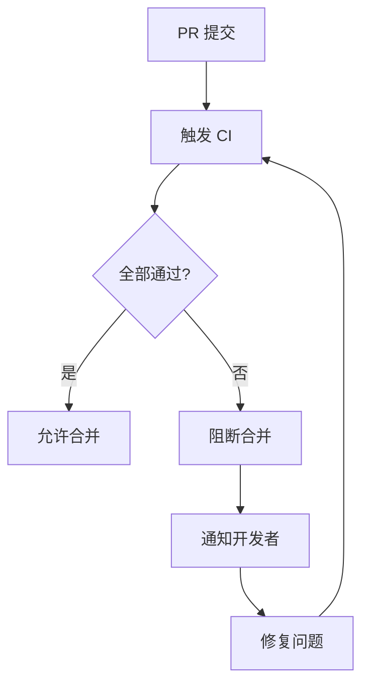

# 9.5.5 Code không đạt tiêu chuẩn không được phép hợp nhất——Chiến lược 门禁: Cơ chế chặn lỗi và thông báo

**Cốt lõi của 质量门禁 là "chặn cứng"——kiểm tra không thông qua thì không được phép hợp nhất, không có ngoại lệ.**

## Quy trình 门禁



## Bảo vệ nhánh GitHub

```yaml
# Cấu hình trong cài đặt kho GitHub:
# Settings > Branches > Add branch protection rule

# Mẫu tên nhánh
Branch name pattern: main

# Quy tắc bảo vệ
✅ Require a pull request before merging
  ✅ Require approvals (1)
  ✅ Dismiss stale pull request approvals when new commits are pushed

✅ Require status checks to pass before merging
  ✅ Require branches to be up to date before merging
  Required checks:
    - type-check
    - lint
    - test
    - build

✅ Require conversation resolution before merging

❌ Allow force pushes
❌ Allow deletions
```

## Kiểm tra CI bắt buộc

```yaml
# .github/workflows/ci.yml
name: CI

on:
  pull_request:
    branches: [main, develop]

jobs:
  type-check:
    runs-on: ubuntu-latest
    steps:
      - uses: actions/checkout@v4
      - uses: actions/setup-node@v4
        with:
          node-version: '20'
          cache: 'npm'
      - run: npm ci
      - run: npm run type-check

  lint:
    runs-on: ubuntu-latest
    steps:
      - uses: actions/checkout@v4
      - uses: actions/setup-node@v4
        with:
          node-version: '20'
          cache: 'npm'
      - run: npm ci
      - run: npm run lint

  test:
    runs-on: ubuntu-latest
    steps:
      - uses: actions/checkout@v4
      - uses: actions/setup-node@v4
        with:
          node-version: '20'
          cache: 'npm'
      - run: npm ci
      - run: npm run test:ci

  build:
    runs-on: ubuntu-latest
    needs: [type-check, lint, test]
    steps:
      - uses: actions/checkout@v4
      - uses: actions/setup-node@v4
        with:
          node-version: '20'
          cache: 'npm'
      - run: npm ci
      - run: npm run build
```

## Thông báo khi thất bại

### Thông báo Slack

```yaml
# .github/workflows/ci.yml
- name: Notify on failure
  if: failure()
  uses: slackapi/slack-github-action@v1
  with:
    channel-id: 'C01234567'
    slack-message: |
      :x: CI failed
      PR: ${{ github.event.pull_request.title }}
      Author: ${{ github.event.pull_request.user.login }}
      Link: ${{ github.event.pull_request.html_url }}
  env:
    SLACK_BOT_TOKEN: ${{ secrets.SLACK_BOT_TOKEN }}
```

### Thông báo DingTalk

```yaml
- name: Notify on failure
  if: failure()
  run: |
    curl -X POST '${{ secrets.DINGTALK_WEBHOOK }}' \
      -H 'Content-Type: application/json' \
      -d '{
        "msgtype": "markdown",
        "markdown": {
          "title": "CI Failed",
          "text": "### CI Build Failed\n- PR: ${{ github.event.pull_request.title }}\n- Author: ${{ github.event.pull_request.user.login }}\n- [View Details](${{ github.event.pull_request.html_url }})"
        }
      }'
```

## Kiểm tra trạng thái PR

```yaml
# .github/workflows/ci.yml
- name: Add PR comment on failure
  if: failure() && github.event_name == 'pull_request'
  uses: actions/github-script@v7
  with:
    script: |
      github.rest.issues.createComment({
        issue_number: context.issue.number,
        owner: context.repo.owner,
        repo: context.repo.repo,
        body: `## ❌ CI Check Failed

Please check the following issues:
- Type error: \`npm run type-check\`
- Lint error: \`npm run lint\`
- Test failed: \`npm run test\`
- Build failed: \`npm run build\`

[View Detailed Logs](${context.payload.repository.html_url}/actions/runs/${context.runId})`
      })
```

## Tối ưu kiểm tra song song

```yaml
# .github/workflows/ci.yml
jobs:
  changes:
    runs-on: ubuntu-latest
    outputs:
      src: ${{ steps.filter.outputs.src }}
      tests: ${{ steps.filter.outputs.tests }}
    steps:
      - uses: actions/checkout@v4
      - uses: dorny/paths-filter@v2
        id: filter
        with:
          filters: |
            src:
              - 'src/**'
            tests:
              - '**/*.test.ts'

  type-check:
    needs: changes
    if: needs.changes.outputs.src == 'true'
    runs-on: ubuntu-latest
    # ...

  test:
    needs: changes
    if: needs.changes.outputs.src == 'true' || needs.changes.outputs.tests == 'true'
    runs-on: ubuntu-latest
    # ...
```

## Bỏ qua khẩn cấp (chỉ trong trường hợp đặc biệt)

```yaml
# Thêm [skip ci] vào commit message có thể bỏ qua CI
# Nhưng bảo vệ nhánh vẫn sẽ chặn hợp nhất

# Trường hợp khẩn cấp cần quyền quản trị viên để bỏ qua
# Settings > Branches > Branch protection rules
# ❌ Do not allow bypassing the above settings
# Khuyên cáo giữ tắt, nếu cần bỏ qua hãy do quản trị viên thực hiện
```

## Danh sách kiểm tra 门禁

| Mục kiểm tra | Xử lý khi thất bại | Cách thông báo |
|--------|----------|----------|
| Biên dịch TypeScript | Chặn | Bình luận PR |
| ESLint | Chặn | Bình luận PR |
| Kiểm tra đơn vị | Chặn | Slack/DingTalk |
| Ngưỡng độ phủ | Chặn | Bình luận Codecov |
| Xác minh xây dựng | Chặn | Slack/DingTalk |

## Tóm tắt chương

Chất lượng 门禁 là tuyến phòng thủ cuối cùng của chất lượng code nhóm. Thông qua cấu hình bảo vệ nhánh GitHub thiết lập kiểm tra CI bắt buộc, tự động thông báo nhà phát triển khi thất bại. Chất lượng 门禁 phải "chặn cứng"——không có cơ chế bỏ qua, đảm bảo code không đạt tiêu chuẩn không bao giờ được vào nhánh chính.
