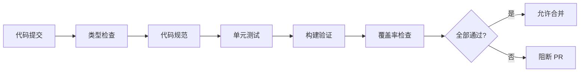

# 9.5 Để robot giúp bạn bảo vệ chất lượng——CI 质量门禁 với GitHub Actions

**CI 质量门禁 là "cửa kiểm tra" của mã——code không đạt chất lượng sẽ không bao giờ được hợp nhất vào nhánh chính.**

## Quy trình 质量门禁



## Nội dung chương này

| Mục | Chủ đề | Nội dung cốt lõi |
|------|------|----------|
| 9.5.1 | Kiểm tra kiểu | Xác minh biên dịch TypeScript |
| 9.5.2 | Tiêu chuẩn code | Kiểm tra ESLint/Prettier tự động |
| 9.5.3 | Xác minh build | Kiểm tra thành công xây dựng production |
| 9.5.4 | Độ phủ | Thiết lập ngưỡng độ phủ code |
| 9.5.5 | Chiến lược 门禁 | Cơ chế chặn lỗi và thông báo |

## Cấu hình GitHub Actions hoàn chỉnh

```yaml
# .github/workflows/ci.yml
name: CI

on:
  push:
    branches: [main, develop]
  pull_request:
    branches: [main, develop]

jobs:
  quality:
    runs-on: ubuntu-latest

    steps:
      - uses: actions/checkout@v4

      - name: Setup Node.js
        uses: actions/setup-node@v4
        with:
          node-version: '20'
          cache: 'npm'

      - name: Install dependencies
        run: npm ci

      - name: Type check
        run: npm run type-check

      - name: Lint
        run: npm run lint

      - name: Test
        run: npm run test:ci

      - name: Build
        run: npm run build

      - name: Upload coverage
        uses: codecov/codecov-action@v3
        with:
          fail_ci_if_error: true
```

## Kịch bản package.json

```json
{
  "scripts": {
    "type-check": "tsc --noEmit",
    "lint": "eslint . --ext .ts,.tsx --max-warnings 0",
    "lint:fix": "eslint . --ext .ts,.tsx --fix",
    "test": "jest",
    "test:ci": "jest --ci --coverage --maxWorkers=2",
    "build": "next build"
  }
}
```

## Tiêu chuẩn chất lượng

| Mục kiểm tra | Ngưỡng | Xử lý khi thất bại |
|--------|------|----------|
| Lỗi TypeScript | 0 | Chặn |
| Cảnh báo ESLint | 0 | Chặn |
| Kiểm tra thất bại | 0 | Chặn |
| Độ phủ | 80% | Chặn |
| Xây dựng thất bại | 0 | Chặn |

## Kiểm tra trước khi đẩy

Chạy kiểm tra hoàn chỉnh trước khi đẩy:

```bash
# Cài đặt husky
npm install -D husky lint-staged
npx husky init

# .husky/pre-commit
npm run type-check && npm run lint && npm run test

# .husky/pre-push
npm run build
```

## Tóm tắt chương

CI 质量门禁 là người bảo vệ chất lượng code của nhóm. Thông qua kiểm tra tự động (kiểu, tiêu chuẩn, test, xây dựng), đảm bảo mỗi lần hợp nhất đều đúng tiêu chuẩn. Các mục tiếp theo sẽ giải thích chi tiết cấu hình và best practices cho từng 门禁.
