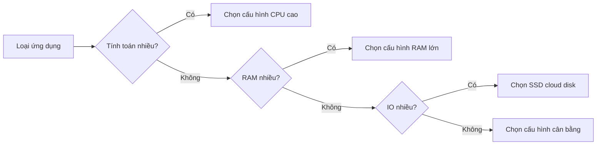

# 10.1.1 Đặt máy chủ ở đâu — Lựa chọn dịch vụ Cloud: Lập kế hoạch tài nguyên Tính toán/Lưu trữ/Mạng

Chọn đúng máy chủ là bước đầu tiên để tiết kiệm tiền và công sức.

## So sánh nhà cung cấp dịch vụ Cloud

Đối với các nhà phát triển cá nhân và nhóm nhỏ, các lựa chọn phổ biến trong nước như sau:

| Nhà cung cấp | Tên sản phẩm | Ưu điểm | Trường hợp sử dụng |
|--------|----------|------|----------|
| Alibaba Cloud | ECS/Lightweight | Hệ sinh thái hoàn thiện, tài liệu đầy đủ | Ưu tiên cho môi trường production |
| Tencent Cloud | CVM/Lightweight | Giá cả hợp lý, nhiều ưu đãi cho người mới | Dự án cá nhân |
| Huawei Cloud | ECS | Độ ổn định cấp doanh nghiệp | Dự án doanh nghiệp |

::: tip Khuyến nghị cho người mới
Ban đầu nên dùng **Lightweight Application Server**, giá rẻ (50-100 NDT/tháng), có image được cài đặt sẵn dùng ngay. Khi lưu lượng tăng lên thì nâng cấp lên ECS.
:::

## Hướng dẫn lựa chọn cấu hình

### Chọn cấu hình theo quy mô dự án

| Quy mô dự án | CPU | RAM | System Disk | Bandwidth | Chi phí ước tính/tháng |
|----------|-----|------|--------|------|------------|
| Blog cá nhân/Demo | 1 core | 2G | 40G | 3M | 50-80 NDT |
| Ứng dụng nhỏ | 2 cores | 4G | 60G | 5M | 100-200 NDT |
| Môi trường production | 4 cores | 8G | 100G | 10M | 300-500 NDT |

### Nguyên tắc lập kế hoạch tài nguyên



## Các điểm quan trọng về cấu hình mạng

### Lựa chọn bandwidth

| Bandwidth | Tốc độ download | Trường hợp sử dụng |
|------|----------|----------|
| 1M | 128KB/s | API service thuần túy |
| 3M | 384KB/s | Website nhỏ |
| 5M | 640KB/s | Lưu lượng trung bình |
| 10M+ | 1.25MB/s+ | Đồng thời cao/Đa phương tiện |

::: warning Lưu ý
Bandwidth của nhà cung cấp dịch vụ cloud chỉ **bandwidth ra ngoài** (server → user), bandwidth vào thường không giới hạn. Bandwidth 1M nghĩa là người dùng chỉ có thể download tối đa 128KB dữ liệu mỗi giây từ server của bạn.
:::

### Cấu hình Security Group

Sau khi mua server phải cấu hình security group, nếu không mạng ngoài không thể truy cập:

| Port | Protocol | Mục đích |
|------|------|------|
| 22 | TCP | SSH remote login |
| 80 | TCP | HTTP website access |
| 443 | TCP | HTTPS encrypted access |
| 3000 | TCP | Next.js development port |
| 3001 | TCP | NestJS API port |

## Lập kế hoạch lưu trữ

### System Disk vs Data Disk

| Loại | Mục đích | Kích thước khuyến nghị |
|------|------|----------|
| System Disk | Hệ điều hành + Ứng dụng | 40-60G |
| Data Disk | Database + User files | Mở rộng theo nhu cầu |

::: tip Best Practice
Database và file upload của người dùng nên đặt trong **Data Disk**, thuận tiện cho việc mở rộng dung lượng và backup sau này. System disk chỉ cài ứng dụng, giữ cho sạch sẽ.
:::

### Object Storage (OSS)

Các file tĩnh như hình ảnh, video do người dùng upload nên lưu vào object storage:

| Ưu điểm | Giải thích |
|------|------|
| Mở rộng không giới hạn | Không chiếm disk của server |
| CDN acceleration | Phân phối từ các node trên toàn quốc |
| Chi phí thấp | Trả theo lượng sử dụng, rẻ hơn cloud disk |
| Độ khả dụng cao | Độ tin cậy dữ liệu 99.999999999% |

## Hướng dẫn làm việc với AI

Khi mô tả nhu cầu triển khai với AI, cung cấp các thông tin quan trọng sau:

```
Tôi cần triển khai một ứng dụng Next.js + NestJS + PostgreSQL,
dự kiến 1000 người dùng hoạt động hàng ngày, cần lưu trữ hình ảnh do người dùng upload.
Vui lòng giúp tôi lập kế hoạch cấu hình cloud server và ước tính chi phí.
```

**Thuật ngữ quan trọng**: ECS, Lightweight Application Server, Security Group, Elastic Public IP, Object Storage, Pay-as-you-go

## Khuyến nghị hữu ích

1. **Mua lightweight trước rồi nâng cấp sau**: Lightweight server rẻ, đợi doanh nghiệp tăng trưởng rồi mới migrate
2. **Chọn region gần**: Người dùng ở đâu thì mua server ở đó
3. **Chú ý các chương trình khuyến mãi**: Các đợt khuyến mãi lớn như Double 11, 618 có thể tiết kiệm một khoản lớn
4. **Thiết lập cảnh báo chi phí**: Tránh bị tấn công độc hại dẫn đến chi phí lưu lượng bùng nổ
