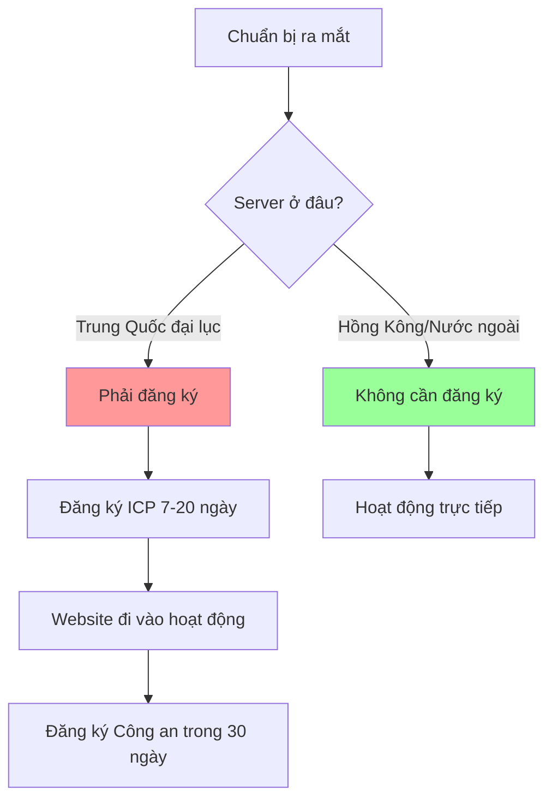

# 10.1.2 Website có cần đăng ký không — Yêu cầu tuân thủ: Đăng ký ICP và Đăng ký Công an

Một câu: Nếu server ở Trung Quốc đại lục, thì bắt buộc phải đăng ký.

## Bản chất của đăng ký

Đăng ký là phương tiện quản lý dịch vụ thông tin internet của nhà nước, chủ yếu bao gồm hai phần:

| Loại đăng ký | Cơ quan quản lý | Thời điểm | Tính bắt buộc |
|----------|----------|------|--------|
| Đăng ký ICP | Bộ Công nghiệp và Thông tin | Trước khi website đi vào hoạt động | Bắt buộc |
| Đăng ký Công an | Bộ Công an | Trong vòng 30 ngày sau khi website hoạt động | Bắt buộc |



## Quy trình đăng ký ICP

### Chuẩn bị tài liệu

| Tài liệu | Đăng ký cá nhân | Đăng ký doanh nghiệp |
|------|----------|----------|
| CMND | ✓ | ✓ (Người đại diện pháp luật + Người chịu trách nhiệm website) |
| Giấy phép kinh doanh | ✗ | ✓ |
| Chứng nhận tên miền | ✓ | ✓ |
| Ảnh màn hình/Xác minh khuôn mặt | ✓ | ✓ |
| Phương án xây dựng website | Tùy trường hợp | Một số tỉnh yêu cầu |

### Các bước đăng ký

1. **Xác thực tên miền thực**: Hoàn thành tại nhà đăng ký tên miền, cần 3 ngày làm việc
2. **Sơ duyệt của nhà cung cấp dịch vụ**: Nộp qua backend Alibaba Cloud/Tencent Cloud, 1-2 ngày
3. **Thẩm định của cục quản lý**: Cục Quản lý Thông tin của các tỉnh, 7-20 ngày làm việc
4. **Đăng ký thành công**: Nhận mã đăng ký ICP, ví dụ `京ICP备12345678号`

::: warning Nhắc nhở quan trọng
- Trong thời gian đăng ký, website **không thể truy cập**
- Tên miền phải **đã xác thực tên thực từ 3 ngày trở lên**
- Đăng ký cá nhân **không được có nội dung kinh doanh**
- Tiêu chuẩn và thời gian thẩm định khác nhau ở các tỉnh khác nhau
:::

## Quy trình đăng ký Công an

Trong vòng 30 ngày sau khi website hoạt động, cần vào [Nền tảng Dịch vụ Quản lý An ninh Internet Toàn quốc](http://www.beian.gov.cn) để hoàn tất đăng ký Công an.

### Các bước thực hiện

1. Đăng ký tài khoản và xác thực tên thật
2. Đăng ký mở mới website
3. Điền thông tin website (tên, tên miền, IP, nội dung dịch vụ, v.v.)
4. Tải xuống thỏa thuận an ninh và ký tên đóng dấu
5. Nộp thẩm định, chờ thông báo

### Yêu cầu sau khi đăng ký

Sau khi đăng ký thành công, cần hiển thị ở cuối website:

```html
<footer>
  <a href="https://beian.miit.gov.cn/" target="_blank">
    京ICP备12345678号
  </a>
  <a href="http://www.beian.gov.cn/portal/registerSystemInfo?recordcode=11010502000000" target="_blank">
    京公网安备 11010502000000号
  </a>
</footer>
```

## Lựa chọn không đăng ký

Nếu dự án của bạn hướng tới người dùng nước ngoài, hoặc chỉ là dự án học tập/demo cá nhân, có thể chọn không đăng ký:

| Phương án | Ưu điểm | Nhược điểm |
|------|------|------|
| Server Hồng Kông | Không cần đăng ký, tốc độ ổn | Giá hơi đắt, độ ổn định khác nhau |
| Server nước ngoài | Không cần đăng ký, giá rẻ | Truy cập từ trong nước chậm |
| Vercel/Netlify | Hosting miễn phí, tự động deploy | Truy cập từ trong nước không ổn định |

::: tip Khi nào phải đăng ký
- Website thương mại hướng tới người dùng trong nước
- Cần tích hợp WeChat Pay, Alipay và các dịch vụ khác
- Cần tích hợp WeChat Official Account/Mini Program
- Cần thứ hạng SEO tốt
:::

## Câu hỏi thường gặp về đăng ký

### Q: Đăng ký mất bao lâu?

| Giai đoạn | Thời gian |
|------|------|
| Xác thực tên miền thực | 3 ngày làm việc |
| Sơ duyệt nhà cung cấp dịch vụ | 1-2 ngày làm việc |
| Thẩm định cục quản lý | 7-20 ngày làm việc |
| **Tổng cộng** | **10-25 ngày làm việc** |

### Q: Đăng ký cá nhân có thể làm website gì?

Đăng ký cá nhân chỉ có thể làm **website phi kinh doanh**, như blog cá nhân, chia sẻ kỹ thuật, trưng bày tác phẩm, v.v. Không được có:
- Chức năng mua sắm/thanh toán
- Chức năng diễn đàn/cộng đồng
- Đăng ký đăng nhập người dùng (còn tranh cãi, tùy khu vực)
- Quảng cáo/nội dung kiếm lợi nhuận

### Q: Đăng ký bị từ chối thì làm sao?

Lý do từ chối phổ biến:
1. **Nội dung website không phù hợp với thông tin đăng ký** → Sửa đổi nội dung website
2. **Tên miền chưa hoàn thành xác thực tên thật** → Đợi 3 ngày rồi nộp lại
3. **Ảnh không rõ** → Chụp lại và upload
4. **Website đã có thể truy cập** → Đóng website rồi nộp lại

## Khuyến nghị hữu ích

1. **Đăng ký sớm**: Bắt đầu từ giai đoạn phát triển dự án, đừng đợi đến phút chót trước khi ra mắt
2. **Dùng hệ thống đăng ký của nhà cung cấp cloud**: Quy trình rõ ràng, hỗ trợ khách hàng nhanh
3. **Giữ điện thoại thông suốt**: Cục quản lý có thể gọi điện xác minh
4. **Thông tin đăng ký phải thật**: Thông tin giả sẽ bị hủy, thậm chí bị đưa vào danh sách đen
