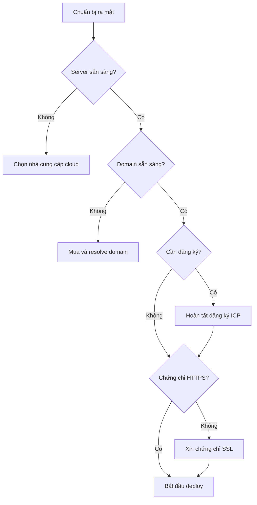

# 10.1 Những điều phải biết trước khi ra mắt — Cloud Service/Network/Domain/Certificate

Code chạy được chỉ là khởi đầu, trước khi ra mắt còn một đống "thủ tục hành chính" phải lo.

## Tại sao cần "Kiểm tra trước chuyến bay"

Nhiều developer lần đầu deploy thường gặp tình huống này: code đã đẩy lên, service đã chạy, nhưng người dùng vẫn không truy cập được. Nguyên nhân thường không phải vấn đề kỹ thuật, mà là các công việc tiền đề như **domain chưa resolve**, **port chưa mở**, **đăng ký chưa hoàn tất** chưa làm.



## Checklist trước khi ra mắt

| Mục kiểm tra | Giải thích | Thời gian dự kiến |
|--------|------|----------|
| Cloud server | Mua và cấu hình ECS/CVM | 30 phút |
| Domain | Mua và hoàn thành xác thực tên thật | 1-3 ngày |
| Đăng ký ICP | Bắt buộc cho server Trung Quốc đại lục | 7-20 ngày |
| Đăng ký Công an | Hoàn thành trong 30 ngày sau khi website hoạt động | 3-7 ngày |
| Chứng chỉ SSL | Kích hoạt mã hóa HTTPS | 10 phút |
| Security group | Mở các port cần thiết | 10 phút |

## Tổng quan các khái niệm cốt lõi

### Cấu trúc 3 tầng của Cloud Service

| Tầng | Loại tài nguyên | Sản phẩm cloud tương ứng |
|------|----------|------------|
| Tầng tính toán | CPU + RAM | ECS, CVM, Lightweight Application Server |
| Tầng lưu trữ | Disk + Object Storage | Cloud Disk, OSS/COS |
| Tầng mạng | Bandwidth + IP | Elastic Public IP, Load Balancer |

### Quy trình resolve domain

```
Người dùng nhập www.example.com
    ↓
DNS server truy vấn
    ↓
Trả về địa chỉ IP (như 1.2.3.4)
    ↓
Trình duyệt truy cập IP đó
```

## Mục lục phần này

- **10.1.1 Đặt server ở đâu** — Lựa chọn nhà cung cấp cloud và lập kế hoạch tài nguyên
- **10.1.2 Website có cần đăng ký không** — Quy trình đăng ký ICP và Công an

## Hướng dẫn tránh bẫy

::: warning Bẫy thường gặp
1. **Chu kỳ đăng ký domain dài**: Dành ít nhất 2-3 tuần
2. **Server nước ngoài không cần đăng ký**: Nhưng tốc độ truy cập chậm, SEO cũng bị ảnh hưởng
3. **Lightweight server có giới hạn lưu lượng**: Lưu lượng tháng vượt quá sẽ tính phí thêm
4. **Security group mặc định đóng hết**: Đừng quên mở port 80/443
:::
