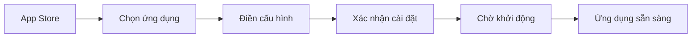
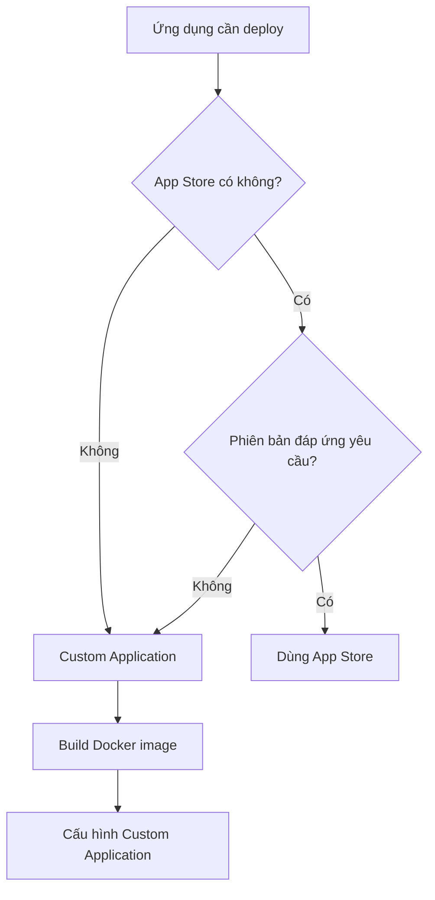

# 10.2.1 App Store hay Tự tùy chỉnh — Thao tác giao diện: App Store vs Custom Application

Tinh hoa của 1Panel: Biến các lệnh phức tạp của Docker thành form trực quan.

## So sánh hai cách triển khai

| Đặc điểm | App Store | Custom Application |
|------|----------|------------|
| Độ phức tạp cấu hình | Thấp, điền form | Trung bình, cần hiểu Docker |
| Phiên bản khả dụng | Giới hạn, do store cung cấp | Tùy ý, tự chỉ định image |
| Trường hợp sử dụng | Dịch vụ chuẩn hóa (database, middleware) | Dự án tự phát triển, yêu cầu đặc biệt |
| Chi phí bảo trì | Thấp, nâng cấp 1 click | Trung bình, cần cập nhật thủ công |

## App Store: Sẵn sàng dùng ngay

### App Store có thể cài gì

| Danh mục | Ứng dụng thường dùng |
|------|----------|
| Database | MySQL, PostgreSQL, Redis, MongoDB |
| Web service | Nginx, OpenResty, Caddy |
| Development tools | Node.js, Python, Go |
| Storage | MinIO (Object Storage) |
| Monitoring | Prometheus, Grafana |

### Các bước cài đặt

1. Vào **App Store** → Chọn ứng dụng (ví dụ PostgreSQL)
2. Click **Cài đặt**
3. Điền thông tin cơ bản:
   - Tên ứng dụng (để nhận dạng)
   - Chọn phiên bản
   - Port mapping
   - Username/Password database
4. Click **Xác nhận cài đặt**

### Ví dụ cài đặt PostgreSQL

| Mục cấu hình | Giá trị ví dụ | Giải thích |
|--------|--------|------|
| Tên ứng dụng | `postgres-main` | Tự đặt, dễ nhận biết |
| Phiên bản | `15` | Khuyến nghị dùng bản ổn định mới nhất |
| Port | `5432` | Port mặc định, có thể sửa |
| Username | `postgres` | Super admin |
| Password | `SecurePass123!` | Nhất định dùng mật khẩu mạnh |
| Thư mục data | `/opt/1panel/apps/postgres/data` | Tự động cấu hình |

## Custom Application: Kiểm soát hoàn toàn

Khi cần deploy dự án Next.js hoặc NestJS tự phát triển, cần dùng custom application.

### Tạo Custom Application

1. Vào **Container** → **Container Management** → **Tạo Container**
2. Hoặc vào **Container** → **Compose** → **Tạo Compose** (khuyến nghị, hỗ trợ nhiều container)

### Các mục cấu hình Custom Application

| Mục cấu hình | Công dụng | Ví dụ |
|--------|------|------|
| Tên image | Chỉ định Docker image | `node:18-alpine` |
| Tên container | Nhận dạng container | `my-nextjs-app` |
| Port mapping | Port truy cập từ bên ngoài | `3000:3000` |
| Volume mount | Lưu trữ dữ liệu lâu dài | `/app/data:/data` |
| Environment variables | Cấu hình runtime | `NODE_ENV=production` |
| Start command | Lệnh khởi động | `npm run start` |
| Restart policy | Hành vi khi container thoát | `always` (tự động restart) |

### Khi nào dùng Custom Application

## Thực hành: Deploy môi trường cơ bản

Một ứng dụng Web điển hình cần các dịch vụ cơ bản sau:

| Dịch vụ | Cách cài đặt | Công dụng |
|------|----------|------|
| PostgreSQL | App Store | Database chính |
| Redis | App Store | Cache/Session |
| OpenResty | App Store | Reverse proxy |
| Ứng dụng Next.js | Custom | Frontend service |
| Ứng dụng NestJS | Custom | Backend API |

### Thứ tự cài đặt khuyến nghị

1. **Cài dịch vụ cơ bản trước**: PostgreSQL, Redis
2. **Sau đó cài Web service**: OpenResty
3. **Cuối cùng deploy ứng dụng**: Next.js, NestJS

::: tip Tại sao phải theo thứ tự này
Khi khởi động, ứng dụng sẽ cố gắng kết nối database và cache, nếu các dịch vụ này chưa sẵn sàng, ứng dụng sẽ khởi động thất bại.
:::

## Hướng dẫn tránh bẫy

### Các vấn đề thường gặp

| Vấn đề | Nguyên nhân | Giải pháp |
|------|------|----------|
| Port conflict | Nhiều ứng dụng dùng cùng port | Sửa port mapping |
| Ứng dụng không khởi động được | Dịch vụ phụ thuộc chưa sẵn sàng | Kiểm tra trạng thái database/Redis |
| Mất dữ liệu | Chưa cấu hình volume mount | Tạo lại và mount data volume |
| Không truy cập được | Security group chưa mở | Mở port ở backend nhà cung cấp cloud |

### Best Practice

1. **Quy ước đặt tên thống nhất**: Ví dụ `prod-postgres`, `prod-redis`
2. **Dùng mật khẩu mạnh**: Mật khẩu database ít nhất 16 ký tự, có ký tự đặc biệt
3. **Backup định kỳ**: 1Panel hỗ trợ backup theo lịch, nhất định phải bật
4. **Giám sát tài nguyên**: Chú ý mức sử dụng CPU, RAM, mở rộng kịp thời
