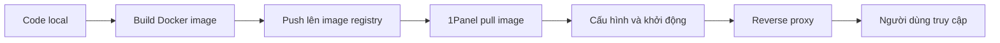

# 10.2.3 Dự án Next.js deploy thế nào — Ví dụ deploy Next.js: Production build và cấu hình port

Cốt lõi deploy Next.js: Build trước, chạy sau.

## Tổng quan quy trình deploy



## Bước 1: Viết Dockerfile

Tạo `Dockerfile` ở thư mục gốc dự án:

```dockerfile
# Giai đoạn build
FROM node:18-alpine AS builder
WORKDIR /app

# Cài đặt dependencies
COPY package*.json ./
RUN npm ci

# Copy source code và build
COPY . .
RUN npm run build

# Giai đoạn production
FROM node:18-alpine AS runner
WORKDIR /app

ENV NODE_ENV=production

# Copy build artifacts
COPY --from=builder /app/.next/standalone ./
COPY --from=builder /app/.next/static ./.next/static
COPY --from=builder /app/public ./public

EXPOSE 3000
CMD ["node", "server.js"]
```

### Giải thích cấu hình quan trọng

| Cấu hình | Công dụng |
|------|------|
| `AS builder` | Multi-stage build, giảm kích thước image cuối cùng |
| `npm ci` | Nhanh và đáng tin cậy hơn `npm install` |
| `standalone` | Chế độ output độc lập của Next.js 13+ |

### Kích hoạt chế độ Standalone

Thêm vào `next.config.js`:

```javascript
/** @type {import('next').NextConfig} */
const nextConfig = {
  output: 'standalone',
}

module.exports = nextConfig
```

## Bước 2: Build và push image

### Build local

```bash
# Build image
docker build -t my-nextjs-app:v1.0.0 .

# Test chạy
docker run -p 3000:3000 my-nextjs-app:v1.0.0
```

### Push lên image registry

```bash
# Login Alibaba Cloud image registry
docker login registry.cn-hangzhou.aliyuncs.com

# Đánh tag
docker tag my-nextjs-app:v1.0.0 registry.cn-hangzhou.aliyuncs.com/your-namespace/my-nextjs-app:v1.0.0

# Push
docker push registry.cn-hangzhou.aliyuncs.com/your-namespace/my-nextjs-app:v1.0.0
```

::: tip Lựa chọn image registry
- **Alibaba Cloud ACR**: Truy cập nhanh trong nước, có quota miễn phí
- **Tencent Cloud TCR**: Tích hợp tốt với dịch vụ Tencent Cloud
- **Docker Hub**: Phổ biến quốc tế, truy cập từ trong nước chậm
:::

## Bước 3: Deploy trên 1Panel

### Cấu hình tạo container

| Mục cấu hình | Giá trị | Giải thích |
|--------|-----|------|
| Image | `registry.cn-hangzhou.aliyuncs.com/xxx/my-nextjs-app:v1.0.0` | Địa chỉ image đầy đủ |
| Tên container | `nextjs-frontend` | Dễ nhận biết |
| Port mapping | `3000:3000` | Ngoài:Trong |
| Restart policy | `always` | Tự động restart khi crash |

### Cấu hình environment variables

| Tên biến | Giá trị | Giải thích |
|--------|-----|------|
| `NODE_ENV` | `production` | Chế độ production |
| `NEXT_PUBLIC_API_URL` | `https://api.example.com` | Địa chỉ backend API |

### Cấu hình health check

| Mục cấu hình | Giá trị |
|--------|-----|
| Cách kiểm tra | HTTP GET |
| Đường dẫn | `/api/health` hoặc `/` |
| Port | `3000` |
| Khoảng thời gian | `30s` |
| Timeout | `10s` |

## Bước 4: Cấu hình reverse proxy

Tạo reverse proxy trong **Website** → **Website** của 1Panel:

| Mục cấu hình | Giá trị |
|--------|-----|
| Domain | `www.example.com` |
| Địa chỉ proxy | `127.0.0.1:3000` |
| HTTPS | Bật, xin chứng chỉ miễn phí |

### Ví dụ cấu hình Nginx

```nginx
server {
    listen 80;
    server_name www.example.com;
    return 301 https://$server_name$request_uri;
}

server {
    listen 443 ssl http2;
    server_name www.example.com;

    ssl_certificate /path/to/cert.pem;
    ssl_certificate_key /path/to/key.pem;

    location / {
        proxy_pass http://127.0.0.1:3000;
        proxy_http_version 1.1;
        proxy_set_header Upgrade $http_upgrade;
        proxy_set_header Connection 'upgrade';
        proxy_set_header Host $host;
        proxy_cache_bypass $http_upgrade;
    }
}
```

## Xác minh deployment

### Kiểm tra trạng thái container

```bash
# Xem log container
docker logs nextjs-frontend

# Xem trạng thái container
docker ps | grep nextjs
```

### Test truy cập

```bash
# Test local
curl http://localhost:3000

# Test domain
curl https://www.example.com
```

## Các vấn đề thường gặp

| Vấn đề | Nguyên nhân | Giải pháp |
|------|------|----------|
| Khởi động thất bại | Thiếu cấu hình standalone | Thêm `output: 'standalone'` |
| Static assets 404 | Chưa copy thư mục static | Kiểm tra lệnh COPY trong Dockerfile |
| Environment variables không hiệu lực | Dùng prefix NEXT_PUBLIC_ | Inject lúc build, hoặc đổi sang server-side variable |
| Memory overflow | RAM không đủ | Tăng RAM server hoặc tối ưu code |

## Hướng dẫn làm việc với AI

Khi mô tả vấn đề deploy Next.js với AI:

```
Ứng dụng Next.js của tôi sau khi deploy hiển thị 502,
dùng App Router, phiên bản Next.js 14.x,
log container hiển thị: [thông báo lỗi cụ thể]
Vui lòng giúp tôi phân tích nguyên nhân.
```

**Thuật ngữ quan trọng**: standalone, multi-stage build, reverse proxy, NEXT_PUBLIC_ environment variables
