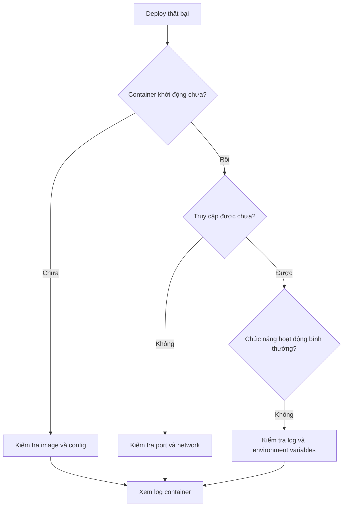

# 10.2.5 Deploy thất bại thì làm sao — Vấn đề thường gặp: Conflict port/Environment variables/Vấn đề quyền

Deploy gặp vấn đề không đáng sợ, đáng sợ là không biết cách troubleshoot.

## Quy trình troubleshoot



## Bước đầu tiên: Xem log container

```bash
# Xem 100 dòng log gần nhất
docker logs --tail 100 tên-container

# Theo dõi log real-time
docker logs -f tên-container

# Trong 1Panel
# Container Management → Chọn container → Log
```

## Các vấn đề thường gặp và giải pháp

### Vấn đề 1: Conflict port

**Thông báo lỗi**:
```
Error: listen EADDRINUSE: address already in use :::3000
```

**Các bước troubleshoot**:
```bash
# Xem port đang bị chiếm
netstat -tlnp | grep 3000
# hoặc
lsof -i :3000
```

**Giải pháp**:

| Phương án | Thao tác |
|------|------|
| Dừng process đang chiếm | `kill -9 PID` |
| Sửa port mapping | Đổi thành `3001:3000` |
| Kiểm tra container khác | `docker ps` để xem |

### Vấn đề 2: Environment variables không hiệu lực

**Các bước troubleshoot**:
```bash
# Vào container xem environment variables
docker exec -it tên-container sh
env | grep DATABASE
```

**Nguyên nhân thường gặp**:

| Nguyên nhân | Giải pháp |
|------|----------|
| Tên biến viết sai | Kiểm tra kỹ chữ hoa/thường |
| Vấn đề dấu ngoặc | Ký tự đặc biệt cần escape |
| Prefix NEXT_PUBLIC_ | Inject lúc build, không phải runtime |
| Biến chưa truyền vào container | Kiểm tra config 1Panel |

### Vấn đề 3: Kết nối database thất bại

**Thông báo lỗi**:
```
Error: Can't reach database server at 'localhost:5432'
```

**Nguyên nhân thường gặp và giải pháp**:

| Nguyên nhân | Giải pháp |
|------|----------|
| Dùng `localhost` | Đổi thành tên container, ví dụ `postgres` |
| Container không cùng network | Thêm container vào cùng Docker network |
| Database chưa khởi động | Kiểm tra trạng thái container database |
| Mật khẩu sai | Kiểm tra lại DATABASE_URL |

```bash
# Kiểm tra network
docker network ls
docker network inspect 1panel-network

# Test kết nối
docker exec -it nestjs-api sh
nc -zv postgres 5432
```

### Vấn đề 4: Vấn đề quyền

**Thông báo lỗi**:
```
Error: EACCES: permission denied, open '/app/logs/app.log'
```

**Giải pháp**:
```bash
# Sửa quyền thư mục
chmod -R 755 /path/to/directory

# Sửa owner thư mục
chown -R 1000:1000 /path/to/directory
```

### Vấn đề 5: RAM không đủ

**Thông báo lỗi**:
```
FATAL ERROR: CALL_AND_RETRY_LAST Allocation failed - JavaScript heap out of memory
```

**Giải pháp**:

```bash
# Phương án 1: Tăng giới hạn RAM Node.js
NODE_OPTIONS=--max-old-space-size=2048

# Phương án 2: Giới hạn RAM Docker
docker run -m 2g ...
```

### Vấn đề 6: Pull image thất bại

**Thông báo lỗi**:
```
Error response from daemon: pull access denied
```

**Giải pháp**:

| Nguyên nhân | Giải pháp |
|------|----------|
| Chưa login private registry | `docker login registry.xxx.com` |
| Tên image sai | Kiểm tra địa chỉ registry và tag |
| Vấn đề network | Cấu hình image accelerator |

```bash
# Cấu hình Alibaba Cloud image accelerator
sudo tee /etc/docker/daemon.json <<-'EOF'
{
  "registry-mirrors": ["https://xxx.mirror.aliyuncs.com"]
}
EOF
sudo systemctl restart docker
```

## Lệnh chẩn đoán nhanh

```bash
# Trạng thái container
docker ps -a

# Chi tiết container
docker inspect tên-container

# Sử dụng tài nguyên container
docker stats

# Xem process trong container
docker top tên-container

# Vào container để debug
docker exec -it tên-container sh
```

## Vị trí log 1Panel

| Loại log | Vị trí |
|----------|------|
| Log 1Panel | `/opt/1panel/log/` |
| Log container | Container Management → Log |
| Log Nginx | `/opt/1panel/apps/openresty/logs/` |
| Log ứng dụng | Thư mục log được mount |

## Restart policy

Khi ứng dụng thoát bất thường, restart policy đúng có thể tự động phục hồi:

| Policy | Giải thích | Trường hợp sử dụng |
|------|------|----------|
| `no` | Không tự động restart | Giai đoạn debug |
| `on-failure` | Chỉ restart khi thất bại | Stateful service |
| `always` | Luôn restart | Môi trường production |
| `unless-stopped` | Trừ khi dừng thủ công | Khuyến nghị sử dụng |

## Checklist troubleshoot

Khi gặp vấn đề, kiểm tra theo thứ tự:

- [ ] Container khởi động thành công chưa (`docker ps`)
- [ ] Log container có lỗi không (`docker logs`)
- [ ] Port mapping đúng chưa (`docker port`)
- [ ] Environment variables đúng chưa (`docker exec ... env`)
- [ ] Network thông chưa (`docker network inspect`)
- [ ] Dung lượng disk đủ chưa (`df -h`)
- [ ] RAM đủ chưa (`free -m`)
- [ ] Security group đã mở port chưa

## Hướng dẫn làm việc với AI

Khi mô tả vấn đề với AI, cung cấp:

```
Môi trường: 1Panel + Docker + Next.js
Hiện tượng: Truy cập trả về 502
Trạng thái container: [output của docker ps]
Log container: [output của docker logs]
Log Nginx: [nội dung error.log]
Vui lòng giúp tôi phân tích nguyên nhân.
```

Thông tin càng chi tiết, càng nhanh chóng định vị được vấn đề.
