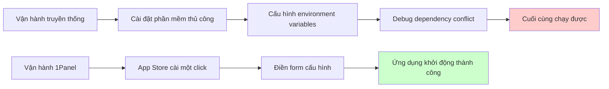
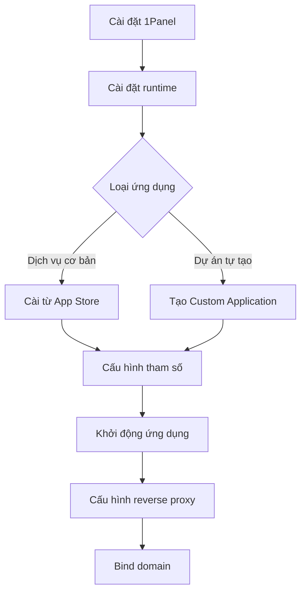

# 10.2 Click chuột là lên mạng — Deploy trực quan với 1Panel: Từ zero đến online

Không biết gõ lệnh? Không sao, click chuột cũng deploy được ứng dụng lên mạng.

## 1Panel là gì

1Panel là panel quản lý vận hành server Linux hiện đại, ý tưởng cốt lõi: **Môi trường runtime = Docker container được cấu hình sẵn**.



## Ưu điểm cốt lõi

| Tính năng | Giải thích |
|------|------|
| Giao diện trực quan | Mọi thao tác hoàn thành qua giao diện Web |
| App Store | Cài một click các dịch vụ thường dùng (MySQL, Redis, Nginx, v.v.) |
| Quản lý container | Dựa trên Docker, môi trường cách ly, không xung đột |
| Tự động backup | Backup theo lịch dữ liệu và cấu hình ứng dụng |
| Gia cố bảo mật | Tích hợp firewall, quản lý SSH |

## Cài đặt 1Panel

Thực thi trên server Linux mới:

```bash
curl -sSL https://resource.fit2cloud.com/1panel/package/quick_start.sh -o quick_start.sh && sudo bash quick_start.sh
```

Sau khi cài đặt xong sẽ hiển thị:
- Địa chỉ truy cập: `http://IP-server:port`
- Username và password

::: warning Nhắc nhở bảo mật
1. Đổi mật khẩu mặc định ngay sau lần đăng nhập đầu
2. Bật xác thực 2 lớp (2FA)
3. Đổi port panel sang giá trị không mặc định
4. Giới hạn IP nguồn truy cập trong security group
:::

## Mục lục phần này

- **10.2.1 App Store hay Tự tùy chỉnh** — Chọn cách deploy phù hợp
- **10.2.2 Deploy cuối cùng phải điền gì** — Giải thích chi tiết các yếu tố cấu hình
- **10.2.3 Dự án Next.js deploy thế nào** — Thực hành deploy ứng dụng frontend
- **10.2.4 Dự án NestJS deploy thế nào** — Thực hành deploy backend API
- **10.2.5 Deploy thất bại thì làm sao** — Troubleshoot các vấn đề thường gặp

## Các khái niệm cốt lõi

### Các mục cấu hình quan trọng trong 1Panel

| Mục cấu hình | Tương ứng Docker | Giải thích |
|--------|-------------|------|
| Image | `image` | Tên Docker image của ứng dụng |
| Port mapping | `-p` | Port ngoài:Port trong container |
| Volume mount | `-v` | Thư mục máy chủ:Thư mục container |
| Environment variables | `-e` | Tham số cấu hình truyền cho ứng dụng |
| Lệnh khởi động | `command` | Lệnh thực thi khi container khởi động |

### App Store vs Custom Application

| Cách | Trường hợp sử dụng | Ưu điểm | Nhược điểm |
|------|----------|------|------|
| App Store | Dịch vụ cơ bản như MySQL, Redis, Nginx | Cài một click, cấu hình sẵn | Lựa chọn phiên bản giới hạn |
| Custom Application | Dự án tự phát triển | Kiểm soát hoàn toàn | Cần tự viết cấu hình |

## Quy trình làm quen nhanh



## Hướng dẫn làm việc với AI

Khi gặp vấn đề deploy 1Panel, cung cấp cho AI:

```
Tôi gặp vấn đề khi deploy ứng dụng Next.js trên 1Panel:
- Image sử dụng: node:18-alpine
- Port mapping: 3000:3000
- Thông báo lỗi: [log lỗi cụ thể]
Vui lòng giúp tôi phân tích nguyên nhân và đưa ra giải pháp.
```

**Thuật ngữ quan trọng**: 1Panel, Docker container, port mapping, volume mount, environment variables, OpenResty
