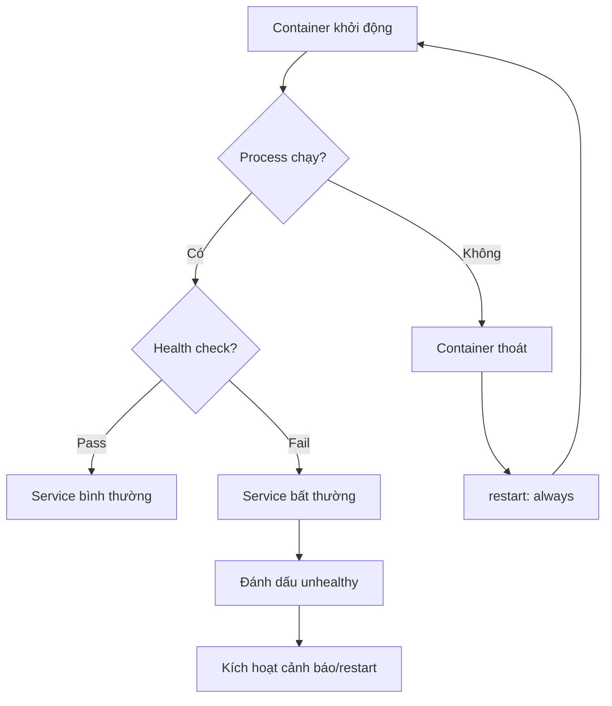
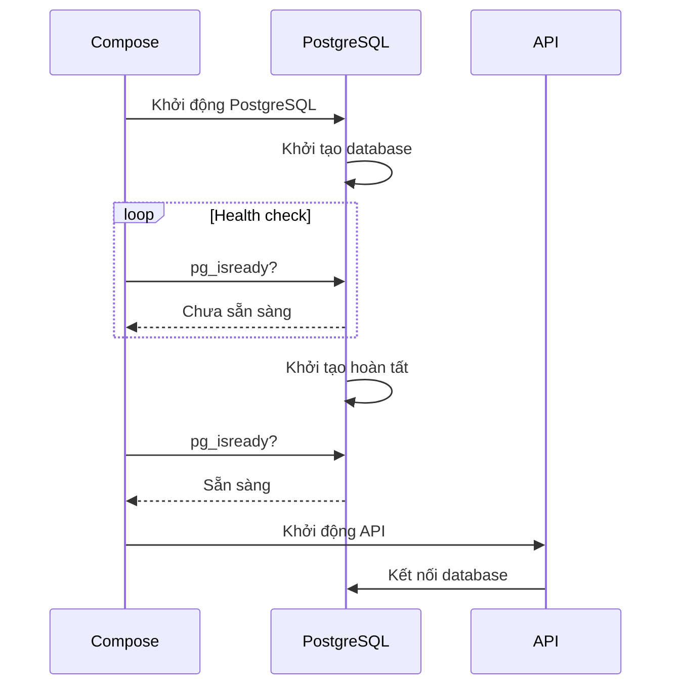

# 10.3.4 Service crash có tự động restart không — Health check: Giám sát khả dụng service và tự động restart

Process đang chạy không có nghĩa service ổn, health check mới là căn cứ đánh giá.

## Tại sao cần health check



| Trường hợp | Trạng thái process | Trạng thái thực tế | Health check |
|------|----------|----------|----------|
| Hoạt động bình thường | Đang chạy | Bình thường | Pass |
| Vòng lặp vô hạn | Đang chạy | Treo | Fail |
| Chờ dependency | Đang chạy | Chưa sẵn sàng | Fail |
| Rò rỉ memory | Đang chạy | Phản hồi chậm | Có thể fail |

## Cấu hình health check

### Cú pháp cơ bản

```yaml
services:
  api:
    healthcheck:
      test: ["CMD", "curl", "-f", "http://localhost:3001/health"]
      interval: 30s      # Khoảng thời gian kiểm tra
      timeout: 10s       # Thời gian timeout
      retries: 3         # Số lần retry khi thất bại
      start_period: 40s  # Thời gian chờ khởi động (không tính vào thất bại)
```

### Cách kiểm tra

```yaml
# Cách 1: Định dạng mảng CMD (khuyến nghị)
healthcheck:
  test: ["CMD", "curl", "-f", "http://localhost:3001/health"]

# Cách 2: Định dạng CMD-SHELL
healthcheck:
  test: ["CMD-SHELL", "curl -f http://localhost:3001/health || exit 1"]

# Cách 3: Tắt health check
healthcheck:
  disable: true
```

## Health check cho các service phổ biến

### Ứng dụng Node.js

```yaml
services:
  api:
    healthcheck:
      test: ["CMD", "curl", "-f", "http://localhost:3001/health"]
      interval: 30s
      timeout: 10s
      retries: 3
```

Code ứng dụng thêm endpoint health check:

```typescript
// NestJS
@Controller('health')
export class HealthController {
  constructor(
    private prisma: PrismaService,
    private redis: RedisService,
  ) {}

  @Get()
  async check() {
    // Kiểm tra kết nối database
    await this.prisma.$queryRaw`SELECT 1`;
    // Kiểm tra kết nối Redis
    await this.redis.ping();

    return { status: 'ok', timestamp: new Date().toISOString() };
  }
}
```

### PostgreSQL

```yaml
services:
  postgres:
    healthcheck:
      test: ["CMD-SHELL", "pg_isready -U postgres"]
      interval: 10s
      timeout: 5s
      retries: 5
```

### Redis

```yaml
services:
  redis:
    healthcheck:
      test: ["CMD", "redis-cli", "ping"]
      interval: 10s
      timeout: 5s
      retries: 3
```

### Nginx

```yaml
services:
  nginx:
    healthcheck:
      test: ["CMD", "curl", "-f", "http://localhost/health"]
      interval: 30s
      timeout: 10s
      retries: 3
```

## Health check cho dependency

Đảm bảo service khởi động đúng thứ tự:

```yaml
services:
  api:
    depends_on:
      postgres:
        condition: service_healthy  # Chờ health check pass
      redis:
        condition: service_started  # Chỉ chờ container khởi động

  postgres:
    healthcheck:
      test: ["CMD-SHELL", "pg_isready -U postgres"]
      interval: 5s
      timeout: 5s
      retries: 10
      start_period: 30s
```



## Chiến lược tự động restart

```yaml
services:
  api:
    restart: always  # Phối hợp với health check
    healthcheck:
      test: ["CMD", "curl", "-f", "http://localhost:3001/health"]
      interval: 30s
      timeout: 10s
      retries: 3
```

| Restart policy | Hành vi |
|----------|------|
| `no` | Không tự động restart |
| `always` | Luôn restart (kể cả sau khi dừng thủ công rồi Docker restart) |
| `on-failure` | Chỉ restart khi thoát bất thường |
| `unless-stopped` | Trừ khi dừng thủ công, còn lại luôn restart |

## Xem trạng thái health

```bash
# Xem trạng thái health của container
docker compose ps

# NAME        STATUS              HEALTH
# api         Up 5 minutes        healthy
# postgres    Up 5 minutes        healthy
# redis       Up 5 minutes        (none)

# Xem lịch sử health check
docker inspect --format='{{json .State.Health}}' tên-container | jq
```

## Best practice health check

### 1. Nội dung kiểm tra toàn diện

```typescript
@Get('health')
async check() {
  const checks = {
    database: await this.checkDatabase(),
    redis: await this.checkRedis(),
    diskSpace: await this.checkDiskSpace(),
  };

  const isHealthy = Object.values(checks).every(c => c.status === 'ok');

  return {
    status: isHealthy ? 'ok' : 'degraded',
    checks,
    timestamp: new Date().toISOString(),
  };
}
```

### 2. Phân biệt liveness và readiness

| Loại | Mục đích | Xử lý khi fail |
|------|------|----------|
| Liveness | Process có còn sống không | Restart container |
| Readiness | Có thể nhận request không | Loại khỏi load balancer |

### 3. Thiết lập tham số hợp lý

| Tham số | Giá trị khuyến nghị | Giải thích |
|------|--------|------|
| interval | 10-30s | Quá thường xuyên sẽ tăng gánh nặng |
| timeout | 5-10s | Phải nhỏ hơn interval |
| retries | 3-5 | Tránh dao động tức thời kích hoạt |
| start_period | 30-60s | Căn cứ vào thời gian khởi động ứng dụng |

## Troubleshoot lỗi

```bash
# Xem log health check
docker inspect tên-container --format='{{range .State.Health.Log}}{{.Output}}{{end}}'

# Thực thi health check thủ công
docker exec tên-container curl -f http://localhost:3001/health
```
