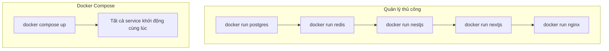

# 10.3 Một phím khởi động tất cả service — Điều phối Docker Compose: Đa service phối hợp

Một lệnh, khởi động toàn bộ stack ứng dụng.

## Tại sao cần Docker Compose

Khi ứng dụng của bạn không chỉ có một container (frontend + backend + database + cache), khởi động thủ công từng cái vừa phiền phức vừa dễ lỗi. Docker Compose cho phép bạn dùng một file YAML định nghĩa tất cả service, sau đó khởi động một phím.



## Ưu điểm cốt lõi

| Tính năng | Giải thích |
|------|------|
| Cấu hình khai báo | Dùng YAML mô tả trạng thái mong muốn, không phải chuỗi lệnh |
| Thao tác một phím | `up` khởi động, `down` dừng, `restart` khởi động lại |
| Quản lý phụ thuộc | Tự động khởi động theo thứ tự các service có phụ thuộc |
| Cách ly mạng | Tự động tạo mạng riêng, service giao tiếp qua tên |
| Môi trường nhất quán | Development và production dùng cùng file điều phối |

## Stack ứng dụng điển hình

```yaml
# docker-compose.yml
services:
  frontend:    # Frontend Next.js
  api:         # Backend NestJS
  postgres:    # Database PostgreSQL
  redis:       # Cache Redis
  nginx:       # Reverse proxy
```

## Mục lục phần này

- **10.3.1 File điều phối viết thế nào** — Cấu trúc file Compose chi tiết
- **10.3.2 Service giao tiếp với nhau thế nào** — Cấu hình network và volume
- **10.3.3 Development và production dùng một bộ config không** — Chiến lược cấu hình đa môi trường
- **10.3.4 Service crash có tự động restart không** — Health check và tự phục hồi

## Lệnh thường dùng nhanh

| Lệnh | Công dụng |
|------|------|
| `docker compose up -d` | Khởi động tất cả service ở chế độ nền |
| `docker compose down` | Dừng và xóa container |
| `docker compose ps` | Xem trạng thái service |
| `docker compose logs -f` | Xem log real-time |
| `docker compose restart api` | Restart service chỉ định |
| `docker compose pull` | Pull image mới nhất |
| `docker compose build` | Build image tùy chỉnh |

## Nhanh chóng làm quen

```bash
# 1. Tạo docker-compose.yml
# 2. Khởi động tất cả service
docker compose up -d

# 3. Xem trạng thái
docker compose ps

# 4. Xem log
docker compose logs -f api

# 5. Dừng service
docker compose down
```

::: tip Lưu ý phiên bản
Docker Compose V2 đã được tích hợp vào Docker CLI, lệnh đổi từ `docker-compose` thành `docker compose` (bỏ dấu gạch nối).
:::
