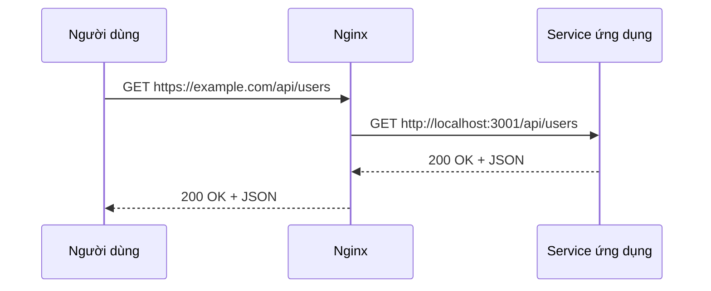

# 10.4.1 Request nên chuyển tiếp cho ai — Reverse proxy: Cấu hình upstream và chuyển tiếp request

Cốt lõi của reverse proxy: Người dùng thấy Nginx, thực sự làm việc là backend service.

## Nguyên lý reverse proxy



Người dùng không biết sự tồn tại của backend service, tất cả request đều qua Nginx trung chuyển.

## Cấu hình cơ bản

### Reverse proxy đơn giản nhất

```nginx
server {
    listen 80;
    server_name www.example.com;
    
    location / {
        proxy_pass http://127.0.0.1:3000;
    }
}
```

### Cấu hình reverse proxy đầy đủ

```nginx
server {
    listen 80;
    server_name www.example.com;

    location / {
        proxy_pass http://127.0.0.1:3000;

        # Truyền thông tin request gốc
        proxy_set_header Host $host;
        proxy_set_header X-Real-IP $remote_addr;
        proxy_set_header X-Forwarded-For $proxy_add_x_forwarded_for;
        proxy_set_header X-Forwarded-Proto $scheme;
        
        # Phiên bản HTTP và connection
        proxy_http_version 1.1;
        proxy_set_header Upgrade $http_upgrade;
        proxy_set_header Connection "upgrade";

        # Thiết lập timeout
        proxy_connect_timeout 60s;
        proxy_send_timeout 60s;
        proxy_read_timeout 60s;
    }
}
```

## Giải thích cấu hình quan trọng

### Chi tiết proxy_set_header

| Header | Công dụng |
|--------|------|
| `Host` | Truyền domain gốc |
| `X-Real-IP` | Truyền IP thật của người dùng |
| `X-Forwarded-For` | Truyền chuỗi proxy |
| `X-Forwarded-Proto` | Truyền protocol gốc (http/https) |
| `Upgrade` | Hỗ trợ WebSocket |
| `Connection` | Hỗ trợ nâng cấp connection |

### Backend lấy IP thật

Lấy IP thật của người dùng trong NestJS:

```typescript
@Get()
getUsers(@Req() req: Request) {
  const realIP = req.headers['x-real-ip'] || req.ip;
  console.log('User IP:', realIP);
}
```

## Proxy nhiều service

### Phân phối theo đường dẫn

```nginx
server {
    listen 80;
    server_name example.com;

    # Ứng dụng frontend
    location / {
        proxy_pass http://127.0.0.1:3000;
    }

    # Backend API
    location /api/ {
        proxy_pass http://127.0.0.1:3001;
    }

    # Tài nguyên tĩnh
    location /_next/static/ {
        alias /var/www/static/;
        expires 1y;
    }
}
```

### Phân phối theo subdomain

```nginx
# Frontend www.example.com
server {
    listen 80;
    server_name www.example.com;

    location / {
        proxy_pass http://127.0.0.1:3000;
    }
}

# API api.example.com
server {
    listen 80;
    server_name api.example.com;
    
    location / {
        proxy_pass http://127.0.0.1:3001;
    }
}
```

## Cấu hình upstream

Khi backend có nhiều instance, dùng `upstream` định nghĩa nhóm service:

```nginx
upstream frontend {
    server 127.0.0.1:3000;
}

upstream backend {
    server 127.0.0.1:3001;
    server 127.0.0.1:3002;  # Nhiều instance
}

server {
    listen 80;
    server_name example.com;
    
    location / {
        proxy_pass http://frontend;
    }
    
    location /api/ {
        proxy_pass http://backend;
    }
}
```

## Viết lại đường dẫn

### Loại bỏ prefix đường dẫn

```nginx
# Request /api/users → Chuyển tiếp đến /users
location /api/ {
    proxy_pass http://127.0.0.1:3001/;  # Chú ý dấu / ở cuối
}
```

### Giữ nguyên prefix đường dẫn

```nginx
# Request /api/users → Chuyển tiếp đến /api/users
location /api/ {
    proxy_pass http://127.0.0.1:3001;  # Không có dấu / ở cuối
}
```

## Cấu hình reverse proxy trong 1Panel

1. Website → Tạo website → Reverse proxy
2. Điền cấu hình:
   - Domain chính: `www.example.com`
   - Địa chỉ proxy: `http://127.0.0.1:3000`

Hệ thống sẽ tự động tạo file cấu hình, có thể xem và sửa trong "File cấu hình".

## Vấn đề thường gặp

| Vấn đề | Nguyên nhân | Giải pháp |
|------|------|----------|
| 502 Bad Gateway | Backend service chưa khởi động | Kiểm tra ứng dụng có đang chạy không |
| 504 Gateway Timeout | Backend phản hồi timeout | Tăng `proxy_read_timeout` |
| Lấy không được IP thật | Chưa cấu hình header | Thêm cấu hình `X-Real-IP` |
| WebSocket bị ngắt | Chưa cấu hình Upgrade | Thêm `Upgrade` và `Connection` |

## Hướng dẫn làm việc với AI

Khi mô tả nhu cầu với AI:

```
Vui lòng giúp tôi cấu hình Nginx reverse proxy:
- Domain: www.example.com proxy đến localhost:3000
- api.example.com proxy đến localhost:3001
- Cần hỗ trợ WebSocket
- Cần truyền IP thật của người dùng
```

**Thuật ngữ quan trọng**: proxy_pass, upstream, proxy_set_header, location
