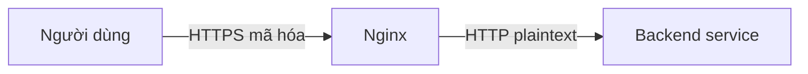
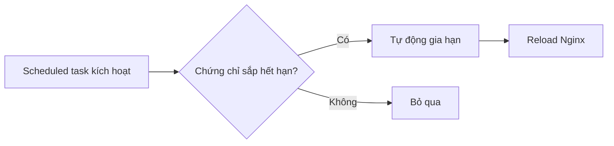

# 10.4.2 Chứng chỉ HTTPS cấu hình thế nào — SSL termination: Cấu hình chứng chỉ HTTPS và tự động gia hạn

Năm 2024 rồi, website không có HTTPS sẽ bị trình duyệt đánh dấu "Không an toàn".

## Nguyên lý SSL termination



Nginx chịu trách nhiệm mã hóa/giải mã HTTPS, backend service chỉ cần xử lý HTTP, đơn giản hóa kiến trúc.

## Cách lấy chứng chỉ

| Cách | Chi phí | Thời hạn | Trường hợp sử dụng |
|------|------|--------|----------|
| Let's Encrypt | Miễn phí | 90 ngày | Cá nhân/Dự án nhỏ |
| Chứng chỉ miễn phí Alibaba Cloud | Miễn phí | 1 năm | Single domain |
| Chứng chỉ trả phí | Có phí | 1-2 năm | Doanh nghiệp/Yêu cầu bảo mật cao |

## Xin chứng chỉ một click trong 1Panel

1Panel hỗ trợ xin chứng chỉ miễn phí Let's Encrypt một click:

1. Website → Chọn site → HTTPS
2. Chọn "Xin chứng chỉ"
3. Chọn Let's Encrypt
4. Cách xác minh: DNS verification hoặc HTTP verification
5. Click xin

::: tip Chọn cách xác minh
- **HTTP verification**: Cần domain đã resolve đến server hiện tại
- **DNS verification**: Có thể xin chứng chỉ wildcard (*.example.com)
:::

## Cấu hình SSL thủ công

### Cấu hình HTTPS cơ bản

```nginx
server {
    listen 80;
    server_name example.com;
    # Redirect HTTP sang HTTPS
    return 301 https://$server_name$request_uri;
}

server {
    listen 443 ssl http2;
    server_name example.com;

    # File chứng chỉ
    ssl_certificate /etc/nginx/ssl/example.com.pem;
    ssl_certificate_key /etc/nginx/ssl/example.com.key;

    # Cấu hình SSL
    ssl_protocols TLSv1.2 TLSv1.3;
    ssl_ciphers ECDHE-ECDSA-AES128-GCM-SHA256:ECDHE-RSA-AES128-GCM-SHA256;
    ssl_prefer_server_ciphers on;

    # Security header
    add_header Strict-Transport-Security "max-age=31536000" always;

    location / {
        proxy_pass http://127.0.0.1:3000;
    }
}
```

### Giải thích cấu hình

| Cấu hình | Công dụng |
|------|------|
| `listen 443 ssl http2` | Bật HTTPS và HTTP/2 |
| `ssl_certificate` | Đường dẫn file chứng chỉ |
| `ssl_certificate_key` | Đường dẫn file private key |
| `ssl_protocols` | Phiên bản TLS được hỗ trợ |
| `ssl_ciphers` | Bộ mã hóa |
| `HSTS` | Bắt buộc trình duyệt dùng HTTPS |

## Tự động gia hạn chứng chỉ

### Tự động gia hạn Let's Encrypt

1Panel sẽ tự động xử lý việc gia hạn chứng chỉ Let's Encrypt. Khi cấu hình thủ công:

```bash
# Cài đặt certbot
apt install certbot python3-certbot-nginx

# Xin chứng chỉ
certbot --nginx -d example.com -d www.example.com

# Test tự động gia hạn
certbot renew --dry-run

# Thêm scheduled task
crontab -e
# Mỗi ngày 2 giờ sáng kiểm tra gia hạn
0 2 * * * certbot renew --quiet
```

### Quy trình gia hạn



## Chứng chỉ nhiều domain

### Domain chính + www

```nginx
server {
    listen 443 ssl http2;
    server_name example.com www.example.com;

    ssl_certificate /etc/nginx/ssl/example.com.pem;
    ssl_certificate_key /etc/nginx/ssl/example.com.key;
}
```

### Chứng chỉ wildcard

```nginx
server {
    listen 443 ssl http2;
    server_name *.example.com;

    ssl_certificate /etc/nginx/ssl/wildcard.example.com.pem;
    ssl_certificate_key /etc/nginx/ssl/wildcard.example.com.key;
}
```

::: warning Chứng chỉ wildcard
Chứng chỉ wildcard (*.example.com) chỉ có thể match subdomain cấp 1, không thể match `a.b.example.com`.
:::

## Tối ưu SSL

### Bật OCSP Stapling

```nginx
ssl_stapling on;
ssl_stapling_verify on;
ssl_trusted_certificate /etc/nginx/ssl/chain.pem;
resolver 8.8.8.8 8.8.4.4 valid=300s;
```

### Bật Session cache

```nginx
ssl_session_cache shared:SSL:10m;
ssl_session_timeout 1d;
ssl_session_tickets off;
```

## Kiểm tra bảo mật

Sau khi cấu hình xong, dùng công cụ online kiểm tra cấu hình SSL:

- [SSL Labs](https://www.ssllabs.com/ssltest/) - Điểm A+ là tốt nhất
- [Security Headers](https://securityheaders.com/) - Kiểm tra security header

## Vấn đề thường gặp

| Vấn đề | Nguyên nhân | Giải pháp |
|------|------|----------|
| Chứng chỉ không tin cậy | Certificate chain không đầy đủ | Dùng fullchain.pem có chứa intermediate certificate |
| Cảnh báo mixed content | Trang có tài nguyên HTTP | Đổi tất cả tài nguyên sang HTTPS |
| Chứng chỉ hết hạn | Gia hạn thất bại | Kiểm tra log certbot |
| ERR_SSL_PROTOCOL_ERROR | Cấu hình sai | Kiểm tra ssl_protocols và ssl_ciphers |

## Best practice

1. **Dùng HTTP/2**: `listen 443 ssl http2`
2. **Tắt protocol cũ**: Chỉ cho phép TLS 1.2 và 1.3
3. **Bật HSTS**: Bắt buộc trình duyệt dùng HTTPS
4. **Kiểm tra định kỳ**: Giám sát thời gian hết hạn chứng chỉ
5. **Backup chứng chỉ**: Backup file private key và certificate
