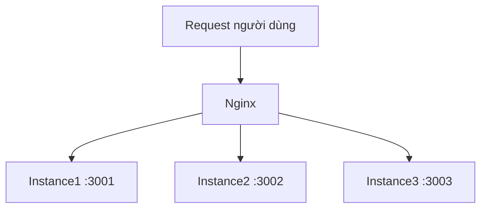
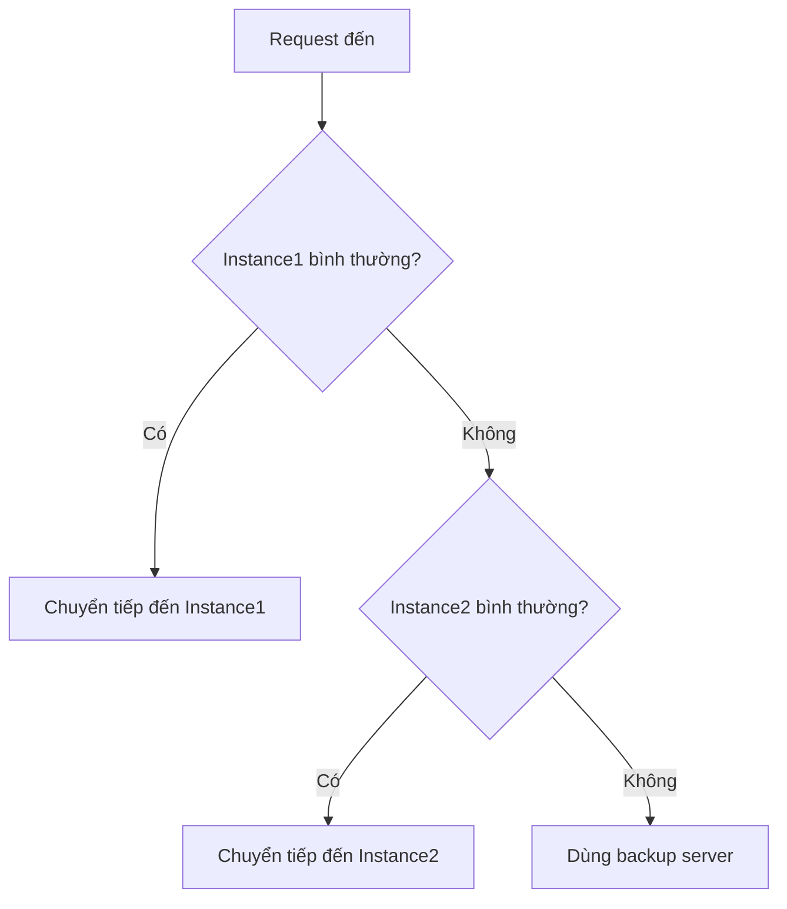

# 10.4.3 Người dùng quá đông thì làm sao — Load balancing: Chiến lược phân phối nhiều instance

Một server gánh không nổi? Vậy thì thêm vài cái.

## Nguyên lý load balancing



Nginx phân phối request đến nhiều backend instance, nâng cao khả năng xử lý và tính khả dụng.

## Cấu hình cơ bản

```nginx
upstream backend {
    server 127.0.0.1:3001;
    server 127.0.0.1:3002;
    server 127.0.0.1:3003;
}

server {
    listen 80;
    server_name api.example.com;

    location / {
        proxy_pass http://backend;
    }
}
```

## Chiến lược load balancing

### Round-robin (mặc định)

Request được phân phối tuần tự đến từng server:

```nginx
upstream backend {
    server 127.0.0.1:3001;
    server 127.0.0.1:3002;
    server 127.0.0.1:3003;
}
```

### Phân phối theo weight

Phân phối weight khác nhau theo hiệu năng server:

```nginx
upstream backend {
    server 127.0.0.1:3001 weight=3;  # Xử lý 3/6 request
    server 127.0.0.1:3002 weight=2;  # Xử lý 2/6 request
    server 127.0.0.1:3003 weight=1;  # Xử lý 1/6 request
}
```

### IP Hash

Cùng một người dùng luôn truy cập cùng một server (giải quyết vấn đề Session):

```nginx
upstream backend {
    ip_hash;
    server 127.0.0.1:3001;
    server 127.0.0.1:3002;
    server 127.0.0.1:3003;
}
```

### Least connections

Request được gửi đến server có ít connection nhất:

```nginx
upstream backend {
    least_conn;
    server 127.0.0.1:3001;
    server 127.0.0.1:3002;
    server 127.0.0.1:3003;
}
```

## So sánh chiến lược

| Chiến lược | Đặc điểm | Trường hợp sử dụng |
|------|------|----------|
| Round-robin | Đơn giản đều đặn | Server cấu hình giống nhau |
| Weight | Phân phối theo hiệu năng | Server cấu hình khác nhau |
| IP Hash | Giữ session | Ứng dụng có state |
| Least connections | Cân bằng động | Thời gian xử lý request chênh lệch lớn |

## Health check

### Passive health check

```nginx
upstream backend {
    server 127.0.0.1:3001 max_fails=3 fail_timeout=30s;
    server 127.0.0.1:3002 max_fails=3 fail_timeout=30s;
    server 127.0.0.1:3003 backup;  # Backup server
}
```

| Tham số | Công dụng |
|------|------|
| `max_fails` | Ngưỡng số lần thất bại |
| `fail_timeout` | Thời gian tạm dừng sau khi thất bại |
| `backup` | Chỉ dùng khi server khác không khả dụng |
| `down` | Đánh dấu server offline |

### Quy trình health check



## Nhiều instance với Docker Compose

```yaml
services:
  api:
    image: my-api:latest
    deploy:
      replicas: 3  # 3 instance
    # Không map port, truy cập qua Nginx

  nginx:
    image: nginx:alpine
    ports:
      - "80:80"
    depends_on:
      - api
```

Kết hợp với Docker internal DNS:

```nginx
upstream backend {
    server api:3001;  # Docker sẽ tự động load balance đến tất cả instance
}
```

## Session persistence

Khi dùng load balancing, người dùng có thể bị phân phối đến server khác, dẫn đến mất session.

### Giải pháp

| Phương án | Cách thực hiện | Ưu nhược điểm |
|------|------|--------|
| IP Hash | Cấu hình Nginx | Đơn giản, nhưng IP thay đổi thì mất hiệu lực |
| Chia sẻ Session | Lưu trữ Redis | Khuyến nghị, ứng dụng stateless |
| JWT Token | Lưu trữ client | Khuyến nghị, hoàn toàn stateless |

### Lưu trữ Session Redis

```typescript
// Cấu hình NestJS
import * as session from 'express-session';
import * as RedisStore from 'connect-redis';

app.use(
  session({
    store: new RedisStore({ client: redisClient }),
    secret: 'your-secret',
    resave: false,
    saveUninitialized: false,
  }),
);
```

## Giám sát và tối ưu

### Xem trạng thái upstream

```nginx
# Bật status page
location /nginx_status {
    stub_status on;
    allow 127.0.0.1;
    deny all;
}
```

### Cấu hình connection pool

```nginx
upstream backend {
    server 127.0.0.1:3001;

    keepalive 32;  # Số connection giữ lại
}

server {
    location / {
        proxy_pass http://backend;
        proxy_http_version 1.1;
        proxy_set_header Connection "";  # Bật keepalive
    }
}
```

## Vấn đề thường gặp

| Vấn đề | Nguyên nhân | Giải pháp |
|------|------|----------|
| Mất Session | Request phân phối đến instance khác | Dùng IP Hash hoặc Redis Session |
| Single point of failure | Instance nào đó crash | Cấu hình health check và backup server |
| Load không đều | Thời gian xử lý request chênh lệch lớn | Dùng chiến lược least_conn |

## Best practice

1. **Thiết kế stateless**: Ứng dụng không phụ thuộc vào local Session
2. **Health check**: Cấu hình max_fails và fail_timeout
3. **Backup server**: Ít nhất một backup server
4. **Giám sát**: Quan tâm tình hình load của từng instance
5. **Mở rộng dần**: Căn cứ vào dữ liệu giám sát để tăng instance dần dần
