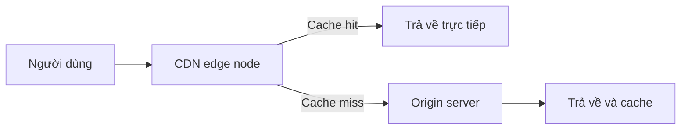
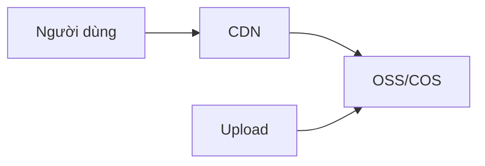

# 10.4.4 Hình ảnh làm sao truy cập nhanh — Tài nguyên tĩnh: Chiến lược cache và tích hợp CDN

Tài nguyên tĩnh không đi qua application server, Nginx trả về trực tiếp là nhanh nhất.

## Phân loại tài nguyên tĩnh

| Loại | Ví dụ | Chiến lược cache |
|------|------|----------|
| File có hash | `main.abc123.js` | Cache vĩnh viễn |
| File không có hash | `logo.png` | Cache ngắn hạn |
| File HTML | `index.html` | Không cache/Ngắn hạn |

## Cấu hình tài nguyên tĩnh Nginx

### Cấu hình cơ bản

```nginx
server {
    listen 80;
    server_name www.example.com;

    # Tài nguyên tĩnh Next.js
    location /_next/static/ {
        alias /var/www/app/.next/static/;
        expires 1y;
        add_header Cache-Control "public, immutable";
    }

    # Tài nguyên public
    location /public/ {
        alias /var/www/app/public/;
        expires 7d;
    }

    # Request khác proxy đến ứng dụng
    location / {
        proxy_pass http://127.0.0.1:3000;
    }
}
```

### Cache control header

```nginx
# Cache vĩnh viễn (file có hash)
location ~* \.(js|css)$ {
    expires 1y;
    add_header Cache-Control "public, immutable";
}

# Cache trung hạn
location ~* \.(jpg|jpeg|png|gif|ico|svg|webp)$ {
    expires 30d;
    add_header Cache-Control "public";
}

# Cache ngắn hạn
location ~* \.(html|json)$ {
    expires 1h;
    add_header Cache-Control "public, must-revalidate";
}
```

## Nén Gzip

```nginx
http {
    gzip on;
    gzip_vary on;
    gzip_min_length 1024;
    gzip_types
        text/plain
        text/css
        text/javascript
        application/javascript
        application/json
        application/xml
        image/svg+xml;
}
```

| Cấu hình | Công dụng |
|------|------|
| `gzip on` | Bật nén |
| `gzip_vary` | Thêm Vary: Accept-Encoding |
| `gzip_min_length` | Kích thước nén tối thiểu |
| `gzip_types` | Loại MIME được nén |

## Tích hợp CDN

### Nguyên lý CDN



### Cấu hình CDN origin

1. Tạo CDN acceleration domain tại nhà cung cấp cloud (ví dụ `cdn.example.com`)
2. Cấu hình origin address là `origin.example.com`
3. Cấu hình origin domain trong Nginx:

```nginx
server {
    listen 80;
    server_name origin.example.com;

    location / {
        root /var/www/static;
        expires 1y;
    }
}
```

### Frontend dùng CDN

```javascript
// next.config.js
module.exports = {
  assetPrefix: process.env.NODE_ENV === 'production'
    ? 'https://cdn.example.com'
    : '',
}
```

## Object Storage + CDN

Lưu trữ tài nguyên tĩnh vào OSS/COS, tăng tốc qua CDN:



### Ưu điểm

| So sánh | Lưu trữ server | OSS + CDN |
|--------|------------|-----------|
| Chi phí lưu trữ | Cao | Thấp |
| Mở rộng | Cần nâng cấp disk | Tự động |
| Tốc độ truy cập | Bị giới hạn bandwidth server | Tăng tốc toàn quốc node |
| Tính khả dụng | Phụ thuộc vào server | 99.99%+ |

### Ví dụ upload lên OSS

```typescript
// NestJS upload service
import * as OSS from 'ali-oss';

const client = new OSS({
  region: 'oss-cn-hangzhou',
  accessKeyId: process.env.OSS_ACCESS_KEY_ID,
  accessKeySecret: process.env.OSS_ACCESS_KEY_SECRET,
  bucket: 'my-bucket',
});

async function uploadFile(file: Express.Multer.File) {
  const result = await client.put(`uploads/${file.originalname}`, file.buffer);
  return result.url;  // Trả về địa chỉ CDN
}
```

## Best practice chiến lược cache

### Tài nguyên tĩnh Next.js

```nginx
# File trong thư mục _next/static đều có hash, có thể cache vĩnh viễn
location /_next/static/ {
    alias /var/www/.next/static/;
    expires max;
    add_header Cache-Control "public, max-age=31536000, immutable";
}

# Tối ưu hình ảnh _next/image
location /_next/image {
    proxy_pass http://127.0.0.1:3000;
    proxy_cache_valid 200 60m;
}
```

### Tài nguyên có version

```html
<!-- Tham chiếu tài nguyên có số version -->
<link rel="stylesheet" href="/css/style.css?v=1.0.0">
<script src="/js/app.js?v=1.0.0"></script>
```

## Giám sát và tối ưu

### Xem tỷ lệ cache hit

```nginx
# Thêm cache status header
add_header X-Cache-Status $upstream_cache_status;
```

### Giá trị cache status

| Status | Ý nghĩa |
|------|------|
| HIT | Cache hit |
| MISS | Cache miss |
| EXPIRED | Cache đã hết hạn |
| BYPASS | Bỏ qua cache |

## Vấn đề thường gặp

| Vấn đề | Nguyên nhân | Giải pháp |
|------|------|----------|
| Sau khi update tài nguyên người dùng không thấy | Browser cache | Dùng filename hash |
| CDN không update | CDN cache chưa làm mới | Thủ công refresh CDN cache |
| Hình ảnh load chậm | Hình ảnh quá lớn | Nén hình ảnh, dùng WebP |
| Lỗi CORS | CDN chưa cấu hình cross-origin | Thêm Access-Control-Allow-Origin |
