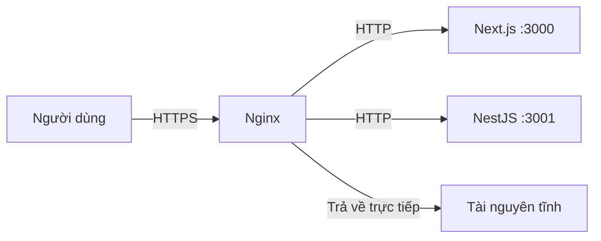
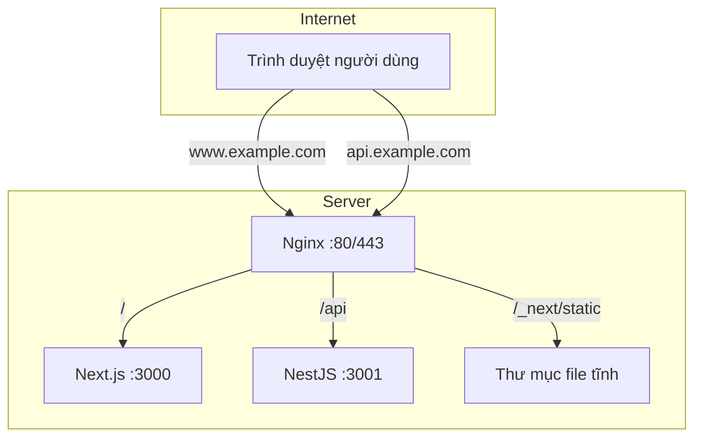

# 10.4 Cảnh sát giao thông của website — Reverse proxy và Load balancing: Thực chiến cấu hình Nginx

Người dùng truy cập domain, Nginx quyết định request đi đâu.

## Tại sao cần Nginx

Nginx đóng vai trò "bảo vệ" trong kiến trúc Web hiện đại:



## Chức năng cốt lõi

| Chức năng | Giải thích |
|------|------|
| Reverse proxy | Chuyển tiếp request đến backend service |
| SSL termination | Xử lý mã hóa/giải mã HTTPS |
| Load balancing | Phân phối request đến nhiều instance |
| Static file | Trả về trực tiếp tài nguyên tĩnh |
| Caching | Cache response, giảm áp lực backend |
| Compression | Nén Gzip nội dung response |

## Nginx trong 1Panel

1Panel mặc định dùng **OpenResty** (phiên bản nâng cấp của Nginx), quản lý qua chức năng **Website**:

| Thao tác | Đường dẫn |
|------|------|
| Tạo website | Website → Website → Tạo website |
| Cấu hình reverse proxy | Website → Chọn site → Reverse proxy |
| Chứng chỉ SSL | Website → Chọn site → HTTPS |
| Xem cấu hình | Website → Chọn site → File cấu hình |

## Mục lục phần này

- **10.4.1 Request nên chuyển tiếp cho ai** — Cấu hình reverse proxy cơ bản
- **10.4.2 Chứng chỉ HTTPS cấu hình thế nào** — Cấu hình SSL và tự động gia hạn
- **10.4.3 Người dùng quá đông thì làm sao** — Chiến lược load balancing
- **10.4.4 Hình ảnh làm sao truy cập nhanh** — Tài nguyên tĩnh và CDN

## Kiến trúc cấu hình điển hình



## Lệnh thường dùng

```bash
# Test cú pháp cấu hình
nginx -t

# Reload cấu hình (không gián đoạn service)
nginx -s reload

# Xem trạng thái Nginx
systemctl status nginx

# Xem access log
tail -f /var/log/nginx/access.log

# Xem error log
tail -f /var/log/nginx/error.log
```

## Cấu trúc file cấu hình

```nginx
# /etc/nginx/nginx.conf Cấu hình chính
http {
    # Cài đặt toàn cục
    include /etc/nginx/conf.d/*.conf;  # Include cấu hình site
}

# /etc/nginx/conf.d/example.conf Cấu hình site
server {
    listen 80;
    server_name example.com;

    location / {
        proxy_pass http://localhost:3000;
    }
}
```
