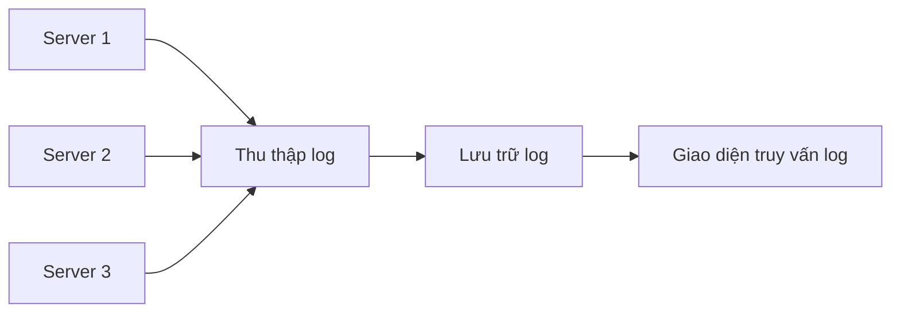

# 10.5.2 Log quá nhiều thì làm sao — Quản lý log: Log có cấu trúc và log rotation

Log là tư liệu tay thứ nhất để tìm vấn đề, nhưng quá nhiều cũng là tai họa.

## Mức độ log

| Mức độ | Công dụng | Production |
|------|------|----------|
| ERROR | Lỗi, cần xử lý | Phải ghi |
| WARN | Cảnh báo, có thể có vấn đề | Nên ghi |
| INFO | Thông tin quan trọng | Ghi có chọn lọc |
| DEBUG | Thông tin debug | Không ghi |
| VERBOSE | Thông tin chi tiết | Không ghi |

## Log có cấu trúc

### Tại sao cần có cấu trúc

```bash
# Log không có cấu trúc - Khó tìm kiếm và phân tích
[2024-01-15 10:30:00] User login failed: invalid password for user@example.com

# Log có cấu trúc - Dễ query và tổng hợp
{"timestamp":"2024-01-15T10:30:00Z","level":"warn","event":"login_failed","reason":"invalid_password","email":"user@example.com"}
```

### Cấu hình log NestJS

```typescript
// logger.service.ts
import { Injectable, Logger } from '@nestjs/common';

@Injectable()
export class AppLogger extends Logger {
  private formatLog(level: string, message: string, context?: object) {
    return JSON.stringify({
      timestamp: new Date().toISOString(),
      level,
      message,
      ...context,
    });
  }

  log(message: string, context?: object) {
    console.log(this.formatLog('info', message, context));
  }

  error(message: string, trace?: string, context?: object) {
    console.error(this.formatLog('error', message, { trace, ...context }));
  }

  warn(message: string, context?: object) {
    console.warn(this.formatLog('warn', message, context));
  }
}
```

### Ví dụ sử dụng

```typescript
// Log business
this.logger.log('Order created', {
  orderId: order.id,
  userId: user.id,
  amount: order.total,
});

// Log lỗi
this.logger.error('Payment failed', error.stack, {
  orderId: order.id,
  gateway: 'stripe',
  errorCode: error.code,
});
```

## Quản lý log Docker

### Xem log

```bash
# Xem log theo thời gian thực
docker logs -f container-name

# Xem 100 dòng gần nhất
docker logs --tail 100 container-name

# Xem khoảng thời gian cụ thể
docker logs --since 2024-01-15T10:00:00 container-name
```

### Cấu hình log driver

```yaml
# docker-compose.yml
services:
  api:
    image: my-api
    logging:
      driver: "json-file"
      options:
        max-size: "10m"    # File log đơn tối đa 10MB
        max-file: "5"      # Giữ tối đa 5 file
```

## Log rotation

### Tại sao cần rotation

| Vấn đề | Hậu quả |
|------|------|
| File log quá lớn | Hết dung lượng đĩa |
| File đơn quá lớn | Khó mở/Khó tìm kiếm |
| Log lịch sử chồng chất | Không thể quản lý hiệu quả |

### Cấu hình logrotate

```bash
# /etc/logrotate.d/app
/var/log/app/*.log {
    daily           # Rotation hàng ngày
    rotate 7        # Giữ 7 ngày
    compress        # Nén log cũ
    delaycompress   # Trì hoãn nén
    missingok       # Log không tồn tại không báo lỗi
    notifempty      # File rỗng không rotation
    create 0644 root root
}
```

### Docker tự động quản lý

Docker cấu hình `max-size` và `max-file` sẽ tự động rotation:

```json
// /etc/docker/daemon.json
{
  "log-driver": "json-file",
  "log-opts": {
    "max-size": "10m",
    "max-file": "5"
  }
}
```

## Best practice log

### Nên ghi gì

```typescript
// 1. Request đầu vào
this.logger.log('Request received', {
  method: req.method,
  path: req.path,
  userId: req.user?.id,
});

// 2. Thao tác business quan trọng
this.logger.log('Order status changed', {
  orderId,
  from: oldStatus,
  to: newStatus,
});

// 3. Gọi bên ngoài
this.logger.log('API call', {
  service: 'payment',
  duration: 150,
  success: true,
});

// 4. Lỗi và ngoại lệ
this.logger.error('Database query failed', error.stack, {
  query: 'findUser',
  userId,
});
```

### Không nên ghi gì

```typescript
// Thông tin nhạy cảm - Tuyệt đối không ghi!
this.logger.log('User login', {
  password: user.password,  // Tuyệt đối không!
  creditCard: card.number,  // Tuyệt đối không!
  token: jwt,               // Tránh ghi token đầy đủ
});

// Nên che giấu
this.logger.log('User login', {
  email: maskEmail(user.email),  // u***@example.com
  cardLast4: card.number.slice(-4),  // 1234
});
```

## Kỹ thuật tìm kiếm log

### Sử dụng grep tìm kiếm

```bash
# Tìm log lỗi
docker logs api 2>&1 | grep -i error

# Tìm người dùng cụ thể
docker logs api | grep "userId\":\"123"

# Tìm khoảng thời gian
docker logs api --since 1h | grep error
```

### Sử dụng jq phân tích JSON

```bash
# Chỉ hiển thị log level error
docker logs api | jq 'select(.level == "error")'

# Trích xuất trường cụ thể
docker logs api | jq '{time: .timestamp, msg: .message}'

# Thống kê số lượng error
docker logs api | jq 'select(.level == "error")' | wc -l
```

## Log tập trung (tùy chọn)

Đối với kịch bản nhiều server, cân nhắc quản lý log tập trung:



### Phương án đơn giản

| Công cụ | Chi phí | Đặc điểm |
|------|------|------|
| Better Stack | Miễn phí khởi đầu | Đơn giản dễ dùng |
| Papertrail | Miễn phí khởi đầu | Tìm kiếm real-time |
| Loki + Grafana | Miễn phí | Tự host |

## Vấn đề thường gặp

| Vấn đề | Nguyên nhân | Giải pháp |
|------|------|----------|
| Dung lượng đĩa không đủ | Log không rotation | Cấu hình log rotation |
| Quá nhiều log không tìm được | Thiếu cấu trúc | Dùng định dạng JSON |
| Ảnh hưởng hiệu năng | Ghi log đồng bộ | Ghi bất đồng bộ/Ghi theo lô |
| Rò rỉ thông tin nhạy cảm | Ghi log không phù hợp | Review nội dung log, xử lý che giấu |
