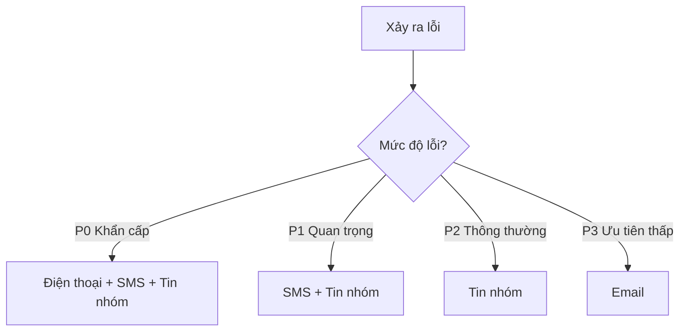

# 10.5.3 Có lỗi thì thông báo ngay — Theo dõi lỗi: Bắt ngoại lệ và cơ chế cảnh báo

Xảy ra lỗi không đáng sợ, đáng sợ là bạn không biết.

## Theo dõi lỗi vs Log

| Mục so sánh | Log | Theo dõi lỗi |
|--------|------|----------|
| Lượng thông tin | Một dòng text | Context đầy đủ |
| Stack trace | Có thể có | Stack trace đầy đủ |
| Tổng hợp | Không | Tự động tổng hợp lỗi giống nhau |
| Thông báo | Cần cấu hình thêm | Cảnh báo tích hợp sẵn |
| Thông tin người dùng | Ghi thủ công | Tự động liên kết |

## Tích hợp Sentry

Sentry là service theo dõi lỗi phổ biến nhất, phiên bản miễn phí đủ dùng.

### Tích hợp backend (NestJS)

```bash
npm install @sentry/node
```

```typescript
// main.ts
import * as Sentry from '@sentry/node';

Sentry.init({
  dsn: process.env.SENTRY_DSN,
  environment: process.env.NODE_ENV,
  tracesSampleRate: 0.1,  // Lấy mẫu 10% request
});

// Global exception filter
@Catch()
export class SentryExceptionFilter implements ExceptionFilter {
  catch(exception: any, host: ArgumentsHost) {
    Sentry.captureException(exception);

    const ctx = host.switchToHttp();
    const response = ctx.getResponse<Response>();

    response.status(500).json({
      message: 'Internal server error',
    });
  }
}
```

### Tích hợp frontend (Next.js)

```bash
npm install @sentry/nextjs
npx @sentry/wizard@latest -i nextjs
```

```typescript
// sentry.client.config.ts
import * as Sentry from '@sentry/nextjs';

Sentry.init({
  dsn: process.env.NEXT_PUBLIC_SENTRY_DSN,
  tracesSampleRate: 0.1,
});
```

### Bắt lỗi tùy chỉnh

```typescript
try {
  await processPayment(order);
} catch (error) {
  Sentry.captureException(error, {
    extra: {
      orderId: order.id,
      amount: order.total,
    },
    tags: {
      payment_gateway: 'stripe',
    },
    user: {
      id: user.id,
      email: user.email,
    },
  });
  throw error;
}
```

## Cấu hình cảnh báo

### Kênh cảnh báo

| Kênh | Ưu điểm | Nhược điểm |
|------|------|------|
| Email | Chi tiết, có thể truy vết | Dễ bị bỏ qua |
| DingTalk/Lark | Tức thì, team nhìn thấy | Có thể gây phiền |
| SMS | Thông báo khẩn cấp | Chi phí cao |
| Điện thoại | Khẩn cấp nhất | Chi phí cao nhất |

### Cảnh báo DingTalk bot

```typescript
async function sendDingTalkAlert(message: string) {
  const webhook = process.env.DINGTALK_WEBHOOK;

  await fetch(webhook, {
    method: 'POST',
    headers: { 'Content-Type': 'application/json' },
    body: JSON.stringify({
      msgtype: 'markdown',
      markdown: {
        title: 'Cảnh báo service',
        text: `## Cảnh báo service\n\n${message}\n\nThời gian: ${new Date().toLocaleString()}`,
      },
    }),
  });
}
```

### Cảnh báo Lark bot

```typescript
async function sendFeishuAlert(title: string, content: string) {
  const webhook = process.env.FEISHU_WEBHOOK;

  await fetch(webhook, {
    method: 'POST',
    headers: { 'Content-Type': 'application/json' },
    body: JSON.stringify({
      msg_type: 'interactive',
      card: {
        header: {
          title: { content: title, tag: 'plain_text' },
          template: 'red',
        },
        elements: [{
          tag: 'div',
          text: { content, tag: 'plain_text' },
        }],
      },
    }),
  });
}
```

## Thiết kế quy tắc cảnh báo

### Cảnh báo phân cấp



| Cấp độ | Định nghĩa | Thời gian phản hồi |
|------|------|----------|
| P0 | Service hoàn toàn không khả dụng | 5 phút |
| P1 | Chức năng cốt lõi bị ảnh hưởng | 30 phút |
| P2 | Vấn đề chức năng không cốt lõi | 4 giờ |
| P3 | Vấn đề người dùng có thể chấp nhận | 1 ngày |

### Tránh mệt mỏi cảnh báo

```typescript
// Tổng hợp lỗi - Lỗi giống nhau trong 5 phút chỉ cảnh báo 1 lần
const alertCache = new Map<string, number>();

function shouldAlert(errorKey: string): boolean {
  const lastAlert = alertCache.get(errorKey);
  const now = Date.now();

  if (lastAlert && now - lastAlert < 5 * 60 * 1000) {
    return false;
  }

  alertCache.set(errorKey, now);
  return true;
}
```

## Cảnh báo UptimeRobot

### Cấu hình người nhận cảnh báo

1. Settings → Alert Contacts
2. Thêm cách thức liên lạc:
   - Email
   - Webhook (khuyến nghị, có thể tích hợp DingTalk/Lark)
   - Slack/Discord

### Webhook chuyển tiếp đến DingTalk

```javascript
// Nhận webhook UptimeRobot, chuyển tiếp đến DingTalk
app.post('/webhook/uptime', async (req, res) => {
  const { monitorFriendlyName, alertType, alertDetails } = req.body;

  const isDown = alertType === '1';
  const message = isDown
    ? `🔴 Service down: ${monitorFriendlyName}\n${alertDetails}`
    : `🟢 Service phục hồi: ${monitorFriendlyName}`;

  await sendDingTalkAlert(message);
  res.send('ok');
});
```

## Best practice xử lý lỗi

### Xử lý ngoại lệ toàn cục

```typescript
// NestJS global exception filter
@Catch()
export class GlobalExceptionFilter implements ExceptionFilter {
  catch(exception: any, host: ArgumentsHost) {
    const ctx = host.switchToHttp();
    const response = ctx.getResponse();
    const request = ctx.getRequest();

    // Ghi log lỗi
    console.error(JSON.stringify({
      level: 'error',
      message: exception.message,
      stack: exception.stack,
      path: request.url,
      method: request.method,
      userId: request.user?.id,
    }));

    // Gửi đến Sentry
    Sentry.captureException(exception);

    // Trả về lỗi thân thiện với người dùng
    response.status(500).json({
      statusCode: 500,
      message: 'Something went wrong',
    });
  }
}
```

### Không được để lộ thông tin nhạy cảm

```typescript
// Cách làm sai
res.status(500).json({ error: exception.message }); // Có thể lộ thông tin database

// Cách làm đúng
res.status(500).json({ message: 'Internal server error' });
```

## Vấn đề thường gặp

| Vấn đề | Nguyên nhân | Giải pháp |
|------|------|----------|
| Quá nhiều cảnh báo | Ngưỡng quá nhạy | Điều chỉnh ngưỡng, tổng hợp lỗi |
| Quá ít cảnh báo | Lỗi chưa được bắt | Hoàn thiện xử lý ngoại lệ toàn cục |
| Cảnh báo chậm trễ | Khoảng thời gian kiểm tra quá dài | Rút ngắn khoảng thời gian kiểm tra |
| Cảnh báo trùng lặp | Chưa làm dedup | Thêm logic tổng hợp cảnh báo |
