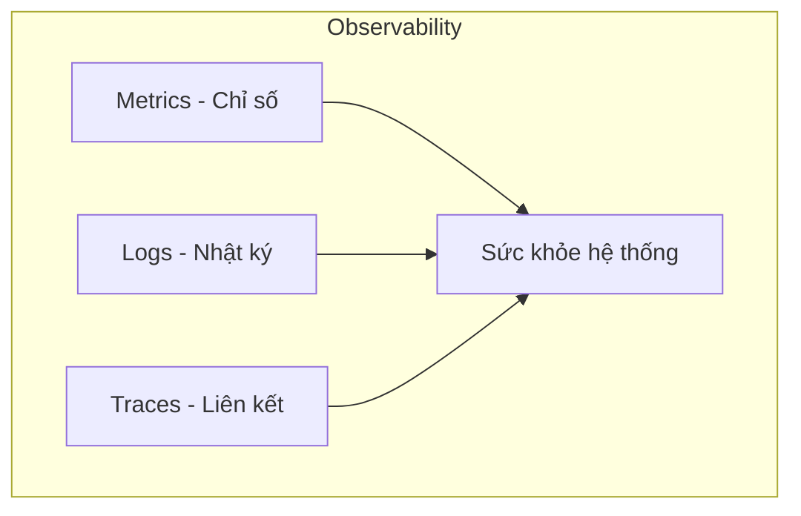
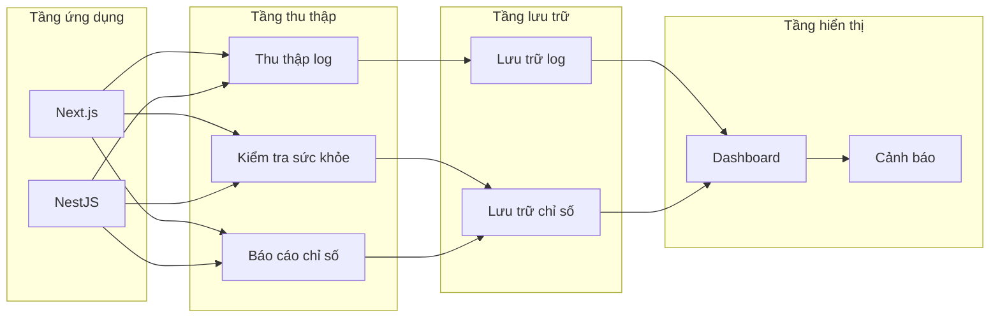

# 10.5 Website bị bệnh thì làm sao — Giám sát và log: Hệ thống observability

Người dùng báo cho bạn biết website down? Vậy là bạn đã chậm rồi.

## Ba trụ cột observability



| Trụ cột | Giải thích | Câu hỏi được trả lời |
|------|------|--------------|
| Metrics | Chỉ số số hóa | Chuyện gì xảy ra? Nghiêm trọng đến mức nào? |
| Logs | Ghi lại sự kiện | Tại sao lại xảy ra? |
| Traces | Liên kết request | Xảy ra ở đâu? |

## Tại sao cần giám sát

| Kịch bản | Không có giám sát | Có giám sát |
|------|----------|--------|
| Website down | Người dùng phàn nàn mới biết | Cảnh báo tự động, phản ứng nhanh |
| Hiệu năng giảm | Đoán mò cảm tính | Dữ liệu định vị điểm nghẽn |
| Theo dõi lỗi | Lục log tìm nửa ngày | Một click định vị vấn đề |
| Lập kế hoạch dung lượng | Đập đầu vào tường mở rộng | Ra quyết định dựa trên dữ liệu |

## Kiến trúc hệ thống giám sát



## Mục lục chương này

- **10.5.1 Website còn sống không** — Kiểm tra sức khỏe và chỉ số cơ bản
- **10.5.2 Log quá nhiều thì làm sao** — Log có cấu trúc và quản lý
- **10.5.3 Có lỗi thì thông báo ngay** — Theo dõi lỗi và cảnh báo
- **10.5.4 Điểm nghẽn hiệu năng ở đâu** — Phân tích và tối ưu hiệu năng

## Giải pháp phù hợp cho independent developer

Không cần ELK Stack phức tạp, giải pháp đơn giản cũng đủ dùng:

| Công cụ | Công dụng | Chi phí |
|------|------|------|
| 1Panel monitoring | Giám sát tài nguyên server | Miễn phí |
| UptimeRobot | Giám sát tính khả dụng website | Miễn phí/Trả phí |
| Sentry | Theo dõi lỗi | Miễn phí/Trả phí |
| Better Stack | Log + Cảnh báo | Miễn phí/Trả phí |
| Docker logs | Xem log container | Miễn phí |

## Bắt đầu nhanh

### 1. Health check endpoint

```typescript
// NestJS
@Get('health')
healthCheck() {
  return { status: 'ok', timestamp: new Date() };
}
```

### 2. Xem Docker logs

```bash
# Xem log ứng dụng
docker logs -f --tail 100 app-container

# Xem log tất cả service
docker-compose logs -f
```

### 3. Cấu hình cảnh báo

Tạo monitoring trong UptimeRobot:
- Địa chỉ giám sát: `https://example.com/api/health`
- Khoảng thời gian kiểm tra: 5 phút
- Cách thức cảnh báo: Email/Webhook
