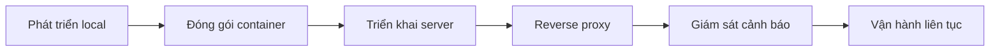

# 10 ｜Triển khai và Vận hành

Code viết xong chỉ là bước đầu tiên của vạn dặm trường chinh, để user thực sự dùng được mới là đích đến.

## Tổng quan chương này

Triển khai không phải là ném code lên server là xong. Đó là một công trình hệ thống, liên quan đến bốn khâu lớn: **lựa chọn cơ sở hạ tầng**, **điều phối container hóa**, **quản lý traffic** và **giám sát runtime**. Chương này sẽ đưa bạn từ con số 0, dùng toolchain hiện đại hoàn thành một lần triển khai production hoàn chỉnh.

## Lý niệm cốt lõi

| Nguyên tắc | Giải thích |
|------|------|
| **Cơ sở hạ tầng tức là code** | Mọi cấu hình đều nên có phiên bản, có thể tái hiện |
| **Triển khai bất biến** | Container image một khi build xong, không sửa nữa |
| **Ưu tiên khả năng quan sát** | Log, metric, trace thiếu một không được |
| **Phương án sự cố đi trước** | Trước khi lên sóng phải nghĩ xem sập thì xử lý thế nào |

## Mục lục chương này

- **10.1 Điều phải biết trước khi lên sóng** — Dịch vụ cloud, tên miền, đăng ký, những công việc tiền đề này không thể bỏ qua
- **10.2 Click chuột là lên sóng** — Dùng 1Panel trực quan hoàn thành từ 0 đến lên sóng
- **10.3 Một phím khởi động tất cả service** — Thực chiến điều phối nhiều service với Docker Compose
- **10.4 Cảnh sát giao thông của website** — Cấu hình reverse proxy và load balancing với Nginx
- **10.5 Website bị bệnh thì làm sao** — Xây dựng hệ thống giám sát, log và cảnh báo

## Tech stack

Công cụ cốt lõi liên quan trong chương này:

| Công cụ | Công dụng |
|------|------|
| Docker | Runtime container hóa |
| Docker Compose | Điều phối nhiều container |
| 1Panel | Panel quản lý server trực quan |
| Nginx | Reverse proxy và load balancing |
| PostgreSQL | Database production |

## Sau khi học xong chương này bạn sẽ có thể

1. Hoàn thành triển khai production một ứng dụng Next.js + NestJS độc lập
2. Dùng Docker Compose điều phối ứng dụng nhiều service
3. Cấu hình reverse proxy Nginx và chứng chỉ HTTPS
4. Xây dựng hệ thống giám sát và log cơ bản
5. Xử lý các vấn đề triển khai thường gặp và sự cố
