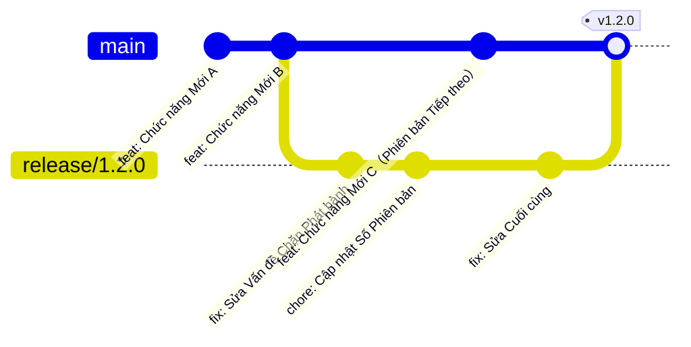

# 11.1.2 Release Branch: Chuẩn bị Phát hành và Ổn định hóa

## Một Câu nói Xuyên suốt

**Release Branch** là một branch Tạm thời được Tách ra từ branch Phát triển, được sử dụng đặc biệt cho Công việc Ổn định hóa trước Phát hành, đảm bảo Chất lượng của Phiên bản Phát hành.

## Giá trị Cốt lõi

Sử dụng Release Branch cho phép bạn:
- Tiếp tục Phát triển Chức năng Mới trong Kỳ Ổn định hóa
- Cách ly Các sửa chữa và Điều chỉnh liên quan đến Phát hành
- Đảm bảo Phiên bản Phát hành được Kiểm thử đầy đủ

## Release Branch Workflow



## Bắt đầu Nhanh chóng

### Bước một: Tạo Release Branch

```bash
# Tạo release branch từ develop hoặc main branch
git checkout develop
git checkout -b release/1.2.0
```

### Bước hai: Công việc Ổn định hóa

Trên Release branch chỉ làm những công việc sau:

```bash
# Sửa Các Vấn đề Chặn Phát hành
git commit -m "fix: Sửa Vấn đề Kiểu dáng Trang Đăng nhập"

# Cập nhật Số Phiên bản
npm version 1.2.0 --no-git-tag-version
git commit -am "chore: bump version to 1.2.0"

# Cập nhật CHANGELOG
git commit -m "docs: update CHANGELOG for 1.2.0"
```

### Bước ba: Hợp nhất về Main Branch

```bash
# Hợp nhất vào main
git checkout main
git merge release/1.2.0 --no-ff

# Đánh Thẻ
git tag -a v1.2.0 -m "Release version 1.2.0"

# Đồng bộ về develop（Nếu dùng Git Flow）
git checkout develop
git merge release/1.2.0 --no-ff

# Xóa release branch
git branch -d release/1.2.0
```

## Danh sách Kiểm tra Phát hành

Trước khi Hợp nhất Release Branch, hãy đảm bảo Hoàn thành các Kiểm tra sau:

```markdown
## Danh sách Kiểm tra Phát hành

### Chất lượng Mã

- [ ] Tất cả các Kiểm thử Đã vượt qua
- [ ] Không có Lỗi ESLint/TypeScript
- [ ] Mã đã được Review

### Thông tin Phiên bản

- [ ] Số Phiên bản trong package.json Đã cập nhật
- [ ] CHANGELOG Đã cập nhật
- [ ] Tài liệu Đã Đồng bộ cập nhật

### Xác minh Môi trường

- [ ] Xác minh trong Môi trường staging Đã vượt qua
- [ ] Kiểm thử Thủ công Chức năng Quan trọng Đã vượt qua
- [ ] Hiệu suất Không có Suy giảm Rõ ràng

### Chuẩn bị Phát hành

- [ ] Tập lệnh di chuyển Cơ sở dữ liệu Đã sẵn sàng
- [ ] Kiểm tra Cấu hình Biến môi trường
- [ ] Phương án Rollback Đã Chuẩn bị sẵn
```

## Hướng dẫn Tránh Lỗi

::: danger Lỗi Dễ mắc nhất của Người mới bắt đầu
1. Phát triển Chức năng Mới trên Release Branch
2. Quên Đồng bộ Các sửa chữa của Release Branch về Branch Phát triển
3. Không Xác minh trong Môi trường Giống Production trước Phát hành
4. Phát hành mà không Chuẩn bị Phương án Rollback
:::
